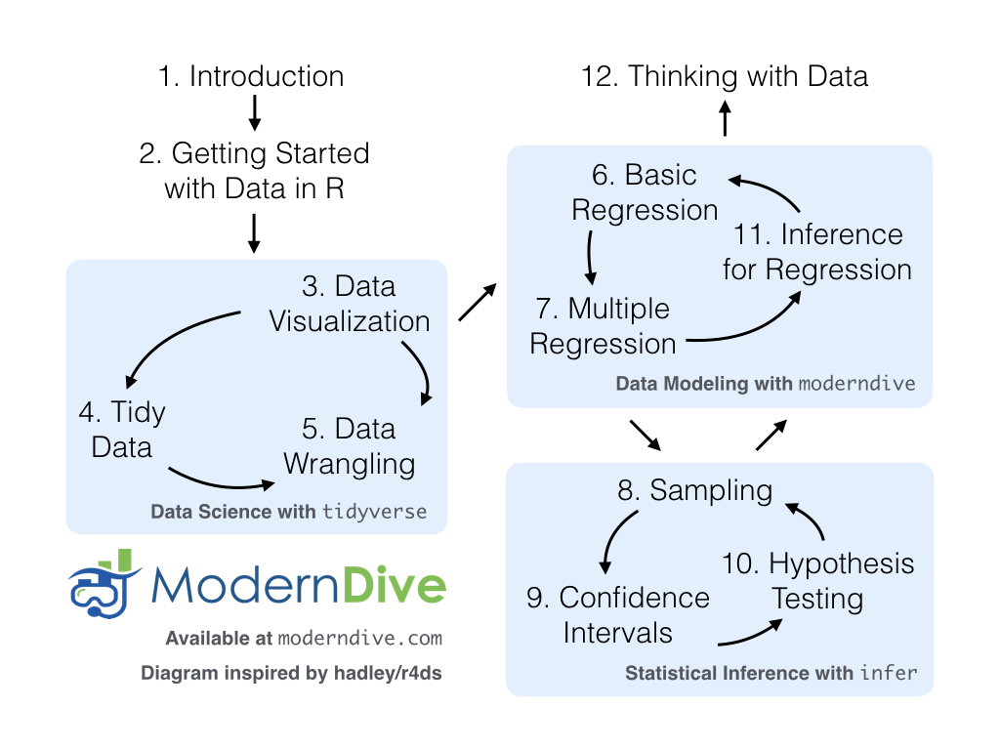
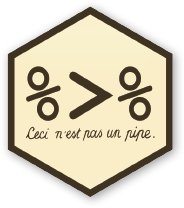
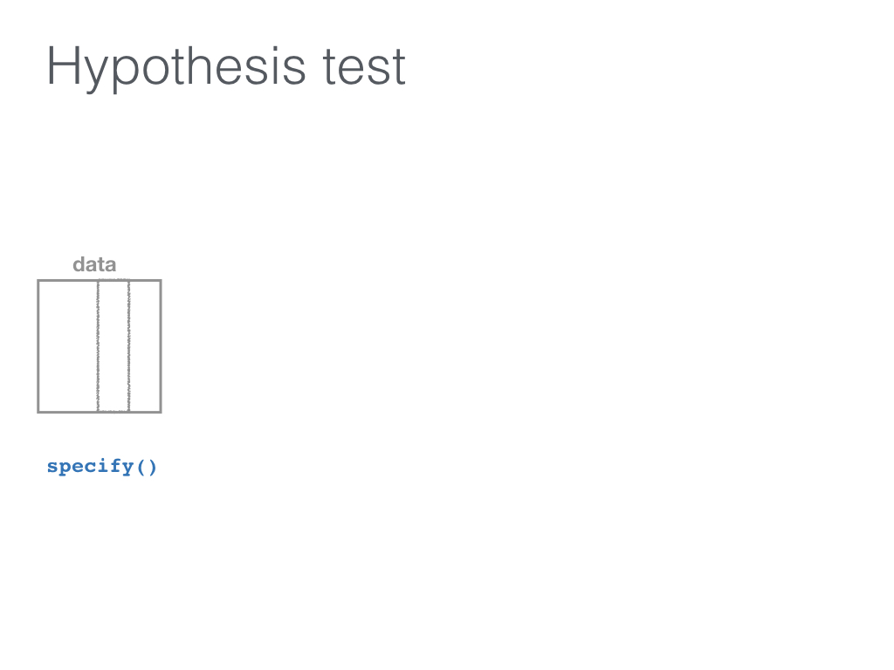
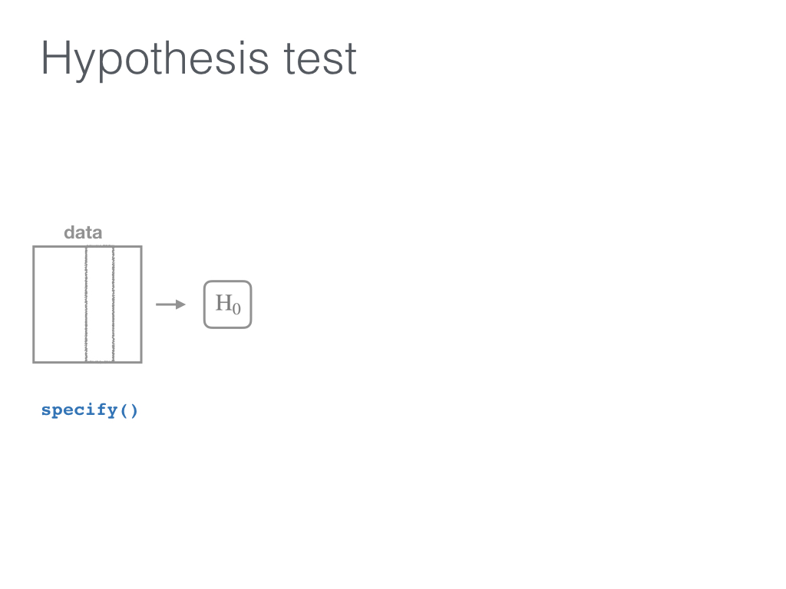
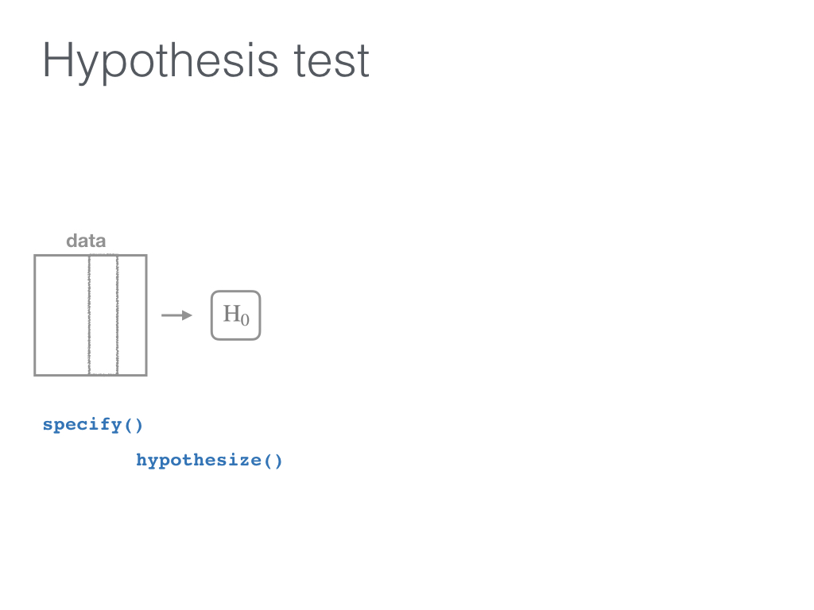
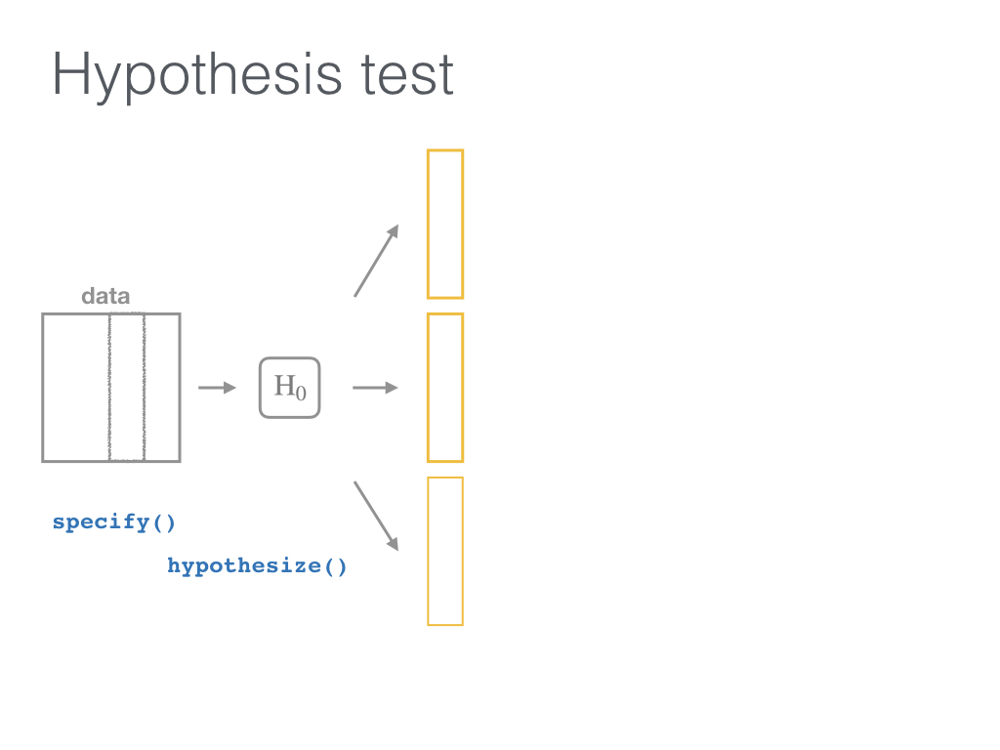
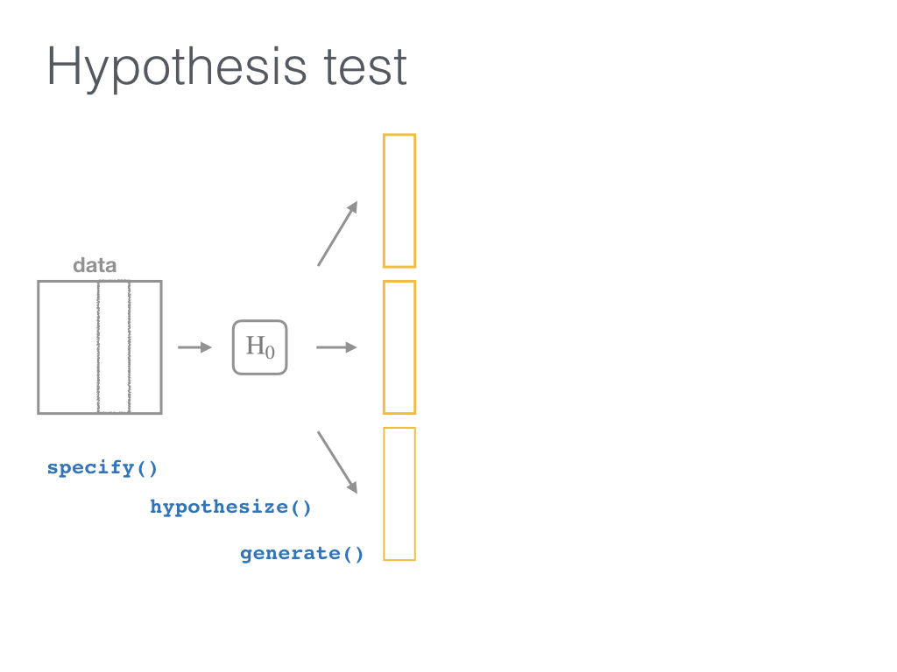
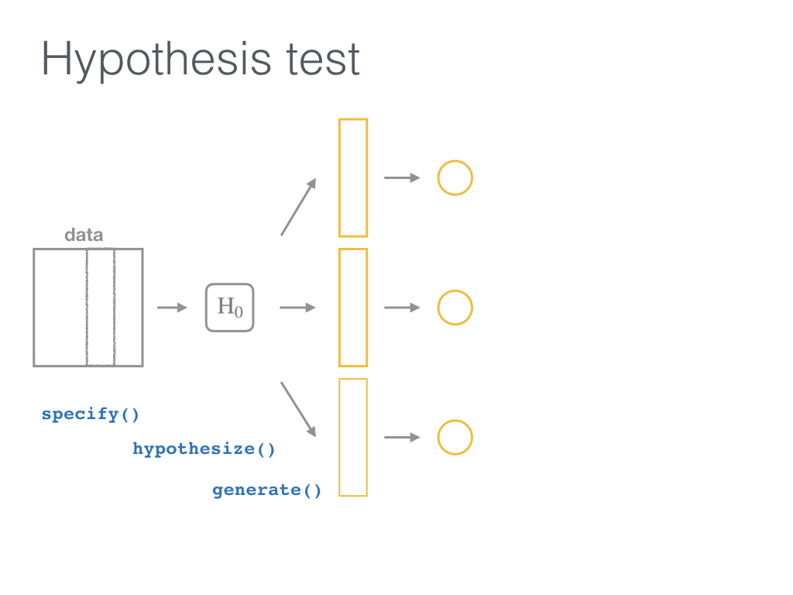
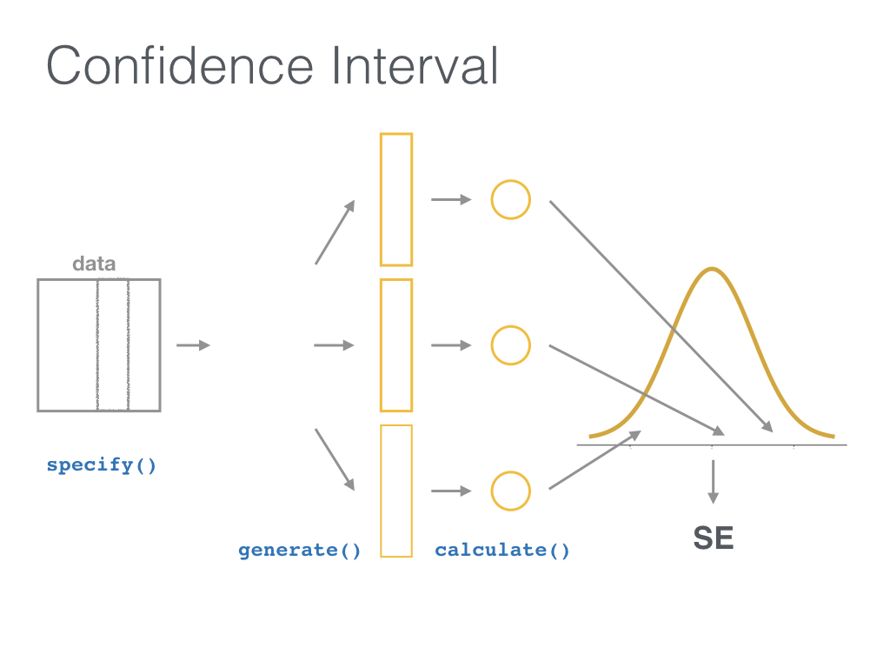

```{r include=FALSE, purl=TRUE}
# specify the packages of interest
pkgs <- c(
  "tidyverse", "moderndive", "gapminder",
  "nycflights13", "fivethirtyeight", "janitor",
  "ggplot2movies", "remotes"
)

# use this function to check if each package is on the local machine
# if a package is installed, it will be loaded
# if any are not, the missing package(s) will be installed and loaded
pkg_check <- function(x) {
  if (!require(x, character.only = TRUE)) {
    install.packages(x, dependencies = TRUE, repos = "https://cran.rstudio.com")
    library(x, character.only = TRUE)
  }
}
lapply(pkgs, pkg_check)

if (!require("fontawesome")) {
  remotes::install_github("rstudio/fontawesome")
}
```

```{r echo=FALSE, purl=FALSE}
library(ggplot2)
knitr::opts_chunk$set(
  warning = FALSE, message = FALSE, 
  fig.width = 10.5, fig.height = 4, 
  comment = NA, rows.print = 16
)
theme_set(theme_gray(base_size = 24))
options(digits = 5, width = 70, knitr.table.format = "html",
        pillar.min_chars = 20, tibble.print_min = 5)

img_link <- function(link, file, size) {
  knitr::asis_output(
    paste0(
      '<center>\n<a href="',
      link,
      '">\n\n</a>\n</center>'
    )
  )
}

# To be added to {moderndive}!
rep_slice_sample <- function(.data, n, #prop,
                             replace = FALSE,
                             reps = 1, prob = NULL) {
  moderndive::rep_sample_n(
    tbl = .data, size = n, replace = replace, reps = reps, prob = prob
  )
}
```

class: middle, center

# Tidyverse Tools in R for <br> Data Science and Statistical Inference

## Dr. Jessica Minnier and Dr. Chester Ismay 

`r knitr::include_graphics("images/csp-logo-virtual.png", dpi = 100)`

### Slides available at <http://bit.ly/csp-tidy> 

### PDF slides at <http://bit.ly/csp-tidy-pdf>

---

name: our-info
class: middle

<h5></h5>

.pull-left[
  
  
  <small>Associate Professor of Biostatistics</small>
  
  

  <br>

  [`r fa(name = "twitter")` @datapointier](http://twitter.com/datapointier)  
  [`r fa(name = "github")` @jminnier](http://github.com/jminnier)  
  [`r fa(name = "link")` jessicaminnier.com](https:/jessicaminnier.com)  
<!--  [`r fa(name = "paper-plane")` `minnier [at] ohsu [dot] edu`](mailto:minnier@ohsu.edu) -->
]

.pull-right[
  
  
  <small>Data Science Evangelist</small>
  
  <br>
  
  
  
  <br><br>
  
  [`r fa(name = "twitter")` @old_man_chester](http://twitter.com/old_man_chester)  
  [`r fa(name = "github")` @ismayc](http://github.com/ismayc)  
  [`r fa(name = "link")` chester.rbind.io](https://chester.rbind.io)  
<!--  [`r fa(name = "paper-plane")` `chester [dot] ismay [at] datarobot [dot] com`](mailto:chester.ismay@datarobot.com) -->
]


---

name: toc
  
# Table of Contents

Part 1
- [Introduction and Setup](#getting-started)
- [Data Wrangling](#wrangling)
- [Data Visualization Basics](#viz)

Part 2
- [Sampling](#sampling)
- [Inference](#inference)

---

layout: true

<div class="my-footer"><span>Slides at https://bit.ly/csp-tidy-slides &emsp; &emsp; &emsp; &emsp; &emsp; &emsp; &emsp; &emsp; &emsp; Return to <u><a style="color:White;" href="slide_deck.html#toc">Table of Contents</a></u></span></div>

---

name:getting-started

## Prior Installation

Make sure you have the current R, RStudio, & R packages
- [Novice's Guide](https://moderndive.com/1-getting-started.html) on ModernDive.com

--

***

- [R (version 4.0.2 or greater)](https://cloud.r-project.org/)
- [RStudio (version 1.4 or greater)](https://www.rstudio.com/products/rstudio/download3/)

--

- Run this in the RStudio Console

```{r, eval=FALSE, purl=FALSE}
pkgs <- c(
  "tidyverse", "moderndive", "gapminder", "nycflights13", 
  "fivethirtyeight", "janitor","ggplot2movies", "usethis"
)
install.packages(pkgs)
```


---


# Getting started

1. Open HTML slides: <https://bit.ly/csp-tidy>
1. Open RStudio  
1. Download course materials to your preferred location by running
   this in the RStudio Console: 
   
   <br>
   
  `usethis::use_course("bit.ly/csp-tidy")`

  <br>

1. Open the Rproj file in the folder that just opened
1. Edit Google Doc to ask questions: <https://csp-tidy-doc>


---

class: inverse, center, middle

# R Data Types

---

## Data types review

Vector/variable
  - Type of vector (`int`, `num` or `dbl`, `chr`, `lgl`, `date`)

--

Data frame
  - Vectors of (potentially) different types
  - Each vector has the same number of rows

---

## Data types review

```{r eval=FALSE, purl=FALSE}
library(tibble) # tibble is the tidyverse data.frame
library(lubridate)
ex1 <- tibble(
  vec1 = c(1980, 1990, 2000, 2010),
  vec2 = c(1L, 2L, 3L, 4L),
  vec3 = c("low", "low", "high", "high"),
  vec4 = c(TRUE, FALSE, FALSE, FALSE),
  vec5 = ymd(c("2017-05-23", "1776/07/04", 
               "1983-05/31", "1908/04-01"))
)
ex1
```

--

```{r echo=FALSE, purl=TRUE}
library(tibble) # tibble is the tidyverse data.frame
library(lubridate)
ex1 <- tibble(
  vec1 = c(1980, 1990, 2000, 2010),
  vec2 = c(1L, 2L, 3L, 4L),
  vec3 = c("low", "low", "high", "high"),
  vec4 = c(TRUE, FALSE, FALSE, FALSE),
  vec5 = ymd(c("2017-05-23", "1776/7/04", "1983-5/31", "1908/04-1"))
)
ex1
```
  
---

## Learning objectives

### Part 1

- Distinguish between different {tidyverse} packages
- Assess different {dplyr} functions for wrangling data
- Discuss the power of "tidy data"
- Develop an intuition behind {ggplot2} plotting syntax

---

class: center, middle

### Shameless plug



---

class: center, middle, inverse

# Getting started with {dplyr}

.pull-left[


<br>

[Alison Horst](https://github.com/allisonhorst/stats-illustrations) 
]

.pull-right[


<!-- New hex is fine here too -->

[dplyr package](https://dplyr.tidyverse.org)
]

---

class: center, middle  
  
## Welcome to the [tidyverse](https://blog.rstudio.org/2016/09/15/tidyverse-1-0-0/)!
  
The {tidyverse} is a collection of R packages that share common philosophies 
and are designed to work together. <br><br> 
  
```{r echo=FALSE}
img_link(
  link = "https://tidyverse.tidyverse.org",
  file = "images/tidyverse_hex.png",
  size = 200
)
```

---

## First motivating example for today

```{r echo=FALSE}
img_link(
  link = "http://gitsense.github.io/images/wealth.gif",
  file = "images/wealth.gif",
  size = 700
)
```


- Inspired by the late, great [Hans Rosling](https://www.youtube.com/watch?v=jbkSRLYSojo)

---

## The `gapminder` data set in {dslabs}

```{r, purl=TRUE}
library(dslabs)
library(dplyr)
gapminder <- tibble(gapminder)
glimpse(gapminder)
```


- Also check out [the {gapminder} package](https://github.com/jennybc/gapminder)

---

name: wrangling

## What is data wrangling?

.pull-left[
- "data janitor work"
- importing data
- cleaning data
- changing shape of data
]
.pull-right[
- fixing errors and poorly formatted data elements
- transforming columns and rows
- filtering, subsetting
]

<br>

```{r echo=FALSE}
img_link(
  link = "https://r4ds.had.co.nz/introduction.html",
  file = "images/r4ds_tidyverse.png",
  size = 600
)
```

---

## Base R versus the {tidyverse}

- The mean life expectancy across all years for Asia
--

```{r, purl=TRUE}
# Base R
asia <- gapminder[gapminder$continent == "Asia", ]
mean(asia$life_expectancy)
```
--
 
```{r purl=FALSE}
library(dplyr)
gapminder %>%
  filter(continent == "Asia") %>%
  summarize(mean_exp = mean(life_expectancy))
```

---

## The pipe `%>%`

 &emsp; &emsp; &emsp; 
--

- A way to chain together commands
- Can be read as "and then" when reading over code
--

```{r eval=FALSE, purl=FALSE}
library(dplyr)
gapminder %>%
  filter(continent == "Asia") %>%
  summarize(mean_exp = mean(life_expectancy))
```

---

class: inverse

## `filter()` rows that satisfy specified conditions

```{r echo=FALSE}
img_link(
  link = "https://github.com/allisonhorst/stats-illustrations",
  file = "images/dplyr_filter.jpg",
  size = 1100
)
```


---

name: filter

## `dplyr::filter()`

- Arguments are "filters" that you'd like to apply.
--

```{r, purl=TRUE}
gap_2014 <- gapminder %>% filter(year == 2014)
gap_2014
```

- Use `==` to compare a variable to a value

---

## Logical operators

- Use `|` to check for any in multiple filters being true:
--

```{r eval=FALSE, purl=FALSE}
gapminder %>%
  filter(life_expectancy < 50 | fertility > 4) %>%
  slice_sample(n = 8)
```
--

```{r echo=FALSE, purl=TRUE}
set.seed(2018)
gapminder %>%
  filter(life_expectancy < 50 | fertility > 4) %>%
  slice_sample(n = 8)
```

---

## Logical operators

- Use `,` to check for all of multiple filters being true:
--

```{r eval=FALSE, purl=FALSE}
gapminder %>%
  filter(life_expectancy < 50, fertility > 4)
```

```{r echo=FALSE, purl=TRUE}
gapminder %>%
  filter(life_expectancy < 50, fertility > 4) %>%
  head(8)
```

---

## Logical operators

- Use `%in%` to check for any being true <br> (shortcut to using `|` repeatedly with `==`)
--

```{r eval=FALSE, purl=FALSE}
gapminder %>%
  filter(country %in% c("Argentina", "Belgium", "Mexico"),
         year %in% c(2012, 2015))
```
--

```{r echo=FALSE, purl=TRUE}
gapminder %>%
  filter(
    country %in% c("Argentina", "Belgium", "Mexico"),
    year %in% c(2012, 2015)
  )
```

---

class: center, middle
background-color: coral

# Your Turn
---

name: yourturnA


```{r echo=FALSE}
counter <- 1
```

## Exercise `r LETTERS[counter]`
## 5:00 minutes

```{r echo=FALSE}
counter <- counter + 1
```
1. Filter observations from either Europe or Africa using the `|`.
2. Filter observations from either Europe or Africa using `%in%`.
3. How many countries had life expectancy greater than 80 years in 1996?

```{r soln1, include = FALSE}
gapminder %>% filter(continent=="Europe" | continent=="Africa")
gapminder %>% filter(continent %in% c("Europe", "Africa"))
gapminder %>% filter(life_expectancy > 80, year==1996)
```

---

name: summarize

## `summarize()`

- Any numerical summary that you want to apply to a column of a data frame is specified within `summarize()`.

```{r eval=FALSE, purl=FALSE}
stats_2015 <- gapminder %>%
  filter(year == 2015) %>%
  summarize(
    max_exp = max(life_expectancy),
    sd_exp = sd(life_expectancy)
  )
stats_2015
```
--

```{r echo=FALSE, purl=TRUE}
stats_2015 <- gapminder %>%
  filter(year == 2015) %>%
  summarize(
    max_exp = max(life_expectancy),
    sd_exp = sd(life_expectancy)
  )
stats_2015
```

---

name: groupby

### Combining `summarize()` with `group_by()`

- When you'd like to determine a numerical summary for all
levels of a different categorical variable

```{r eval=FALSE, purl=FALSE}
max_exp_2015_by_cont <- gapminder %>%
  filter(year == 2015) %>%
  group_by(continent) %>%
  summarize(max_exp = max(life_expectancy),
            sd_exp = sd(life_expectancy))
max_exp_2015_by_cont
```

--
```{r echo=FALSE, purl=TRUE}
max_exp_2015_by_cont <- gapminder %>%
  filter(year == 2015) %>%
  group_by(continent) %>%
  summarize(max_exp = max(life_expectancy),
            sd_exp = sd(life_expectancy))
max_exp_2015_by_cont
```

---

class: inverse

## `mutate()` changes the data

```{r echo=FALSE}
img_link(
  link = "https://github.com/allisonhorst/stats-illustrations",
  file = "images/dplyr_mutate.png",
  size = 600
)
```

---

name: mutate

## `mutate()`

- Most importantly, allows you to create a new variable based on other variables

--

```{r, purl=TRUE}
gapminder_plus <- gapminder %>% 
  mutate(gdp_per_capita = gdp / population)
slice_sample(gapminder_plus, n = 4)
```

---

class: center, middle

<h5></h5>

```{r echo=FALSE}
img_link(
  link = "https://github.com/allisonhorst/stats-illustrations",
  file = "images/tidydata_1.jpg",
  size = 1200
)
```

---

class: center, middle

<h5></h5>

```{r echo=FALSE}
img_link(
  link = "https://github.com/allisonhorst/stats-illustrations",
  file = "images/tidydata_2.jpg",
  size = 1200
)
```

---

name: arrange

## `arrange()`

- Reorders the rows in a data frame based on the values of one or more variables
--

```{r, purl=TRUE}
gapminder_plus %>%
  arrange(year, country)
```

---

## `arrange()`

- Can also put into descending order
--

```{r desc, purl=TRUE}
gapminder_plus %>%
  filter(year > 2000) %>%
  arrange(desc(life_expectancy))
```

---

## Don't mix up `arrange()` and `group_by()`

- `group_by()` is used (mostly) with `summarize()` to calculate summaries 
over groups

- `arrange()` is used for sorting

---

## Don't mix up `arrange()` and `group_by()`

This doesn't really do anything useful by itself

```{r purl=TRUE}
gapminder %>% group_by(country)
```

---

## Don't mix up `arrange()` and `group_by()`

But this does

```{r purl=TRUE}
gapminder %>% arrange(country)
```

---

name: select

## `select()`

- Chooses a subset of _columns_ (don't mix up with `filter()`)

```{r}
gapminder_plus %>% 
  select(country, region, gdp_per_capita)
```

---


class: center, middle
background-color: coral

# Your Turn
---

name: yourturnB

## Exercise `r LETTERS[counter]`
## 5 minutes

```{r echo=FALSE}
counter <- counter + 1
```
1. Create a data frame that has the median life expectancy by year.
2. Use `arrange()` on this data frame to see the top years with the highest median life expectancy. What about the year with the lowest median life expectancy?
3. Create a new column that is median life expectancy rounded to the nearest integer, and remove the original un-rounded column with `select()`.

```{r soln2, include=FALSE}
lifeyear <- gapminder %>%
  group_by(year) %>%
  summarize(med_exp = median(life_expectancy))

lifeyear %>% arrange(desc(med_exp))
lifeyear %>% arrange(med_exp)
lifeyear %>% mutate(med_exp_round = round(med_exp)) %>% select(-med_exp)
```


---

name: viz
class: center, middle, inverse

##  Basics of {ggplot2}


.pull-left[


<br>

[Alison Horst](https://github.com/allisonhorst/stats-illustrations) 
]

.pull-right[


<br>

[ggplot2 package](https://ggplot2.tidyverse.org)
]

---

class: center, middle

```{r echo=FALSE}
img_link(
  link = "https://github.com/rstudio/cheatsheets/blob/master/data-visualization-2.1.pdf",
  file = "images/ggplot_basics_from_ppt.png",
  size = 1000
)
```


---

## Learning objectives

### Part 2

- Build a sampling distribution by repeatedly sampling from a population using the {moderndive} package
- Compose a visualization of a sampling distribution
- Construct a bootstrap distributions for a basic confidence interval of a statistic
- Perform tidy hypothesis testing using the {infer} package

---

name: sampling

## Extending this {tidyverse} knowledge to something new

- How can we now learn about <u>sampling distributions</u>?

--

`r img_link("https://moderndive.com/7-sampling.html", "images/sampling_bowl.jpeg", 380)`

---

class: middle

```{r purl=TRUE}
library(moderndive)
bowl %>% slice_head(n = 15)
```

---

## One virtual scoop of 50 balls (one sample)

```{r purl=TRUE}
set.seed(8675309)
(jennys_sample <- bowl %>% slice_sample(n = 50))
```

---

## Proportion that are red

```{r purl=TRUE}
jennys_sample %>%
  summarize(prop_red = mean(color == "red")) %>%
  pull()
```

--

## Is this how many are in the full bowl?

---

## Sampling variability

### What does `rep_bowl_samples` look like?

```{r purl=TRUE, cache=TRUE}
library(moderndive)
rep_bowl_samples <- bowl %>%
  rep_slice_sample(n = 50, reps = 10000)
```

--

### How about `bowl_props`?

```{r purl=TRUE}
bowl_props <- rep_bowl_samples %>%
  group_by(replicate) %>%
  summarize(prop_red = mean(color == "red"))
```


---

## The sampling distribution

```{r fig.height=4.7, purl=TRUE}
ggplot(data = bowl_props, mapping = aes(x = prop_red)) +
  geom_histogram(binwidth = 0.02, color = "white")
```

---

## Shifting focus

### What about if all we had was the one sample of balls (not the whole bowl)?

```{r purl=TRUE}
jennys_sample %>% count(color)
```

--

### How could we use this sample to make a guess about the sampling variability from other samples?

---

## Building up to statistical inference!

```{r purl=TRUE}
library(infer)
jennys_sample %>%
  specify(formula = color ~ NULL, success = "red")
```

---

## Bootstrapping?

```{r purl=TRUE}
library(infer)
(bootstrap_samples <- jennys_sample %>%
  specify(formula = color ~ NULL, success = "red") %>%
  generate(reps = 48, type = "bootstrap"))
```

---

## What does `bootstrap_samples` represent?

- Remember we assumed that all we had was the original sample of 19 red and 31 white to start.
--

- Hope each selection in `bootstrap_samples` is similar to:

`r img_link("http://moderndive.netlify.com/images/sampling_bowl.jpeg", "images/big_sampling_bowl.jpeg", 500)`

---

## Bootstrap statistics

```{r purl=TRUE, cache=TRUE}
jennys_sample %>%
  specify(formula = color ~ NULL, success = "red") %>%
  generate(reps = 48, type = "bootstrap") %>%
  calculate(stat = "prop")
```

---

## Do 10,000 reps to get a better sense for variability

### Just as we did with the sampling distribution

```{r purl=TRUE, cache=TRUE}
bootstrap_stats <- jennys_sample %>%
  specify(formula = color ~ NULL, success = "red") %>%
  generate(reps = 10000, type = "bootstrap") %>%
  calculate(stat = "prop")
```

---

### The bootstrap distribution

```{r fig.height=2.7, echo=FALSE, purl=TRUE}
ggplot(data = bootstrap_stats, mapping = aes(x = stat)) +
  geom_histogram(binwidth = 0.02, color = "white") +
  geom_vline(
    xintercept = mean(bootstrap_stats$stat), color = "red",
    size = 2
  ) +
  xlim(0.15, 0.55) +
  geom_vline(xintercept = c(mean(bootstrap_stats$stat) - sd(bootstrap_stats$stat), mean(bootstrap_stats$stat) + sd(bootstrap_stats$stat)), color = "red", size = 1.5)
```

### The sampling distribution

```{r fig.height=2.7, echo=FALSE, purl=TRUE}
ggplot(data = bowl_props, mapping = aes(x = prop_red)) +
  geom_histogram(binwidth = 0.02, color = "white") +
  geom_vline(
    xintercept = mean(bowl_props$prop_red), color = "red",
    size = 2
  ) +
  xlim(0.15, 0.55) +
  geom_vline(xintercept = c(mean(bowl_props$prop_red) - sd(bowl_props$prop_red), mean(bowl_props$prop_red) + sd(bowl_props$prop_red)), color = "red", size = 1.5)
```

---

## Get a confidence interval

```{r}
get_ci(bootstrap_stats, level = 0.95)
```

- We are 95% "confident" the true proportion of red balls in the hopper/bowl is
between `r get_ci(bootstrap_stats, level = 0.95)[1]` and `r get_ci(bootstrap_stats, level = 0.95)[2]`.

--
***

- In the population:

```{r}
mean(bowl$color == "red")
```


---

## {infer} verbs

`r img_link("https://iinfer.tidymodels.org", "images/infer_ci.jpg", 750)`

---

## {infer} verbs

`r img_link("https://iinfer.tidymodels.org", "images/infer_ht.jpg", 750)`


---

class: middle, center

# Statistical Inference

`r img_link("https://infer-dev.netlify.com", "images/infer_gnome.png", 400)`

<br>

.footnote[{infer} hex sticker designs kindly created by [Thomas Mock](https://www.linkedin.com/in/jthomasmock/)]

---


# Research Question

If you see someone else yawn, are you more likely to yawn?

In an episode of the show *Mythbusters*, they tested the myth that yawning is contagious. 

--
- 50 adults who thought they were being considered for an appearance on the show. 

--

- Each participant was interviewed individually by a show recruiter ("confederate") who either yawned or did not.

--

- Participants then sat by themselves in a large van and were asked to wait. 

--

- While in the van, the Mythbusters watched to see if the unaware participants yawned.


---

### Data

- 34 saw the confederate yawn ( *seed* )
- 16 did not see the confederate yawn ( *control* )
- `Yawn` - participant yawn, `No Yawn` - participant did not

--

```{r purl=TRUE}
group <- c(rep("control", 12), rep("seed", 24),
  rep("control", 4), rep("seed", 10))
yawn <- c(rep("No Yawn", 12 + 24), rep("Yawn", 4 + 10))
yawn_myth <- tibble(subj = seq(1, 50), group, yawn) %>%
  mutate(yawn = factor(yawn))
yawn_myth %>% slice(c(5, 17, 37, 49))
```

---

# Results

`r img_link("https://github.com/sfirke/janitor", "images/janitor_hex.png", 150)`

```{r purl=TRUE}
library(janitor)
yawn_myth %>%
  tabyl(group, yawn) %>%
  adorn_percentages() %>%
  adorn_pct_formatting() %>%
  adorn_ns()
```

---

## *Finding: CONFIRMED*

> "Though that's not an enormous increase, since they tested 50 people in the field, the gap was still wide enough for the MythBusters to confirm that yawning is indeed contagious." <sup>1</sup>

.footnote[
[1] http://www.discovery.com/tv-shows/mythbusters/mythbusters-database/yawning-contagious/]


---

## Really? Let's formally check this

- State the hypotheses

--

<br>

Null hypothesis:  

> There is no difference between the seed and control groups in the proportion of people who yawned.

--

Alternative hypothesis (directional): 

> More people (relatively) yawned in the seed group than in the control group.

---

## Test the hypothesis

Which type of hypothesis test would you conduct here?

- A. Independent samples t-test  
- B. Two proportion test  
- C. Chi-square Goodness of Fit  
- D. Analysis of Variance

--

### B. Two proportion test

---

## Two proportion test

$$H_0: p_{seed} - p_{control} = 0$$

--

$$H_A: p_{seed} - p_{control} > 0$$

---

## The observed difference

```{r purl=TRUE}
obs_diff <- yawn_myth %>% 
  specify(yawn ~ group, success = "Yawn") %>%
  calculate(
    stat = "diff in props",
    order = c("seed", "control")
  )
obs_diff
```

---
class: middle, center

## Is this difference *meaningful*?

--

## Different question: 

--

## Is this difference *significant*?

---

# Modeling the null hypothesis

If... 

<br>

&emsp;&emsp; $H_0: p_{seed} = p_{control}$ &emsp;&emsp;

<br>

is true, then whether or not the participant saw someone else yawn does not matter.

--

<br>

In other words, there is no association between exposure and yawning.


---
class: center, middle


---


.pull-left[
### Original universe

```{r echo=FALSE, purl=TRUE}
yawn_myth %>%
  slice(c(1:6, 15:20))
yawn_myth %>%
  tabyl(group, yawn) %>%
  adorn_totals(where = c("row", "col"))
```
]

--

.pull-right[
### Parallel universe
```{r echo=FALSE, purl=TRUE}
set.seed(2018)
perm1 <- yawn_myth %>%
  specify(
    formula = yawn ~ group,
    success = "Yawn"
  ) %>%
  hypothesize(null = "independence") %>%
  generate(reps = 1, type = "permute") %>%
  ungroup() %>%
  mutate(subj = seq(1, 50)) %>%
  select(subj, group, alt_yawn = yawn)
perm1 %>%
  slice(c(1:6, 15:20))
perm1 %>%
  tabyl(group, alt_yawn) %>%
  adorn_totals(where = c("row", "col"))
```
]

---

# 1000 parallel universes

.pull-left[
```{r echo=FALSE, purl=TRUE, cache=TRUE}
yawn_universes <- yawn_myth %>%
  specify(yawn ~ group, success = "Yawn") %>%
  hypothesize(null = "independence") %>%
  generate(reps = 1000, type = "permute") %>%
  calculate(
    stat = "diff in props",
    order = c("seed", "control")
  )
yawn_universes %>%
  slice(1:10)
```
]

--

.pull-right[
```{r echo=FALSE, purl=TRUE}
yawn_universes %>%
  slice(991:1000)
```
]

---
## The parallel universe distribution

```{r echo=FALSE, purl=TRUE, cache=TRUE}
set.seed(2)
null_distn <- yawn_myth %>%
  specify(
    formula = yawn ~ group,
    success = "Yawn"
  ) %>%
  hypothesize(null = "independence") %>%
  generate(reps = 1000, type = "permute") %>%
  calculate(
    stat = "diff in props",
    order = c("seed", "control")
  )
null_plot <- null_distn %>%
  visualize(bins = 10) +
  shade_p_value(obs_stat = obs_diff, direction = "right") +
  labs(x = "Difference in proportions")
null_plot
```


The distribution of 1000 differences in proportions, if the null hypothesis were *true* and yawning was not contagious. 


---
## Calculating the p-value

<!--
In how many of our "parallel universes" is the difference as big or bigger than the one we observed (`obs_diff`)?
-->

--

<br>

The shaded proportion is the p-value!

```{r purl=TRUE}
null_distn %>% 
  get_p_value(obs_stat = obs_diff, direction = "right")
```

---
class: middle, center
layout: false

## There is Only One Test!

[](http://allendowney.blogspot.com/2016/06/there-is-still-only-one-test.html)

---


---



---



---



---



---



---



---


---


---


---



---


## {infer}

Five main functions:

- `specify()`
- `hypothesize()`
- `generate()`
- `calculate()`
- `visualize()`

---

## {infer}
<small>
- `specify()` the response and explanatory variables (`y ~ x`)
- `hypothesize()` what the null hypothesis is (here, `independence` of `y` and `x`)
- `generate()` new samples from parallel universes under the null hypothesis model:
    - <small>Resample from our original data <u>without replacement</u>, each time shuffling the `group` (`type = "permute"`)</small>
    - <small>Do this <u>a ton of times</u> (`reps = 1000`)</small>
- `calculate()` the statistic (`stat = "diff in props"`) for each of the `reps`
</small>

---

## {infer} example

```{r eval=FALSE, purl=FALSE, cache=TRUE}
set.seed(8)
null_distn <- yawn_myth %>%
  specify(formula = yawn ~ group, success = "Yawn") %>%
  hypothesize(null = "independence") %>%
  generate(reps = 1000, type = "permute") %>%
  calculate(stat = "diff in props", order = c("seed", "control"))
```

---

## Visualize the null distribution

- `visualize()` the distribution of the `stat` <br> (here, `diff in props`)

```{r include=FALSE, purl=TRUE}
set.seed(8)
null_distn <- yawn_myth %>%
  specify(formula = yawn ~ group, success = "Yawn") %>%
  hypothesize(null = "independence") %>%
  generate(reps = 1000, type = "permute") %>%
  calculate(stat = "diff in props", order = c("seed", "control"))
```


```{r purl=TRUE}
null_distn %>%
  visualize(bins = 10) +
  shade_p_value(obs_stat = obs_diff, direction = "right")
```

---

## Classical inference

Rely on theory to tell us what the null distribution looks like.

```{r eval=FALSE, include=FALSE, purl=FALSE}
theme_set(theme_gray(base_size = 22))
yawn_table <- table(group, yawn)
yz <- prop.test(
  x = yawn_table, n = nrow(yawn_myth),
  alternative = "greater", correct = FALSE
)
obs_z <- yz %>%
  broom::tidy(yz) %>%
  pull(statistic)
```

```{r eval=FALSE, purl=FALSE}
obs_z <- yawn_myth %>%
  specify(yawn ~ group, success = "Yawn") %>%
  calculate(stat = "z", order = c("seed", "control")) #<<
yawn_myth %>%
  specify(yawn ~ group, success = "Yawn") %>%
  hypothesize(null = "independence") %>%
  # generate() is not needed since we are not simulating
  calculate(stat = "z", order = c("seed", "control")) %>%
  visualize(method = "theoretical") + #<<
  shade_p_value(obs_stat = obs_z, direction = "right")
```

---

## Classical inference

```{r echo=FALSE, purl=TRUE, warning=TRUE, fig.height=4.5}
obs_z <- yawn_myth %>%
  specify(yawn ~ group, success = "Yawn") %>%
  calculate(stat = "z", order = c("seed", "control"))
yawn_myth %>%
  specify(yawn ~ group, success = "Yawn") %>%
  hypothesize(null = "independence") %>%
  # generate() is not needed since we are not doing simulation
  calculate(stat = "z", order = c("seed", "control")) %>%
  visualize(method = "theoretical") +
  shade_p_value(obs_stat = obs_z, direction = "right")
```

---

# Simulation-based vs Classical (`stat = "z"`) 

```{r fig.height=2.8, warning=TRUE, purl=TRUE, cache=TRUE}
yawn_myth %>%
  specify(yawn ~ group, success = "Yawn") %>%
  hypothesize(null = "independence") %>%
  generate(reps = 1000, type = "permute") %>%
  calculate(stat = "z", order = c("seed", "control")) %>%
  visualize(method = "both", bins = 10) + #<<
  shade_p_value(obs_stat = obs_z, direction = "right")
```

---

## More info and resources

- https://infer.tidymodels.org/
  - Many examples under Articles
  - Discussed in [www.ModernDive.com](https://www.ModernDive.com)
      - [Sign up](http://eepurl.com/cBkItf) to the mailing list for updates
- [Learn the tidyverse](https://www.tidyverse.org/learn/)

---

layout: false
class: middle

<center>
<a href="https://www.tidyverse.org">

</a>&emsp;&emsp;<a href="https://moderndive.netlify.com"> 
</a>&emsp;&emsp;<a href="https://infer.tidymodels.org"> 
</a></center>

## Any questions?

<!-- - Special thanks to -->

- Slides created via the R package [xaringan](https://github.com/yihui/xaringan) by Yihui Xie
- Slides' source code at <https://github.com/ismayc/talks/>
- R code from throughout the slides as an R script [here](https://raw.githubusercontent.com/ismayc/talks/master/csp-2021/slide_code.R)

---
class: inverse, center, middle

# Appendix

---

name: plug

## Freely available information

`r img_link("https://moderndive.com", "images/wide_format.png", 650)`

<center><h2>Statistical Inference via Data Science <br> A ModernDive into R and the Tidyverse</h2></center>

* Webpage: <https://moderndive.com>
* Developmental version: <https://moderndive.netlify.app>
* [GitHub Repo](https://github.com/moderndive/ModernDive_book)
* Please [signup](http://eepurl.com/cBkItf) for our mailing list!

---

## Good practices in RStudio

__Use projects__ ([read this](https://r4ds.had.co.nz/workflow-projects.html))
- Create an RStudio project for each data analysis project
- A project is associated with a directory folder
    + Keep data files there
    + Keep scripts there; edit them, run them in bits or as a whole
    + Save your outputs (plots and cleaned data) there

- Only use relative paths, never absolute paths
    + relative (good): `read_csv("data/mydata.csv")`
    + absolute (bad): 
    
    <code><small>read_csv("/home/yourname/Documents/stuff/mydata.csv")</small></code>
    
---

## Advantages of using RStudio projects

- standardize file paths
- keep everything together
- a whole folder can be shared and run on another computer

---

# Useful keyboard shortcuts

.pull-left[

action | mac | windows/linux
---| ---| ---
run code in script | cmd + enter | ctrl + enter 
`<-`| option + - | alt + -
`%>%` | cmd + shift + m | ctrl + shift + m
]

.pull-right[
Try typing (with shortcut) and running
```{r, eval=FALSE}
y <- 5
y
```
Now, in the console, press the up arrow.
]

---

## Other keyboard shortcuts: ([see full list](https://support.rstudio.com/hc/en-us/articles/200711853-Keyboard-Shortcuts))

action | mac | windows/linux
---| ---| ---
interrupt currently executing command | esc | esc
in console, go to previously run code | up/down | up/down
keyboard shortcut help | option + shift + k | alt + shift + k

---


class: middle, center

# Thanks!

.pull-left[
  

  [`r fa(name = "twitter")` @datapointier](http://twitter.com/datapointier)  
  [`r fa(name = "github")` @jminnier](http://github.com/jminnier)  
  [`r fa(name = "link")` jessicaminnier.com](https:/jessicaminnier.com)  
<!--  [`r fa(name = "paper-plane")` `minnier [at] ohsu [dot] edu`](mailto:minnier@ohsu.edu) -->
]

.pull-right[
  
  
  
  [`r fa(name = "twitter")` @old_man_chester](http://twitter.com/old_man_chester)  
  [`r fa(name = "github")` @ismayc](http://github.com/ismayc)  
  [`r fa(name = "link")` chester.rbind.io](https://chester.rbind.io)  
<!--  [`r fa(name = "paper-plane")` `chester [dot] ismay [at] datarobot [dot] com`](mailto:chester.ismay@datarobot.com) -->
]