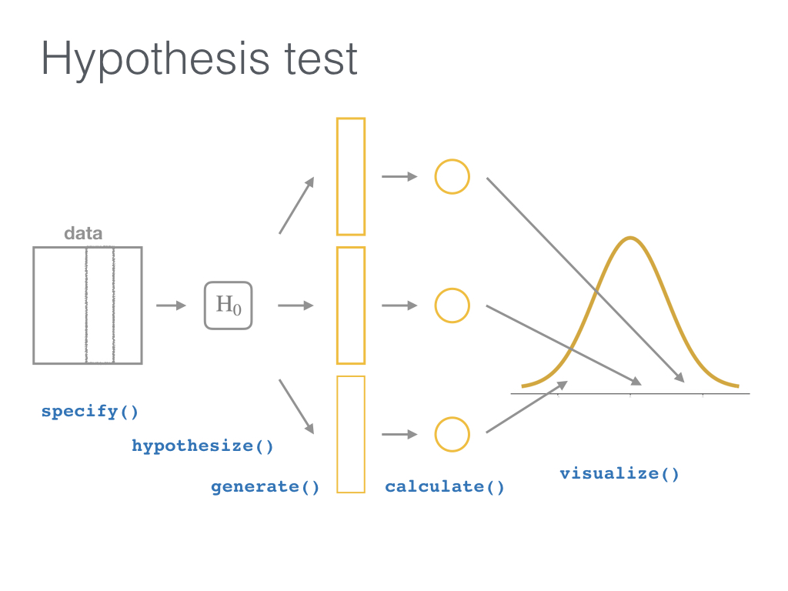

```{r include=FALSE, purl=TRUE}
# specify the packages of interest
pkgs <- c(
  "tidyverse", "moderndive", "dslabs",
  "infer", "janitor", "remotes", "knitr",
  "usethis"
)

# use this function to check if each package is on the local machine
# if a package is installed, it will be loaded
# if any are not, the missing package(s) will be installed and loaded
pkg_check <- function(x) {
  if (!require(x, character.only = TRUE)) {
    install.packages(x, dependencies = TRUE, repos = "https://cran.rstudio.com")
    library(x, character.only = TRUE)
  }
}
lapply(pkgs, pkg_check)

if (!require("fontawesome")) {
  remotes::install_github("rstudio/fontawesome")
}

if (!require("countdown")) {
  remotes::install_github("gadenbuie/countdown")
}

```

```{r echo=FALSE, purl=FALSE}
library(ggplot2)
knitr::opts_chunk$set(
  warning = FALSE, message = FALSE, 
  fig.width = 10.5, fig.height = 4, 
  comment = NA, rows.print = 16
)
theme_set(theme_gray(base_size = 24))
options(digits = 5, width = 65, knitr.table.format = "html",
        pillar.min_chars = 20, tibble.print_min = 5)
library(fontawesome)

img_link <- function(link, file, size) {
  knitr::asis_output(
    paste0(
      '<center>\n<a href="',
      link,
      '">\n\n</a>\n</center>'
    )
  )
}
```

class: middle, center

# Tidyverse Tools in R for <br> Data Science and Statistical Inference

## Dr. Jessica Minnier and Dr. Chester Ismay 

`r knitr::include_graphics("images/csp-logo-virtual.png", dpi = 200)`

### Slides available at <http://bit.ly/csp-tidy-slides> 

### PDF slides at <http://bit.ly/csp-tidy-pdf>

???

Welcome to our course! You can find the link to the HTML version of our slides
as well as the PDF version here. We'll give you a few minutes to get these
loaded and then start with introductions of your presenters.

---

name: our-info
class: middle

<h5></h5>

.pull-left[
  
  
  <small>Associate Professor of Biostatistics</small>
  
  

  <br>

  [`r fa(name = "twitter")` @datapointier](http://twitter.com/datapointier)  
  [`r fa(name = "github")` @jminnier](http://github.com/jminnier)  
  [`r fa(name = "link")` jessicaminnier.com](https:/jessicaminnier.com)  
<!--  [`r fa(name = "paper-plane")` `minnier [at] ohsu [dot] edu`](mailto:minnier@ohsu.edu) -->
]

.pull-right[
  
  
  <small>Data Science Evangelist</small>
  
  <br>
  
  
  
  <br><br>
  
  [`r fa(name = "twitter")` @old_man_chester](http://twitter.com/old_man_chester)  
  [`r fa(name = "github")` @ismayc](http://github.com/ismayc)  
  [`r fa(name = "link")` chester.rbind.io](https://chester.rbind.io)  
<!--  [`r fa(name = "paper-plane")` `chester [dot] ismay [at] datarobot [dot] com`](mailto:chester.ismay@datarobot.com) -->
]

???

Hello. My name is Chester and I lead data science and machine learning courses
for DataRobot. I'm based in Portland, Oregon. I'm next going to give you an
overview of the content of this course and review R prerequisites to follow
along with us before I turn it back over to Jessica
to lead you through the first part of the course.

---

name: toc
  
# Table of Contents

Part 1
- [Introduction and Setup](#getting-started)
- [Data Wrangling](#wrangling)
- [Data Visualization Basics](#viz)

Part 2
- [Sampling](#sampling)
- [Inference](#inference)

???
The first part of the course is focused on exploratory data analysis in
the tidyverse and the second part is about statistical inference using
data science principles you'll learn about in the first part.
---

layout: true

<div class="my-footer"><span>Slides at https://bit.ly/csp-tidy-slides &emsp; &emsp; &emsp; &emsp; &emsp; &emsp; &emsp; &emsp; &emsp; Return to <u><a style="color:White;" href="slide_deck.html#toc">Table of Contents</a></u></span></div>

---

name:getting-started

## Prior Installation

Make sure you have the current R, RStudio, & R packages
- [Novice's Guide](https://moderndive.com/1-getting-started.html) on ModernDive.com

???
We recommend that you have the following versions of R, RStudio, and some R
packages downloaded. If you are having issues getting these things going right
now, we recommend you just follow along with the slides and work to get the
installations working during exercises and our break about halfway through.

--

***

- [R (version 4.0.2 or greater)](https://cloud.r-project.org/)
- [RStudio (version 1.4 or greater)](https://www.rstudio.com/products/rstudio/download3/)

***

<!--
These slides were built using

```{r}
R.version.string
```

```{r}
rstudioapi::versionInfo()$version
```
-->

<br>

- Run this in the RStudio Console

```{r, eval=FALSE, purl=FALSE}
pkgs <- c(
  "tidyverse", "moderndive", "dslabs", 
  "infer", "janitor", "usethis"
  )
install.packages(pkgs)
```

???
If you already downloaded the course materials and already ran the prereqs.R,
you can skip running this code again. After you've run these commands to get the packages installed, please follow
the steps on the next slide. I'll leave this up for a little bit to make sure
those following along can copy the code into RStudio and run it.

---


# Getting started

**1.** Open HTML slides: <https://bit.ly/csp-tidy-slides>

**2.** Open RStudio  

**3.** Download course materials to your preferred location by copying this
and running it in the RStudio Console: 
   
```{r eval=FALSE}
usethis::use_course("https://csp2021.netlify.app/materials.zip")
```

**4.** Edit Google Doc to ask and answer questions:
[https://bit.ly/csp-tidy-doc](https://docs.google.com/document/d/1Qsf1-GNMkjkP7lQAdiuhuu-gEP2reS2vkxRwfdXdYUI/edit)

???
- Just a reminder here on the HTML slides link if you missed it at the beginning.
It will also be available at the bottom of the slides as you can see here
throughout the presentation.

- Please follow steps 2 and 3 next including copying the code in step 3 and
running in RStudio. This will start up a new RStudio project and make sure
you have the code available that we will go over.

- Lastly please open up the Google Doc linked here. You can add your questions
and any issues you are having here. We'll be keeping an eye on it. Help out
your fellow participants as well if you are able to answer questions before
Jessica or I can. 

- I'm going to turn it over to Jessica now to get us going
on the content.
---

class: inverse, center, middle

# R Data Types

---

## Data types review

Vector/variable
  - Type of vector (`int`, `num` or `dbl`, `chr`, `lgl`, `date`)

--

Data frame
  - Vectors of (potentially) different types
  - Each vector has the same number of rows

---

## Data types review

```{r eval=FALSE, purl=FALSE}
library(tibble) # tibble is the tidyverse data.frame
library(lubridate)
ex1 <- tibble(
  vec1 = c(1980, 1990, 2000, 2010),
  vec2 = c(1L, 2L, 3L, 4L),
  vec3 = c("low", "low", "high", "high"),
  vec4 = c(TRUE, FALSE, FALSE, FALSE),
  vec5 = ymd(c("2017-05-23", "1776/07/04", 
               "1983-05/31", "1908/04-01"))
)
ex1
```

--

```{r echo=FALSE, purl=TRUE}
library(tibble) # tibble is the tidyverse data.frame
library(lubridate)
ex1 <- tibble(
  vec1 = c(1980, 1990, 2000, 2010),
  vec2 = c(1L, 2L, 3L, 4L),
  vec3 = c("low", "low", "high", "high"),
  vec4 = c(TRUE, FALSE, FALSE, FALSE),
  vec5 = ymd(c("2017-05-23", "1776/7/04", "1983-5/31", "1908/04-1"))
)
ex1
```
  
---

## Learning objectives

### Part 1

- Distinguish between different {tidyverse} packages
- Assess different {dplyr} functions for wrangling data
- Discuss the power of "tidy data"
- Develop an intuition behind {ggplot2} plotting syntax

---

class: center, middle

### Shameless plug


---

class: center, middle, inverse

# Getting started with {dplyr}

.pull-left[


<br>

[Alison Horst](https://github.com/allisonhorst/stats-illustrations) 
]

.pull-right[


<!-- New hex is fine here too -->

[dplyr package](https://dplyr.tidyverse.org)
]

---

class: center, middle  
  
## Welcome to the [tidyverse](https://blog.rstudio.org/2016/09/15/tidyverse-1-0-0/)!
  
The {tidyverse} is a collection of R packages that share common philosophies 
and are designed to work together. <br><br> 
  
```{r echo=FALSE}
img_link(
  link = "https://tidyverse.tidyverse.org",
  file = "images/tidyverse_hex.png",
  size = 200
)
```

---

## First motivating example for today

```{r echo=FALSE}
img_link(
  link = "http://gitsense.github.io/images/wealth.gif",
  file = "images/wealth.gif",
  size = 700
)
```


- Inspired by the late, great [Hans Rosling](https://www.youtube.com/watch?v=jbkSRLYSojo)

---

## The `gapminder` data set in {dslabs}

```{r, purl=TRUE}
library(dslabs)
library(dplyr)
gapminder <- tibble(gapminder)
glimpse(gapminder)
```


- Also check out [the {gapminder} package](https://github.com/jennybc/gapminder)

---

name: wrangling

## What is data wrangling?

.pull-left[
- "data janitor work"
- importing data
- cleaning data
- changing shape of data
]
.pull-right[
- fixing errors and poorly formatted data elements
- transforming columns and rows
- filtering, subsetting
]

<br>

```{r echo=FALSE}
img_link(
  link = "https://r4ds.had.co.nz/introduction.html",
  file = "images/r4ds_tidyverse.png",
  size = 600
)
```

---

## Base R versus the {tidyverse}

- The mean life expectancy across all years for Asia
--

```{r, purl=TRUE}
# Base R
asia <- gapminder[gapminder$continent == "Asia", ]
mean(asia$life_expectancy)
```
--
 
```{r purl=FALSE}
library(dplyr)
gapminder %>%
  filter(continent == "Asia") %>%
  summarize(mean_exp = mean(life_expectancy))
```

---

## The pipe `%>%`

 &emsp; &emsp; &emsp; 
--

- A way to chain together commands
- Can be read as "and then" when reading over code
--

```{r eval=FALSE, purl=FALSE}
library(dplyr)
gapminder %>%
  filter(continent == "Asia") %>%
  summarize(mean_exp = mean(life_expectancy))
```

---

class: inverse

## `filter()` rows that satisfy specified conditions

```{r echo=FALSE}
img_link(
  link = "https://github.com/allisonhorst/stats-illustrations",
  file = "images/dplyr_filter.jpg",
  size = 1100
)
```


---

name: filter

## `dplyr::filter()`

- Arguments are "filters" that you'd like to apply.
--

```{r, purl=TRUE}
gap_2014 <- gapminder %>% filter(year == 2014)
gap_2014
```

- Use `==` to compare a variable to a value

---

## Logical operators

- Use `|` to check for any in multiple filters being true:
--

```{r eval=FALSE, purl=FALSE}
gapminder %>%
  filter(life_expectancy < 50 | fertility > 4) %>%
  slice_sample(n = 8)
```
--

```{r echo=FALSE, purl=TRUE}
set.seed(2018)
gapminder %>%
  filter(life_expectancy < 50 | fertility > 4) %>%
  slice_sample(n = 8)
```

---

## Logical operators

- Use `,` to check for all of multiple filters being true:
--

```{r eval=FALSE, purl=FALSE}
gapminder %>%
  filter(life_expectancy < 50, fertility > 4)
```

```{r echo=FALSE, purl=TRUE}
gapminder %>%
  filter(life_expectancy < 50, fertility > 4) %>%
  head(8)
```

---

## Logical operators

- Use `%in%` to check for any being true <br> (shortcut to using `|` repeatedly with `==`)
--

```{r eval=FALSE, purl=FALSE}
gapminder %>%
  filter(country %in% c("Argentina", "Belgium", "Mexico"),
         year %in% c(2012, 2015))
```
--

```{r echo=FALSE, purl=TRUE}
gapminder %>%
  filter(
    country %in% c("Argentina", "Belgium", "Mexico"),
    year %in% c(2012, 2015)
  )
```

---

class: center, middle
background-color: coral

# Your Turn
---

name: yourturnA


```{r echo=FALSE}
counter <- 1
```

## Exercise `r LETTERS[counter]` - 5 minutes

```{r echo=FALSE}
counter <- counter + 1
```
1. Filter observations from either Europe or Africa using the `|`.
2. Filter observations from either Africa or Asia using `%in%`.
3. How many countries had life expectancy greater than 80 years in 1996?

```{r soln1, include = FALSE}
gapminder %>% filter(continent == "Europe" | continent == "Africa")
gapminder %>% filter(continent %in% c("Africa", "Asia"))
gapminder %>% filter(life_expectancy > 80, year == 1996)
```
```{r include=FALSE}
# This code generates the HTML code that follows
# to get a timer
countdown::countdown(minutes = 5, 
          left = 0, right = 0,
          padding = "30px",
          margin = "10%",
          font_size = "5em")
```
<div class="countdown blink-colon" id="timer1" style="right:0;bottom:0;left:0;margin:10%;padding:5px;font-size:5em;" data-warnwhen="0">
<code class="countdown-time"><span class="countdown-digits minutes">05</span><span class="countdown-digits colon">:</span><span class="countdown-digits seconds">00</span></code>
</div>

---

class: center, middle
background-color: turquoise

# Walk through exercise in RStudio

---

name: summarize

## `summarize()`

- Any numerical summary that you want to apply to a column of a data frame is specified within `summarize()`.

```{r eval=FALSE, purl=FALSE}
stats_2015 <- gapminder %>%
  filter(year == 2015) %>%
  summarize(
    max_exp = max(life_expectancy),
    sd_exp = sd(life_expectancy)
  )
stats_2015
```
--

```{r echo=FALSE, purl=TRUE}
stats_2015 <- gapminder %>%
  filter(year == 2015) %>%
  summarize(
    max_exp = max(life_expectancy),
    sd_exp = sd(life_expectancy)
  )
stats_2015
```

---

name: groupby

### Combining `summarize()` with `group_by()`

- When you'd like to determine a numerical summary for all
levels of a different categorical variable

```{r eval=FALSE, purl=FALSE}
max_exp_2015_by_cont <- gapminder %>%
  filter(year == 2015) %>%
  group_by(continent) %>%
  summarize(max_exp = max(life_expectancy),
            sd_exp = sd(life_expectancy))
max_exp_2015_by_cont
```

--
```{r echo=FALSE, purl=TRUE}
max_exp_2015_by_cont <- gapminder %>%
  filter(year == 2015) %>%
  group_by(continent) %>%
  summarize(max_exp = max(life_expectancy),
            sd_exp = sd(life_expectancy))
max_exp_2015_by_cont
```

---

class: inverse

## `mutate()` changes the data

```{r echo=FALSE}
img_link(
  link = "https://github.com/allisonhorst/stats-illustrations",
  file = "images/dplyr_mutate.png",
  size = 600
)
```

---

name: mutate

## `mutate()`

- Most importantly, allows you to create a new variable based on other variables

--

```{r, purl=TRUE}
gapminder_plus <- gapminder %>% 
  mutate(gdp_per_capita = gdp / population)
slice_sample(gapminder_plus, n = 4)
```

---

class: center, middle

<h5></h5>

```{r echo=FALSE}
img_link(
  link = "https://github.com/allisonhorst/stats-illustrations",
  file = "images/tidydata_1.jpg",
  size = 1200
)
```

---

class: center, middle

<h5></h5>

```{r echo=FALSE}
img_link(
  link = "https://github.com/allisonhorst/stats-illustrations",
  file = "images/tidydata_2.jpg",
  size = 1200
)
```

---

name: arrange

## `arrange()`

- Reorders the rows in a data frame based on the values of one or more variables
--

```{r, purl=TRUE}
gapminder_plus %>%
  arrange(year, country)
```

---

## `arrange()`

- Can also put into descending order
--

```{r desc, purl=TRUE}
gapminder_plus %>%
  filter(year > 2000) %>%
  arrange(desc(life_expectancy))
```

---

## Don't mix up `arrange()` and `group_by()`

- `group_by()` is used (mostly) with `summarize()` to calculate summaries 
over groups

- `arrange()` is used for sorting

---

## Don't mix up `arrange()` and `group_by()`

This doesn't really do anything useful by itself

```{r purl=TRUE}
gapminder %>% group_by(country)
```

---

## Don't mix up `arrange()` and `group_by()`

But this does

```{r purl=TRUE}
gapminder %>% arrange(country)
```

---

name: select

## `select()`

- Chooses a subset of _columns_ (don't mix up with `filter()`)

```{r}
gapminder_plus %>% 
  select(country, region, gdp_per_capita)
```

---


class: center, middle
background-color: coral

# Your Turn
---

name: yourturnB

## Exercise `r LETTERS[counter]` - 5 minutes

```{r echo=FALSE}
counter <- counter + 1
```
1. Create a data frame that has the median life expectancy by year.
2. Use `arrange()` on this data frame to see the top years with the highest median life expectancy. What about the year with the lowest median life expectancy?
3. Create a new column that is median life expectancy rounded to the nearest integer, and remove the original un-rounded column with `select()`.

```{r soln2, include=FALSE}
lifeyear <- gapminder %>%
  group_by(year) %>%
  summarize(med_exp = median(life_expectancy))

lifeyear %>% arrange(desc(med_exp))
lifeyear %>% arrange(med_exp)
lifeyear %>% mutate(med_exp_round = round(med_exp)) %>% select(-med_exp)
```

```{r include=FALSE}
# This code generates the HTML code that follows
# to get a timer
countdown::countdown(minutes = 5, 
          left = 0, right = 0,
          padding = "30px",
          margin = "10%",
          font_size = "5em")
```
<div class="countdown blink-colon" id="timer1" style="right:0;bottom:0;left:0;margin:10%;padding:5px;font-size:5em;" data-warnwhen="0">
<code class="countdown-time"><span class="countdown-digits minutes">05</span><span class="countdown-digits colon">:</span><span class="countdown-digits seconds">00</span></code>
</div>

---

class: center, middle
background-color: turquoise

# Walk through exercise in RStudio

---

name: viz
class: center, middle, inverse

##  Basics of {ggplot2}


.pull-left[


<br>

[Alison Horst](https://github.com/allisonhorst/stats-illustrations) 
]

.pull-right[


<br>

[ggplot2 package](https://ggplot2.tidyverse.org)
]

---

class: center, middle

```{r echo=FALSE}
img_link(
  link = "https://github.com/rstudio/cheatsheets/blob/master/data-visualization-2.1.pdf",
  file = "images/ggplot_basics_from_ppt.png",
  size = 1000
)
```


---

## Learning objectives

### Part 2

- Build a sampling distribution by repeatedly sampling from a population using the {moderndive} package
- Compose a visualization of a sampling distribution
- Construct a bootstrap distribution for a basic confidence interval of a statistic
- Perform tidy hypothesis testing using the {infer} package

???
- Welcome to Part 2 of the class. Here I'll introduce some statistical ideas
but we'll take a computational approach using the tidyverse framework you've
seen so far.
- We'll finish Part 2 by using the infer package for tidy statistical inference.

---

name: sampling

## Extending this {tidyverse} knowledge to something new

- How can we now learn about <u>sampling distributions</u>?

--

`r img_link("https://moderndive.com/7-sampling.html", "images/sampling_bowl.jpeg", 380)`

???
Let's say we were interested in the proportion of balls in this bin that were
red. Instead of taking all the balls out of the hopper, we could take a sample
using a shovel to get an estimate as to that proportion.

---

class: middle

```{r purl=TRUE}
library(moderndive)
bowl %>% slice_head(n = 15)
```

???
The moderndive package includes a tibble called bowl that represents
all of the balls in this hopper. The first 15 rows of this tibble are shown.

---

## One virtual scoop of 50 balls (one sample)

```{r purl=TRUE}
set.seed(8675309)
(jennys_sample <- bowl %>% slice_sample(n = 50))
```

???
Let's say our friend Jenny wants to take a sample of the entries in bowl.
We can do that programmatically using the slice_sample function from dplyr
after setting Jenny's seed value.

---

## Proportion that are red

```{r purl=TRUE}
jennys_sample %>%
  summarize(prop_red = mean(color == "red")) %>%
  pull()
```

```{r echo=FALSE}
jenny_prop <- jennys_sample %>%
  summarize(prop_red = mean(color == "red")) %>%
  pull()
```


???
- In this particular sample, we can see that Jenny had `r jenny_prop * 100`%
red balls.

--

## Is this how many are in the full bowl?

???
- Are we guaranteed that is the same proportion that are in the full bowl?
- No, different samples will lead to different proportions of red balls.
- If we repeated the process of sampling many times, we could then
get a sense for the variation in the proportion of red balls across samples.

---

## Sampling variability

### What does `rep_bowl_samples` look like?

```{r purl=TRUE, cache=TRUE}
library(moderndive)
library(infer)
rep_bowl_samples <- bowl %>%
  rep_slice_sample(n = 50, reps = 10000)
```

???
- That's exactly what is done here. The rep_slice_sample function repeatedly
samples from a data frame and then stacks the resulting rows on top of each
other.

--

### How about `bowl_props`?

```{r purl=TRUE}
bowl_props <- rep_bowl_samples %>%
  group_by(replicate) %>%
  summarize(prop_red = mean(color == "red"))
```

???
- The last step here is to group based on each of the ten thousand replicates
to get the proportion of red balls in each sample.
---

## The sampling distribution

```{r fig.height=4.7, purl=TRUE}
ggplot(data = bowl_props, mapping = aes(x = prop_red)) +
  geom_histogram(binwidth = 0.02, color = "white")
```

???
If we visualize the proportion of red variable, we can see how the
sample statistic varies from one sample to another for samples of size 50.
---

## Shifting focus

### What about if all we had was the one sample of balls (not the whole bowl)?

```{r purl=TRUE}
jennys_sample %>% count(color)
```

???
- In reality, we don't usually have the population of interest like we did here
with the `bowl` tibble.
- Rather we have only one sample and would like to understand the variability
we might expect from one sample to another.
--

### How could we use this sample to make a guess about the sampling variability from other samples?

???
- So how can we do this?
---

## Building up to statistical inference!

```{r purl=TRUE}
library(infer)
jennys_sample %>%
  specify(formula = color ~ NULL, success = "red")
```

???
- The infer package provides a way for us to do just this.
- We'll formalize the different functions in a bit but I want to first walk
through our example to help you get a feel for the syntax.
- First we specify that we are interested in looking for red balls with
a response variable set to color.

---

## Bootstrapping?

```{r purl=TRUE}
library(infer)
(bootstrap_samples <- jennys_sample %>%
  specify(formula = color ~ NULL, success = "red") %>%
  generate(reps = 5, type = "bootstrap"))
```

???
- We can use sampling with replacement from the color variable to create
bootstrap samples from our original sample of Jenny's.
- Five is chosen for the number of reps here just to help you see what is
going on initially.

---

## What does `bootstrap_samples` represent?

- Remember we assumed that all we had was the original sample of 19 red and 31 white to start.
--

- Hope each of the five sample selections in `bootstrap_samples` is similar to:

`r img_link("http://moderndive.netlify.com/images/sampling_bowl.jpeg", "images/big_sampling_bowl.jpeg", 500)`

???
One way I like to think about bootstrap sampling is that each bootstrap sample
is an attempt to guess at what the population might look like, using the 
original single sample as a guide.

---

## Bootstrap statistics

```{r purl=TRUE, cache=TRUE}
jennys_sample %>%
  specify(formula = color ~ NULL, success = "red") %>%
  generate(reps = 5, type = "bootstrap") %>%
  calculate(stat = "prop")
```

???
After collecting the samples, we last calculate the proportion of red balls
in each bootstrap sample to obtain five different bootstrap statistics.

---

## Do 10,000 reps to get a better sense for variability

### Just as we did with the sampling distribution

```{r purl=TRUE, cache=TRUE}
bootstrap_stats <- jennys_sample %>%
  specify(formula = color ~ NULL, success = "red") %>%
  generate(reps = 10000, type = "bootstrap") %>%
  calculate(stat = "prop")
```

???
- Lastly, we can go a step further and repeat this bootstrapping process many
times, say ten thousand.
- And then visualize it which we'll see next.

---

### The bootstrap distribution

```{r fig.height=2.7, echo=FALSE, purl=TRUE}
ggplot(data = bootstrap_stats, mapping = aes(x = stat)) +
  geom_histogram(binwidth = 0.02, color = "white") +
  geom_vline(
    xintercept = mean(bootstrap_stats$stat), color = "red",
    size = 2
  ) +
  xlim(0.15, 0.55) +
  geom_vline(
    xintercept = c(mean(bootstrap_stats$stat) - sd(bootstrap_stats$stat),
                   mean(bootstrap_stats$stat) + sd(bootstrap_stats$stat)), 
    color = "red", size = 1.5)
```

???
- I've added in some bars here corresponding to the mean of the distribution
as well as one standard deviation in both directions.
- This can provide a way to get a sense for sampling variability using
only a single sample.
--

### The sampling distribution

```{r fig.height=2.7, echo=FALSE, purl=TRUE}
ggplot(data = bowl_props, mapping = aes(x = prop_red)) +
  geom_histogram(binwidth = 0.02, color = "white") +
  geom_vline(
    xintercept = mean(bowl_props$prop_red), color = "red",
    size = 2
  ) +
  xlim(0.15, 0.55) +
  geom_vline(xintercept = c(mean(bowl_props$prop_red) - sd(bowl_props$prop_red), mean(bowl_props$prop_red) + sd(bowl_props$prop_red)), color = "red", size = 1.5)
```

???
- If you compare this to the actual sampling distribution we calculated before,
you can see that the variation in the two plots is similar.
- Thus, assuming you have a random sample from the population to start (and it
is of reasonable size---whatever that may mean for your problem), bootstrapping
can be a nice way to estimate the variability from one sample to another based
on your statistic of interest.

---

## Get a confidence interval

```{r}
get_ci(bootstrap_stats, level = 0.95)
```

- We are 95% "confident" the true proportion of red balls in the hopper/bowl is
between `r get_ci(bootstrap_stats, level = 0.95)[1]` and `r get_ci(bootstrap_stats, level = 0.95)[2]`.

???
- The infer package also includes a get_ci function, which you can use
to return the appropriate percentiles of the bootstrap distribution
corresponding to the level given.

--
***

- In the population:

```{r}
mean(bowl$color == "red")
```

???
- In this case, we expect about 95 confidence intervals out of 100 to include
the true value from the population and that's why we put confident in quotes.
- As a check since we know the population, we can calculate this proportion.
- Here we see that Jenny's sample would be one of the 95% of intervals that
includes the true population parameter of red balls.
---

## {infer} verbs

`r img_link("https://infer.tidymodels.org", "images/infer_ci.jpg", 650)`


???
- You've seen these verbs now via example but I'd like to walk through them
again now with a diagram.
- First, you specify which columns you'd like to work with. You've seen so far
only choosing one variable but you'll see soon that you can select a response
variable and an explanatory variable.
- Then, you can generate bootstrap samples.
- And calculate the appropriate statistic of interest from each sample.
- Looking at the standard deviation of these statistics provides as estimate
for the standard error denoted as SE here.

---

## {infer} verbs

`r img_link("https://infer.tidymodels.org", "images/infer_ht.jpg", 650)`

???
- The infer package was designed to also help with hypothesis testing.
- There is only one additional function there with `hypothesize()`.
- That allows you to denote what type of hypothesis test you are wanting to
perform as well as any other null values as needed.
- The `visualize()` function is a wrapper around ggplot2 to provide a quick
way to look at the statistics that have been produced.
- We'll see this further in our next example.


---

class: middle, center

# Statistical Inference

`r img_link("https://infer-dev.netlify.com", "images/infer_gnome.png", 400)`

<br>

.footnote[{infer} hex sticker designs kindly created by [Thomas Mock](https://www.linkedin.com/in/jthomasmock/)]

???
Thomas Mock was kind enough to produce a few different options for the
{infer} package hex sticker. My personal favorite is here with the gnome
learning about the unknown mu parameter from being in the fir tree.

---


# Research Question

If you see someone else yawn, are you more likely to yawn?

In an episode of the show *Mythbusters*, they tested the myth that yawning is contagious. 

--
- 50 adults who thought they were being considered for an appearance on the show. 

--

- Each participant was interviewed individually by a show recruiter ("confederate") who either yawned or did not.

--

- Participants then sat by themselves in a large van and were asked to wait. 

--

- While in the van, the Mythbusters watched to see if the unaware participants yawned.

???
- Next, I'd walk through another example that lends itself nicely to a hypothesis
testing framework.
- The TV show Mythbusters wanted to test if yawning is contagious.
- They selected 50 adults and split them into two groups.
- Some were shown a yawn and some weren't.
- They they observed whether each participant also yawned.

---

### Data

- `group`
  - 34 saw the confederate yawn (`seed`)
  - 16 did not see the confederate yawn (`control`)
- `yawn`
  - `yes` - participant yawned
  - `no` - participant did not yawn

--

```{r purl=TRUE}
library(moderndive)
mythbusters_yawn %>% slice(c(1, 3, 6, 19))
```

???
In the moderndive package, we've included a tibble based on the data presented.
Here are what a few rows of that data looks like.

---

# Results

`r img_link("https://github.com/sfirke/janitor", "images/janitor_hex.png", 150)`

```{r purl=TRUE}
library(janitor)
mythbusters_yawn %>%
  tabyl(group, yawn) %>%
  adorn_percentages() %>%
  adorn_pct_formatting() %>%
  adorn_ns()
```

???
- The janitor package provides some tools for looking at the table of yawn versus
group.
- We can see that those who were shown a yawn tended to also yawn more than
those that weren't shown a yawn.
---

## *Finding: CONFIRMED*

> "Though that's not an enormous increase, since they tested 50 people in the field, the gap was still wide enough for the MythBusters to confirm that yawning is indeed contagious." <sup>1</sup>

<br><br>

.footnote[
[1] http://www.discovery.com/tv-shows/mythbusters/mythbusters-database/yawning-contagious/]

???
Mythbusters said this statement on the show. Do you think they did the 
hypothesis test needed to check to see if that claim is appropriate?
---

## Really? Let's formally check this

- State the hypotheses

--

<br>

Null hypothesis:  

> There is no difference between the seed and control groups in the proportion of people who yawned.

--

Alternative hypothesis (directional): 

> More people (relatively) yawned in the seed group than in the control group.

---

## Test the hypothesis

**QUIZ**: Which type of hypothesis test would you conduct here?

- A. Independent samples t-test  
- B. Two proportion test  
- C. Chi-square Goodness of Fit  
- D. Analysis of Variance

<!--
## Answer: <br> &nbsp;&nbsp;&nbsp; B. Two proportion test
-->

---

## Two proportion test

$$H_0: p_{seed} - p_{control} = 0$$

--

$$H_A: p_{seed} - p_{control} > 0$$

---

## The observed difference

```{r purl=TRUE}
library(infer)
obs_diff <- mythbusters_yawn %>% 
  specify(yawn ~ group, success = "yes") %>%
  calculate(
    stat = "diff in props",
    order = c("seed", "control")
  )
obs_diff
```

???
We've added a shortcut into infer for calculating the observed statistic using
just specify and calculate. We'll add more verbs to this when we get to doing
the hypothesis test with infer.

---
class: middle, center

## Is this difference *meaningful*?

--

## Different question: 

--

## Is this difference *significant*?

---

# Modeling the null hypothesis

If... 

<br>

&emsp;&emsp; $H_0: p_{seed} = p_{control}$ &emsp;&emsp;

<br>

is true, then whether or not the participant saw someone else yawn does not matter.

--

<br>

In other words, there is no association between exposure and yawning.

???
We can test for independence between the group and yawn variables.

---
class: center, middle


???
One way to think about this framework of hypothesis testing is by
creating parallel universes where the null hypothesis is true and then
see where what we observed falls in relation to that.

---


.pull-left[
### Original universe
```{r echo=FALSE, purl=TRUE}
mythbusters_yawn  %>%
  slice(c(1:6, 15:20)) %>% 
  knitr::kable()
mythbusters_yawn %>%
  tabyl(group, yawn) %>%
  adorn_totals(where = c("row", "col"))
```
]

???
Our original universe looks like this.

--

.pull-right[
### Parallel universe
```{r echo=FALSE, purl=TRUE}
set.seed(201)
perm1 <- mythbusters_yawn %>%
  specify(
    formula = yawn ~ group,
    success = "yes"
  ) %>%
  hypothesize(null = "independence") %>%
  generate(reps = 1, type = "permute") %>%
  ungroup() %>%
  mutate(subj = seq(1, 50)) %>%
  select(subj, group, alt_yawn = yawn)
perm1 %>%
  slice(c(1:6, 15:20)) %>% 
  knitr::kable()
perm1 %>%
  tabyl(group, alt_yawn) %>%
  adorn_totals(where = c("row", "col"))
```
]

???
One parallel universe looks like this. Notice that the overall Totals in the 
table at the bottom stays the same, but the values of the response variable have
been shuffled.

---

# 1000 parallel universes

.pull-left[
```{r echo=FALSE, purl=TRUE, cache=TRUE}
yawn_universes <- mythbusters_yawn %>%
  specify(yawn ~ group, success = "yes") %>%
  hypothesize(null = "independence") %>%
  generate(reps = 1000, type = "permute") %>%
  calculate(
    stat = "diff in props",
    order = c("seed", "control")
  )
yawn_universes %>%
  slice(1:15) %>% 
  knitr::kable()
```
]

.pull-right[
```{r echo=FALSE, purl=TRUE}
yawn_universes %>%
  slice(986:1000) %>% 
  knitr::kable()
```
]

???
We can next think about 1000 such parallel universes as well as the difference
in proportions for each of those replicates.

---
## The parallel universe distribution

```{r echo=FALSE, purl=TRUE, cache=TRUE}
set.seed(8)
null_distn <- mythbusters_yawn %>%
  specify(
    formula = yawn ~ group,
    success = "yes"
  ) %>%
  hypothesize(null = "independence") %>%
  generate(reps = 1000, type = "permute") %>%
  calculate(
    stat = "diff in props",
    order = c("seed", "control")
  )
null_plot <- null_distn %>%
  visualize(bins = 8) +
  shade_p_value(obs_stat = obs_diff, direction = "right") +
  labs(x = "Difference in proportions")
null_plot
```


The distribution of 1000 differences in proportions, if the null hypothesis were *true* and yawning was not contagious. 

???
It's always a little weird shading a histogram but you can see that around
40-50% of the values in this null distribution are greater than what we 
observed.

---
## Calculating the p-value

<!--
In how many of our "parallel universes" is the difference as big or bigger than the one we observed (`obs_diff`)?
-->

--

<br>

The shaded proportion is the p-value!

```{r purl=TRUE}
null_distn %>% 
  get_p_value(obs_stat = obs_diff, direction = "right")
```

???
- We can calculate this value directly using the get_p_value function from infer.
- This determines the proportion of statistics that are as extreme or more
extreme than what was observed in our sample.

---
class: middle, center
layout: false

## There is Only One Test!

[](http://allendowney.blogspot.com/2016/06/there-is-still-only-one-test.html)

???
This framework for thinking about hypothesis testing was inspired by
Allen Downey and his "There is Only One Test!" blogpost. If you click on the
diagram here it will send you to this webpage.

---


---


---


---


---


---


---


---


---


---



---


---


## {infer}

Five main functions:

- `specify()`
- `hypothesize()`
- `generate()`
- `calculate()`
- `visualize()`

---

## {infer}
<small>
- `specify()` the response and explanatory variables (`y ~ x`)
- `hypothesize()` what the null hypothesis is (here, `independence` of `y` and `x`)
- `generate()` new samples from parallel universes under the null hypothesis model:
    - <small>Resample from our original data <u>without replacement</u>, each time shuffling the `group` (`type = "permute"`)</small>
    - <small>Do this <u>a ton of times</u> (`reps = 1000`)</small>
- `calculate()` the statistic (`stat = "diff in props"`) for each of the `reps`
</small>

???
This slide gives you more details on what each step in the process looks like
for this example.

---

## {infer} example

```{r eval=FALSE, purl=FALSE, cache=TRUE}
set.seed(8)
null_distn <- mythbusters_yawn %>%
  specify(
    formula = yawn ~ group, 
    success = "yes"
  ) %>%
  hypothesize(null = "independence") %>%
  generate(reps = 1000, type = "permute") %>%
  calculate(
    stat = "diff in props", 
    order = c("seed", "control")
  )
```

???
The infer pipeline is verbose but it is designed to help beginners understand
simulation-based inference via the code written. It helps remind them of how
the problem is set up as well as the steps in Allen Downey's framework.

---

## Visualize the null distribution

- `visualize()` the distribution of the `stat` <br> (here, `diff in props`)

```{r include=FALSE, purl=TRUE}
set.seed(8)
null_distn <- mythbusters_yawn %>%
  specify(formula = yawn ~ group, success = "yes") %>%
  hypothesize(null = "independence") %>%
  generate(reps = 1000, type = "permute") %>%
  calculate(stat = "diff in props", order = c("seed", "control"))
```


```{r purl=TRUE}
null_distn %>%
  visualize(bins = 8) +
  shade_p_value(obs_stat = obs_diff, direction = "right")
```

???
Lastly, we can visualize and shade in the p-value to get a sense for its value
as well as a conceptual understanding of what it represents for this problem.

---

## Classical inference

Rely on theory to tell us what the null distribution looks like.

```{r eval=FALSE, include=FALSE, purl=FALSE}
theme_set(theme_gray(base_size = 22))
yawn_table <- table(group, yawn)
yz <- prop.test(
  x = yawn_table, n = nrow(mythbusters_yawn),
  alternative = "greater", correct = FALSE
)
obs_z <- yz %>%
  broom::tidy(yz) %>%
  pull(statistic)
```

```{r eval=FALSE, purl=FALSE}
obs_z <- mythbusters_yawn %>%
  specify(yawn ~ group, success = "yes") %>%
  calculate(stat = "z", order = c("seed", "control")) 

mythbusters_yawn %>%
  specify(yawn ~ group, success = "yes") %>%
  hypothesize(null = "independence") %>%
  # generate() is not needed since we are not simulating
  calculate(stat = "z", order = c("seed", "control")) %>%
  visualize(method = "theoretical") +
  shade_p_value(obs_stat = obs_z, direction = "right")
```

???
- infer also works for many of the common traditional classical inference
techniques like performing a z test here.
- The syntax is much the same except now we are calculating a z statistic
and we don't need to use generate since the normal distribution will be
used directly.

---

## Classical inference

```{r echo=FALSE, purl=TRUE, warning=TRUE, fig.height=4.5}
obs_z <- mythbusters_yawn %>%
  specify(yawn ~ group, success = "yes") %>%
  calculate(stat = "z", order = c("seed", "control"))
mythbusters_yawn %>%
  specify(yawn ~ group, success = "yes") %>%
  hypothesize(null = "independence") %>%
  # generate() is not needed since we are not doing simulation
  calculate(stat = "z", order = c("seed", "control")) %>%
  visualize(method = "theoretical") +
  shade_p_value(obs_stat = obs_z, direction = "right")
```

???
infer also gives a warning here that the assumptions behind a traditional
hypothesis test such as sample size and independence of observations have
not been checked.

---

# Simulation-based vs Classical (`stat = "z"`) 

```{r warning=FALSE, purl=TRUE, cache=TRUE}
mythbusters_yawn %>%
  specify(yawn ~ group, success = "yes") %>%
  hypothesize(null = "independence") %>%
  generate(reps = 1000, type = "permute") %>%
  calculate(stat = "z", order = c("seed", "control")) %>%
  visualize(method = "both", bins = 8) + 
  shade_p_value(obs_stat = obs_z, direction = "right")
```

???
Lastly, you can do both simulation and classical types of inference at the same
time using `visualize(method = "both)`.

---

## More info and resources

- https://infer.tidymodels.org/
  - Many examples under Articles
  - Discussed in [www.ModernDive.com](https://www.ModernDive.com)
      - [Sign up](http://eepurl.com/cBkItf) to the mailing list for updates
- [Learn the tidyverse](https://www.tidyverse.org/learn/)

---

layout: false
class: middle

<center>
<a href="https://www.tidyverse.org">

</a>&emsp;&emsp;<a href="https://moderndive.netlify.com"> 
</a>&emsp;&emsp;<a href="https://infer.tidymodels.org"> 
</a></center>

## Any further questions?

<!-- - Special thanks to -->

- Slides created via the R package [xaringan](https://github.com/yihui/xaringan) by Yihui Xie
- Slides' source code at <https://github.com/ismayc/talks/>
- R code from throughout the slides as an R script as [slide_code.R](https://raw.githubusercontent.com/ismayc/talks/master/csp-2021/slide_code.R)

---

class: middle, center

# Thanks!


.pull-left[
  [`r fa(name = "twitter")` @datapointier](http://twitter.com/datapointier)  
  [`r fa(name = "github")` @jminnier](http://github.com/jminnier)  
  [`r fa(name = "link")` jessicaminnier.com](https:/jessicaminnier.com)  
<!--  [`r fa(name = "paper-plane")` `minnier [at] ohsu [dot] edu`](mailto:minnier@ohsu.edu) -->
]

.pull-right[
  [`r fa(name = "twitter")` @old_man_chester](http://twitter.com/old_man_chester)  
  [`r fa(name = "github")` @ismayc](http://github.com/ismayc)  
  [`r fa(name = "link")` chester.rbind.io](https://chester.rbind.io)  
<!--  [`r fa(name = "paper-plane")` `chester [dot] ismay [at] datarobot [dot] com`](mailto:chester.ismay@datarobot.com) -->
]

???
We've also included some tips in the Appendix that follows.

---
class: inverse, center, middle

# Appendix

---

name: plug

## Freely available information

`r img_link("https://moderndive.com", "images/wide_format.png", 650)`

<center><h2>Statistical Inference via Data Science <br> A ModernDive into R and the Tidyverse</h2></center>

* Webpage: <https://moderndive.com>
* Developmental version: <https://moderndive.netlify.app>
* [GitHub Repo](https://github.com/moderndive/ModernDive_book)
* Please [signup](http://eepurl.com/cBkItf) for our mailing list!

---

## Good practices in RStudio

__Use projects__ ([read this](https://r4ds.had.co.nz/workflow-projects.html))
- Create an RStudio project for each data analysis project
- A project is associated with a directory folder
    + Keep data files there
    + Keep scripts there; edit them, run them in bits or as a whole
    + Save your outputs (plots and cleaned data) there

- Only use relative paths, never absolute paths
    + relative (good): `read_csv("data/mydata.csv")`
    + absolute (bad): 
    
    <code><small>read_csv("/home/yourname/Documents/stuff/mydata.csv")</small></code>
    
---

## Advantages of using RStudio projects

- standardize file paths
- keep everything together
- a whole folder can be shared and run on another computer

---

# Useful keyboard shortcuts

.pull-left[

action | mac | windows/linux
---| ---| ---
run code in script | cmd + enter | ctrl + enter 
`<-`| option + - | alt + -
`%>%` | cmd + shift + m | ctrl + shift + m
]

.pull-right[
Try typing (with shortcut) and running
```{r, eval=FALSE}
y <- 5
y
```
Now, in the console, press the up arrow.
]

---

## Other keyboard shortcuts: ([see full list](https://support.rstudio.com/hc/en-us/articles/200711853-Keyboard-Shortcuts))

action | mac | windows/linux
---| ---| ---
interrupt currently executing command | esc | esc
in console, go to previously run code | up/down | up/down
keyboard shortcut help | option + shift + k | alt + shift + k

