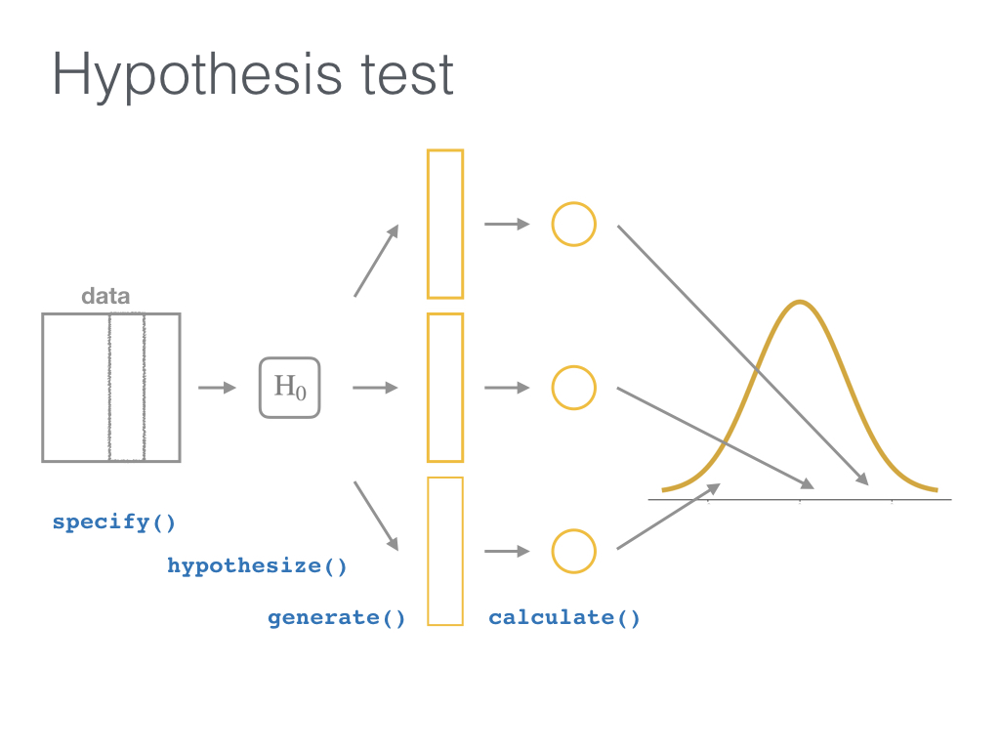

```{r include=FALSE, purl=TRUE}
# specify the packages of interest
pkgs <- c(
  "tidyverse", "moderndive", "dslabs",
  "infer", "janitor", "remotes", "knitr",
  "usethis"
)

# use this function to check if each package is on the local machine
# if a package is installed, it will be loaded
# if any are not, the missing package(s) will be installed and loaded
pkg_check <- function(x) {
  if (!require(x, character.only = TRUE)) {
    install.packages(x, dependencies = TRUE, repos = "https://cran.rstudio.com")
    library(x, character.only = TRUE)
  }
}
lapply(pkgs, pkg_check)

if (!require("fontawesome")) {
  remotes::install_github("rstudio/fontawesome")
}

if (!require("countdown")) {
  remotes::install_github("gadenbuie/countdown")
}

```

```{r echo=FALSE, purl=FALSE}
library(ggplot2)
knitr::opts_chunk$set(
  warning = FALSE, message = FALSE, 
  fig.width = 10.5, fig.height = 4, 
  comment = NA, rows.print = 16
)
theme_set(theme_gray(base_size = 24))
options(digits = 5, width = 65, knitr.table.format = "html",
        pillar.min_chars = 20, tibble.print_min = 5)
library(fontawesome)

img_link <- function(link, file, size) {
  knitr::asis_output(
    paste0(
      '<center>\n<a href="',
      link,
      '">\n\n</a>\n</center>'
    )
  )
}
```

class: middle, center

# Tidyverse Tools in R for <br> Data Science and Statistical Inference

## Dr. Jessica Minnier and Dr. Chester Ismay 

`r knitr::include_graphics("images/csp-logo-virtual.png", dpi = 200)`

### Slides available at <http://bit.ly/csp-tidy-slides> 

### PDF slides at <http://bit.ly/csp-tidy-pdf>

---

name: our-info
class: middle

<h5></h5>

.pull-left[
  
  
  <small>Associate Professor of Biostatistics</small>
  
  

  <br>

  [`r fa(name = "twitter")` @datapointier](http://twitter.com/datapointier)  
  [`r fa(name = "github")` @jminnier](http://github.com/jminnier)  
  [`r fa(name = "link")` jessicaminnier.com](https:/jessicaminnier.com)  
<!--  [`r fa(name = "paper-plane")` `minnier [at] ohsu [dot] edu`](mailto:minnier@ohsu.edu) -->
]

.pull-right[
  
  
  <small>Data Science Evangelist</small>
  
  <br>
  
  
  
  <br><br>
  
  [`r fa(name = "twitter")` @old_man_chester](http://twitter.com/old_man_chester)  
  [`r fa(name = "github")` @ismayc](http://github.com/ismayc)  
  [`r fa(name = "link")` chester.rbind.io](https://chester.rbind.io)  
<!--  [`r fa(name = "paper-plane")` `chester [dot] ismay [at] datarobot [dot] com`](mailto:chester.ismay@datarobot.com) -->
]


---

name: toc
  
# Table of Contents

Part 1
- [Introduction and Setup](#getting-started)
- [Data Wrangling](#wrangling)
- [Data Visualization Basics](#viz)

Part 2
- [Sampling](#sampling)
- [Inference](#inference)

---

layout: true

<div class="my-footer"><span>Slides at https://bit.ly/csp-tidy-slides &emsp; &emsp; &emsp; &emsp; &emsp; &emsp; &emsp; &emsp; &emsp; Return to <u><a style="color:White;" href="slide_deck.html#toc">Table of Contents</a></u></span></div>

---

name:getting-started

## Prior Installation

Make sure you have the current R, RStudio, & R packages
- [Novice's Guide](https://moderndive.com/1-getting-started.html) on ModernDive.com

--

***

- [R (version 4.0.2 or greater)](https://cloud.r-project.org/)
- [RStudio (version 1.4 or greater)](https://www.rstudio.com/products/rstudio/download3/)

***

<!--
These slides were built using

```{r}
R.version.string
```

```{r}
rstudioapi::versionInfo()$version
```
-->

<br>

- Run this in the RStudio Console

```{r, eval=FALSE, purl=FALSE}
pkgs <- c(
  "tidyverse", "moderndive", "dslabs", 
  "infer", "janitor", "usethis"
  )
install.packages(pkgs)
```


---


# Getting started

**1.** Open HTML slides: <https://bit.ly/csp-tidy-slides>

**2.** Open RStudio  

**3.** Download course materials to your preferred location by copying this
and running it in the RStudio Console: 
   
```{r eval=FALSE}
usethis::use_course("https://csp2021.netlify.app/materials.zip")
```

**4.** Edit Google Doc to ask and answer questions:
[https://bit.ly/csp-tidy-doc](https://docs.google.com/document/d/1Qsf1-GNMkjkP7lQAdiuhuu-gEP2reS2vkxRwfdXdYUI/edit)


---

class: inverse, center, middle

# R Data Types


???

Great, so we are assuming you have some experience with R, and so hopefully you are familiar with the various data types in R. 

---

## Data types review

Vector/variable
  - Type of vector (`int`, `num` or `dbl`, `chr`, `lgl`, `date`)

???

- But just as a refresher, the main components we work with are called vectors, which store a certain variable type, either from our data, or for other computational uses. So we have integer and numeric, also called double, which store numbers, as well as character for letters or words etc, as well as logical for true/false or boolean data, and date. You will probably encounter numeric and character most often, and date is useful for timestamp tor dates.
- Usually our data is basically a set of vectors or variables, and often of different types. In R, we store those in a data frame, which is essentially a rectangular data table or matrix, with information about different kinds of variables. We think of data frames as having observations usually by row, and so each vector in a data frame must have the same number of rows.
--

Data frame
  - Vectors of (potentially) different types
  - Each vector has the same number of rows


---

## Data types review

```{r eval=FALSE, purl=FALSE}
library(tibble) # tibble is the tidyverse data.frame
library(lubridate)
ex1 <- tibble(
  vec1 = c(1980, 1990, 2000, 2010),
  vec2 = c(1L, 2L, 3L, 4L),
  vec3 = c("low", "low", "high", "high"),
  vec4 = c(TRUE, FALSE, FALSE, FALSE),
  vec5 = ymd(c("2017-05-23", "1776/07/04", 
               "1983-05/31", "1908/04-01"))
)
ex1
```

???

- So if you have worked in R, you should have worked with data frames, and when you made a new data frame by hand you likely used the function data.frame. In the tidyverse, we use a different flavor of data frame called a tibble. Basically, it is a  data frame with some extra information and features. We can use the function tibble to create it. 
- Then, when we print out the new tibble, or fancy data frame, we can see the output tells us it is a tibble, it tells us the number of rows and columns, and we also see the variable or vector types at the top of the data frame. We don’t get this information automatically from a regular data frame. For all intents and purposes this acts like a data frame when doing analyses or data wrangling. The most noticable differences are usually in just how it is printed. Something you can’t see here is that if we had three thousand rows in this tibble, it would only print the top 10 or so. If you’ve ever accidentally printed a giant data frame in R, you know that the default way is to print all the rows, which is a bit annoying. So tibbles fix annoying things like that.
- We show you this, because when using the tidyverse functions, the output is going to be a tibble. Also, when you use tidyverse functions to read in data, such as read underscore excel, or read underscore table, the resulting data frame is actually a tibble. So just something to be aware of.
--

```{r echo=FALSE, purl=TRUE}
library(tibble) # tibble is the tidyverse data.frame
library(lubridate)
ex1 <- tibble(
  vec1 = c(1980, 1990, 2000, 2010),
  vec2 = c(1L, 2L, 3L, 4L),
  vec3 = c("low", "low", "high", "high"),
  vec4 = c(TRUE, FALSE, FALSE, FALSE),
  vec5 = ymd(c("2017-05-23", "1776/7/04", "1983-5/31", "1908/04-1"))
)
ex1
```
  
---

## Learning objectives

### Part 1

- Distinguish between different {tidyverse} packages
- Assess different {dplyr} functions for wrangling data
- Discuss the power of "tidy data"
- Develop an intuition behind {ggplot2} plotting syntax

???

Ok, so just a note about going forward and our goals for this super short introduction to tidyverse in the first hour. We want to talk about the differences between different tidyverse packages and look at different functions in the dplyr package for wrangling data. We will talk a bit about tidy data, and an extremely short intro to ggplot, really just a taste to get you interested in finding out more.

---

class: center, middle

### Shameless plug


???

Ok this is Chester’s shameless plug in that most of what we are talking about today is in this awesome book that Chester and his colleagues wrote, called Modern Dive. It’s available freely online at this websote, and was also recently published in book form as well. So if you want to learn more through reading and exercises, I definitely recommend it, and I can say that because I had nothing to do with it.


---

class: center, middle, inverse

# Getting started with {dplyr}

.pull-left[


<br>

[Alison Horst](https://github.com/allisonhorst/stats-illustrations) 
]

.pull-right[


<!-- New hex is fine here too -->

[dplyr package](https://dplyr.tidyverse.org)
]

???
Now, the first main tidyverse package we will talk about is dplyr, which is mainly for what we call data wrangling. 
---

class: center, middle  
  
## Welcome to the [tidyverse](https://blog.rstudio.org/2016/09/15/tidyverse-1-0-0/)!
  
The {tidyverse} is a collection of R packages that share common philosophies 
and are designed to work together. <br><br> 
  
```{r echo=FALSE}
img_link(
  link = "https://tidyverse.tidyverse.org",
  file = "images/tidyverse_hex.png",
  size = 200
)
```

???

We keep mentioning the tidyverse, but we haven’t actually defined that. So in general, the tidyverse refers to a collection of R packages that share common philosophies, mainly related to what we call tidy data and how functions are written, and they are designed to work together. The tidyverse became its own package somewhat recently, so that when you install the tidyverse package, it installs a small collection of packages. But there are many other packages that fit into the tidyverse universe, they just aren’t automatically installed with the tidyverse package. 
---

## First motivating example for today

```{r echo=FALSE}
img_link(
  link = "http://gitsense.github.io/images/wealth.gif",
  file = "images/wealth.gif",
  size = 700
)
```


- Inspired by the late, great [Hans Rosling](https://www.youtube.com/watch?v=jbkSRLYSojo)

???


- So before we talk about code, we want to motivate you with what we are trying to achieve with our data wrangling and visualization tools in the tidyverse. We won’t be able to get into detail on how to create a plot like this in an hour or two, but just know that once you have the foundation that we talk about today, it’s not too much more work to get to a pretty amazing visual like this. Here we have an animated visualization of income per capita vs life expectancy over the years from the gapminder data set which we will use today. This plot specifically is inspired by a talk the swedish physician Hans Rosling gave, and we recommend you spend some time watching his talks because he was a really great orator and conveyer of information with data and statistics.
- So the ultimate goal is really to convey information with our data, in an intuitive way.

---

## The `gapminder` data set in {dslabs}

```{r, purl=TRUE}
library(dslabs)
library(dplyr)
gapminder <- tibble(gapminder)
glimpse(gapminder)
```


- Also check out [the {gapminder} package](https://github.com/jennybc/gapminder)

???

- So that visualization was from the gapminder data, which is a free public data set from the world bank. It’s very large and all of it is available on the gapminder website, but some of it has been packaged up into an R data set. Here we are using a relatively small subset of the data found in dslabs package, but more data can be found in the gapminder package. In this data, we have about 10 thousand rows where each row or observation is for a country for one year, and we have information about those countries’ population size, infant mortality and life expectancy, and fertility rates, as well as gdp and where in the world that country is located.
- We are going to use this data for some exercises, so if you all could open an R script or R markdown or whatever you use in R and copy this code and run it right now, that will help for later.
---

name: wrangling

## What is data wrangling?

.pull-left[
- "data janitor work"
- importing data
- cleaning data
- changing shape of data
]
.pull-right[
- fixing errors and poorly formatted data elements
- transforming columns and rows
- filtering, subsetting
]

<br>

```{r echo=FALSE}
img_link(
  link = "https://r4ds.had.co.nz/introduction.html",
  file = "images/r4ds_tidyverse.png",
  size = 600
)
```

???

- In this first hour we are mostly talking about data wrangling. By data wrangling, we mean anything we do to manipulate data to get it ready for analyses or visualization, whether that’s what we think of as data cleaning, or changing the shape or filtering of the data, or transforming or fixing up the data in some way. 
- In this diagram we can see that data wrangling includes the import, tidying, and transformation of the data before the downstream visualize and model steps.  But we also might wrangle data that has been output from model steps, so it’s actually an integral step that happens throughout the entire data analysis process, and not just at the beginning.

---

## Base R versus the {tidyverse}

- The mean life expectancy across all years for Asia

???

- Now, how does working in the tidyverse differ from working in base R.
- CLICK: First let’s look at this simple example where we want to calculate the mean life expectancy across all years for the continent of Asia. In regular base R, we need to subset the data to get only rows where continent is equal to Asia, and the common way to do this is by putting a true false statement inside the bracket. Of course there are lots of ways to do this, maybe using the subset function, but I think this is probably the most common way we are taught. Since we are subsetting rows this goes in the first slot of the bracket, and we put a comma after and then a blank to get all the columns. Then, we need to calculate the mean of the column life expectancy. This works well.
- However, we have to admit this is hard to read, and confusing for beginners because the bracket, comma thing is not so intuitive.
- CLICK: In the tidy verse, using the dplyr package, we use what is called a pipe function, which is thisfunny symbol with percent greater than percent, to essentially chain together functions. We will explain this code in more detail, but this is what we’d do in the tidyverse, where we’d run this code to perform functions in order: first filtering rows where continent equals Asia, then summarizing to get the mean life expectancy. We end up with the same answer, though note the output is a tibble.
--

```{r, purl=TRUE}
# Base R
asia <- gapminder[gapminder$continent == "Asia", ]
mean(asia$life_expectancy)
```
--
 
```{r purl=FALSE}
library(dplyr)
gapminder %>%
  filter(continent == "Asia") %>%
  summarize(mean_exp = mean(life_expectancy))
```

---

## The pipe `%>%`

 &emsp; &emsp; &emsp; 


???

- let’s go through that code more in detail. first, what is this pipe? Like i mentioned, this is a way to chain together commands. In R, when running multiple functions, we often end up with a web of nested parantheses, or many rows where we save the output of one function and run a new function on it, and again and again. This is a way to do that just with one symbol, the pipe. When looking at code we read it as “and then”. 
- CLICK So for this example, we use the gapminder data, and then we filter by continent, and then we summarize with mean life expectancy. So here we are able to separate out our steps using the pipe, in the order that we perform these wrangling steps.
- If you’re in rstudio there’s also a keyboard shortcut, which is cmd-shift-m on a mac, or ctrl-shift-m on windows.

--

- A way to chain together commands
- Can be read as "and then" when reading over code
--

```{r eval=FALSE, purl=FALSE}
library(dplyr)
gapminder %>%
  filter(continent == "Asia") %>%
  summarize(mean_exp = mean(life_expectancy))
```

---

class: inverse

## `filter()` rows that satisfy specified conditions

```{r echo=FALSE}
img_link(
  link = "https://github.com/allisonhorst/stats-illustrations",
  file = "images/dplyr_filter.jpg",
  size = 1100
)
```

???

Digging deeper into that code, the first function we use (besides the pipe, which is technically a function in the same way the plus sign or bracket are functions), but the first data wrangling function we use is the filter function, which filters rows that satisfy specified conditions. We can have multiple conditions, strung together with logical operators like the & symbol, or or symbol, or other ways you might create a true false statement. This is similar to what you might put in the brackets using the base R way we showed earlier. We will talk a bit about these logical operators in the next slides.

---

name: filter

## `dplyr::filter()`

- Arguments are "filters" that you'd like to apply.

???

- Here is an example where we want to filter on year. The arguments are going to be the filters that we want to apply.
- CLICK  Note that we have to use the double equal sign to tell R we want a true/false statement. We can also see the output of the filter statement is again a tibble, this time with fewer rows because we’ve only taken the subset with year equal to 2014. Using the pipe however lets us easily keep going with our functions and we don’t really need to save this subset data to do our next step.


--

```{r, purl=TRUE}
gap_2014 <- gapminder %>% filter(year == 2014)
gap_2014
```

- Use `==` to compare a variable to a value

---

## Logical operators

- Use `|` to check for any in multiple filters being true:

???

- We had an example using the & logical operator to string two logical statements together, but there is also the or operator which is this vertical line. 
- CLICK: So we would check here whether life expectancy is less than 50 OR fertility is greater than 4, one or the other or both.
- CLICK: And again we can see the tibble output, where some rows for instance the first one, does not meet the life expectancy criteria but it does meet the fertility >4 criteria.

--

```{r eval=FALSE, purl=FALSE}
gapminder %>%
  filter(life_expectancy < 50 | fertility > 4) %>%
  slice_sample(n = 8)
```
--

```{r echo=FALSE, purl=TRUE}
set.seed(2018)
gapminder %>%
  filter(life_expectancy < 50 | fertility > 4) %>%
  slice_sample(n = 8)
```


---

## Logical operators

- Use `,` to check for all of multiple filters being true:

???

- Instead of using &, we can also use commas in the filter function to check that all filters are true. 
- CLICK So here the comma is like an and, so that we need life expectancy to be less than 50 AND fertility to be greater than 4.


--

```{r eval=FALSE, purl=FALSE}
gapminder %>%
  filter(life_expectancy < 50, fertility > 4)
```

```{r echo=FALSE, purl=TRUE}
gapminder %>%
  filter(life_expectancy < 50, fertility > 4) %>%
  head(8)
```

---

## Logical operators

- Use `%in%` to check for any being true <br> (shortcut to using `|` repeatedly with `==`)

???

- Another useful operator is the in operator, which checks whether one thing is in a vector of things. 
- CLICK: So here we want country to be in one of these countries, and year in one of these years. Note I said AND year in this set of years, because we have a comma. So we can have country equal to argentina but then we also need year to be either 2012 or 2015.
- CLICK: And we can see the output is a pretty small tibble, with just 6 rows.


--

```{r eval=FALSE, purl=FALSE}
gapminder %>%
  filter(country %in% c("Argentina", "Belgium", "Mexico"),
         year %in% c(2012, 2015))
```
--

```{r echo=FALSE, purl=TRUE}
gapminder %>%
  filter(
    country %in% c("Argentina", "Belgium", "Mexico"),
    year %in% c(2012, 2015)
  )
```

---

class: center, middle
background-color: coral

# Your Turn
---

name: yourturnA


```{r echo=FALSE}
counter <- 1
```

## Exercise `r LETTERS[counter]` - 5 minutes

```{r echo=FALSE}
counter <- counter + 1
```
1. Filter observations from either Europe or Africa using the `|`.
2. Filter observations from either Africa or Asia using `%in%`.
3. How many countries had life expectancy greater than 80 years in 1996?

```{r soln1, include = FALSE}
gapminder %>% filter(continent == "Europe" | continent == "Africa")
gapminder %>% filter(continent %in% c("Africa", "Asia"))
gapminder %>% filter(life_expectancy > 80, year == 1996)
```
```{r include=FALSE}
# This code generates the HTML code that follows
# to get a timer
countdown::countdown(minutes = 5, 
          left = 0, right = 0,
          padding = "30px",
          margin = "10%",
          font_size = "5em")
```
<div class="countdown blink-colon" id="timer1" style="right:0;bottom:0;left:0;margin:10%;padding:5px;font-size:5em;" data-warnwhen="0">
<code class="countdown-time"><span class="countdown-digits minutes">05</span><span class="countdown-digits colon">:</span><span class="countdown-digits seconds">00</span></code>
</div>

???

Exercise 1,
Ok so with that information about filtering, let’s have a bit of practice. We’ll just give you 5 minutes to work on this so don’t worry if you don’t get very far. We just want you to get into the data a bit if possible. If you don’t want to practice, feel free to take a break. If you haven’t been following along with your R code, it might take a bit to get the data up in Rstudio and everything (go back to slide 17 if you  need the code for the data), so at least try doing that so that for the next practice you’ll be ready. I’ll go over the answers when the timer is done.

---

class: center, middle
background-color: turquoise

# Walk through exercise in RStudio

---

name: summarize

## `summarize()`

- Any numerical summary that you want to apply to a column of a data frame is specified within `summarize()`.


```{r eval=FALSE, purl=FALSE}
stats_2015 <- gapminder %>%
  filter(year == 2015) %>%
  summarize(
    max_exp = max(life_expectancy),
    sd_exp = sd(life_expectancy)
  )
stats_2015
```


???

- Ok the second useful tidyverse function we will talk about today is summarize. If you remember when we were using base R, we saved the subset of data, and then we used the mean function to calculate the mean of a vector, which we selected using the dollar sign operator. 
- CLICK Here, we will use the pipe to chain together the filter and summarize functions. And summarize is a lot more powerful than just using individual functions like mean or sd or median. We can calculate the summary of several vectors of with multiple different summarization functions all at once. Here, we’ve filtered just for year 2015, and then we use summarize to output the max and standard deviation of life expectancy. 
- What we get is another tibble, with two columns, one for each summary. We also named them, which is what this part on the left side of the equals sign is doing. You can imagine we can really go wild with this function, and could add in mean, median, min, whatever you like, and even use your own functions or calculations within summarize. It’s very flexible. We also could have used multiple variables in the same summarize function.

--

```{r echo=FALSE, purl=TRUE}
stats_2015 <- gapminder %>%
  filter(year == 2015) %>%
  summarize(
    max_exp = max(life_expectancy),
    sd_exp = sd(life_expectancy)
  )
stats_2015
```

---

name: groupby

### Combining `summarize()` with `group_by()`

- When you'd like to determine a numerical summary for all
levels of a different categorical variable

```{r eval=FALSE, purl=FALSE}
max_exp_2015_by_cont <- gapminder %>%
  filter(year == 2015) %>%
  group_by(continent) %>%
  summarize(max_exp = max(life_expectancy),
            sd_exp = sd(life_expectancy))
max_exp_2015_by_cont
```

???

- A very powerful way to use summarize is in conjunction with the group_by() function. This is a common task in data summarization where we want to know for example the mean of a variable stratified by another factor. In this case, we have continent as a grouping variable, so it’s a categorical factor where we have a finite number of continents, and we want to know the max and standard deviation of life expectancy within each continent. So all we need to do is add this one line, group_by(continent).
- CLICK: Now we see the output is still a tibble, but instead of just one row with the summairzation for the whole data set, we have 5 rows for each of the five continents in the data. This makes it easy to compare across continents. We also see that the continent has been kept as a column in this tibble. This really helps with downstream visualizations and so on. I think this is one of those things that is super annoying to do in base R, but extremely easy to do in tidyverse. The group_by() function is used in a lot of different ways to do things in parallel essentially across different categorical variables.

--
```{r echo=FALSE, purl=TRUE}
max_exp_2015_by_cont <- gapminder %>%
  filter(year == 2015) %>%
  group_by(continent) %>%
  summarize(max_exp = max(life_expectancy),
            sd_exp = sd(life_expectancy))
max_exp_2015_by_cont
```

---

class: inverse

## `mutate()` changes the data

```{r echo=FALSE}
img_link(
  link = "https://github.com/allisonhorst/stats-illustrations",
  file = "images/dplyr_mutate.png",
  size = 600
)
```

???

Ok, so moving a bit away from summarization and filtering, and now we want to talk about adding variables or changing them in some way. This is where the mutate function comes in. 

---

name: mutate

## `mutate()`

- Most importantly, allows you to create a new variable based on other variables

???

- In base R, we could add or change variables in a data frame using the $ operator, where we save each new variable individually. With mutate, we can make that code a bit more intutive and readable.
- CLICK So for adding a new variable based on existing variables, like in this example, we we want to have gdp per capita, so we want gdp which is already a column, divided by the population column, we just have mutate with gdp_per_capita the name of the new varaible on the left of hte equal sign, and on the right of the equal sign we have hte code to create it, using existing variable names. We don’t need to use dollar signs or anything here. We can see the a random subset of 4 rows of the output tibble with this slice_sample function here. 
- Since we can’t see the column though, the slide is too small, I’ll go into R really quick just to show you what it looks like. I’m going to use a function View which shows us the tibble nicely in Rstudio. SHOW R CODE.

--

```{r, purl=TRUE}
gapminder_plus <- gapminder %>% 
  mutate(gdp_per_capita = gdp / population)
slice_sample(gapminder_plus, n = 4)
```

---

class: center, middle

<h5></h5>

```{r echo=FALSE}
img_link(
  link = "https://github.com/allisonhorst/stats-illustrations",
  file = "images/tidydata_1.jpg",
  size = 1200
)
```

???

- Ok, so we have been using the tidyverse package and functions, and I mentioned that all of these packages follow the same principles, and that mainly is to create and use what we call tidy data. Tidy data is just data that is built in a standard way that is easy to analyze and visualize. 
- In tidy data, we want each variable to form a column, and essentially have no combined information within a column that you need to do data gymnastics to extract. For example, if we have a medication in a column, we don’t want to to be something like the string advil 400 mg, because that is actually two pieces of information, the name of the medication and the dose. We’d want that to be two separate columns. 
- Second, we want each observation to form a row. That nuance can be seen most when using longitudinal data, so if we have multiple observations on one person, we want each of their observation to be a row, not in multiple columns. This is what we might call “long” data, as opposed to wide data. When you start working with ggplot, you’ll see why this format is especially useful, because we can plot each observation more easily with a column that specifies were all that information is, and a categorical visit number or time variable.
- Lastly, we want each cell to be a single measurement. This goes back to my advil mg example, because that is two pieces of information. So if every cell is just one piece of information it’s much easier to analyze and plot. 
- So that is the foundation of the tidyverse, in that we want all of our data to be tidy and ready for analysis. Often it takes a bit of wrangling and cleaning to get it there.

---

class: center, middle

<h5></h5>

```{r echo=FALSE}
img_link(
  link = "https://github.com/allisonhorst/stats-illustrations",
  file = "images/tidydata_2.jpg",
  size = 1200
)
```

???


The other benefit of tidy data is that tidy datasets are all alike. We don’t need to think too hard about the structure of the data when we are modeling with it. Though this is easier said than done sometimes, and I’m sure you’ve all had to deal with some absurdly messy or strangely formatted data sets. But hopefully these tidyverse functions will help you get your data in a tidy data format more easily.

---

name: arrange

## `arrange()`

- Reorders the rows in a data frame based on the values of one or more variables

???

- All of the functions so far have significantly changed the data in some way, through subsetting or summarizing, or mutating. But sometimes you just want to sort your data. Rather than opening it in excel, an easy way in the tidyverse is just using the arrange function. We can arrange or sort based on one or multiple variables, or even functions of variables.
- CLICK: Here’s a simple example where we sort first on year and then within the same year we sort on country. The default is to use an ascending sort .

--

```{r, purl=TRUE}
gapminder_plus %>%
  arrange(year, country)
```

---

## `arrange()`

- Can also put into descending order

???

If we want descending arrangement, we can use this desc function. Pretty simple.

--

```{r desc, purl=TRUE}
gapminder_plus %>%
  filter(year > 2000) %>%
  arrange(desc(life_expectancy))
```

---

## Don't mix up `arrange()` and `group_by()`

- `group_by()` is used (mostly) with `summarize()` to calculate summaries 
over groups

- `arrange()` is used for sorting

???

Ok just an aside, that arrange can sort the data for you, and you can save the output so now your data has been changed in the sense that the order of the rows is now different. However, this is not the same thing as group_by. Group_by is mostly a helper function that can be used with summarize to compute data summaries by a factor. If you use group_by() on a data set, the attributes actually change behind the scenes, but you won’t see any difference in the order it is printed. 

---

## Don't mix up `arrange()` and `group_by()`

This doesn't really do anything useful by itself

```{r purl=TRUE}
gapminder %>% group_by(country)
```

???


You can try it by using group_by() instead of arrange and printing the resulting tibble. It won’t look any different, but R will tell you that it has been grouped.

---

## Don't mix up `arrange()` and `group_by()`

But this does

```{r purl=TRUE}
gapminder %>% arrange(country)
```

???

Here, we use arrange instead, and we can see the output has changed.


---

name: select

## `select()`

- Chooses a subset of _columns_ (don't mix up with `filter()`)

```{r}
gapminder_plus %>% 
  select(country, region, gdp_per_capita)
```

???

- This is our last function we want to talk about, which is select. This essentially replaces the bracket and dollar sign game completely when we just want to subset or remove some columns. Just remember that filter which we learned earlier is for subsetting rows, and now we have select which is for subsetting columns. In this example, we are selecting country, region, and gdp per capita. The output is a tibble with just those 3 columns. 
- The select function is a lot more flexible than this, and we recommend reading about it more in Modern Dive or in the help documents to see all the ways you can use it. You can select by a condition like, contains the string gdp, for example, or select all numeric columns, or use the negative sign to remove columns, and so on. It’s super handy.

---


class: center, middle
background-color: coral

# Your Turn
---

name: yourturnB

## Exercise `r LETTERS[counter]` - 5 minutes

```{r echo=FALSE}
counter <- counter + 1
```
1. Create a data frame that has the median life expectancy by year.
2. Use `arrange()` on this data frame to see the top years with the highest median life expectancy. What about the year with the lowest median life expectancy?
3. Create a new column that is median life expectancy rounded to the nearest integer, and remove the original un-rounded column with `select()`.

```{r soln2, include=FALSE}
lifeyear <- gapminder %>%
  group_by(year) %>%
  summarize(med_exp = median(life_expectancy))

lifeyear %>% arrange(desc(med_exp))
lifeyear %>% arrange(med_exp)
lifeyear %>% mutate(med_exp_round = round(med_exp)) %>% select(-med_exp)
```

```{r include=FALSE}
# This code generates the HTML code that follows
# to get a timer
countdown::countdown(minutes = 5, 
          left = 0, right = 0,
          padding = "30px",
          margin = "10%",
          font_size = "5em")
```
<div class="countdown blink-colon" id="timer1" style="right:0;bottom:0;left:0;margin:10%;padding:5px;font-size:5em;" data-warnwhen="0">
<code class="countdown-time"><span class="countdown-digits minutes">05</span><span class="countdown-digits colon">:</span><span class="countdown-digits seconds">00</span></code>
</div>

???

Ok one more exercise now, before we get to our ggplot intro and then inference section. We will give you five minutes to work on these and then come back to the solutions together. Don’t worry if you don’t get through it all, or don’t know some of the helper functions, though as a hint, one of them for question 3 is the function round().

---

class: center, middle
background-color: turquoise

# Walk through exercise in RStudio

---

name: viz
class: center, middle, inverse

##  Basics of {ggplot2}


.pull-left[


<br>

[Alison Horst](https://github.com/allisonhorst/stats-illustrations) 
]

.pull-right[


<br>

[ggplot2 package](https://ggplot2.tidyverse.org)
]

???

Alright, with this being a tutorial, we really don’t have much time to get into details of the tidyverse, and ggplot really takes probably a couple hours to learn the fundamentals of ggplot. So we just want to basically show you that it fits in to the tidyverse universe, and there are a lot of resources out there to learn more. I know ggplot can be really intimidating if you haven’t used it before, but I’ll just say that once you get over the initial hump it really isn’t hard to use. 

---

class: center, middle

```{r echo=FALSE}
img_link(
  link = "https://github.com/rstudio/cheatsheets/blob/master/data-visualization-2.1.pdf",
  file = "images/ggplot_basics_from_ppt.png",
  size = 1000
)
```


???


- This is our one slide on ggplot. Ggplot has three main components, at least that’s the bare minimum you need to make a plot. Here we see we use the ggplot function which  names the data set we are using, in this case gapminder filtered to have just data from 2011, and then the aesthetic, which maps variables to plot elements. Here we map food supply to the x axis, life expectancy to the y axis, the four region categorical variable to the color, and the population number to the size of the point. 
- We lastly need to tell ggplot what kind of plot we want ot make, which is the geometry component. Here we use geom_point to say we want the point or scatterplot geometry. All ggplots are variations on this format, we might have geom_boxplot or histogram or all the other common types of plots. But we always need to specify the data, and the aesthetic with the geometry. We also need the data to be tidy, so that each row and column denote separate observations and variables that we want to plot. 
- I wish we had more time to get into the details here, but really there are a ton of resources out there so if you don’t use ggplot, it’s worth giving it a try.


---

## Learning objectives

### Part 2

- Build a sampling distribution by repeatedly sampling from a population using the {moderndive} package
- Compose a visualization of a sampling distribution
- Construct a bootstrap distribution for a basic confidence interval of a statistic
- Perform tidy hypothesis testing using the {infer} package

???

Alright before we get to part 2, we will take a short break to have a bit of a rest or whatever you need. Feel free to ask questions in the google doc or in chat during break. We will come back at XXXX.


---

name: sampling

## Extending this {tidyverse} knowledge to something new

- How can we now learn about <u>sampling distributions</u>?

--

`r img_link("https://moderndive.com/7-sampling.html", "images/sampling_bowl.jpeg", 380)`

---

class: middle

```{r purl=TRUE}
library(moderndive)
bowl %>% slice_head(n = 15)
```

---

## One virtual scoop of 50 balls (one sample)

```{r purl=TRUE}
set.seed(8675309)
(jennys_sample <- bowl %>% slice_sample(n = 50))
```

---

## Proportion that are red

```{r purl=TRUE}
jennys_sample %>%
  summarize(prop_red = mean(color == "red")) %>%
  pull()
```

--

## Is this how many are in the full bowl?

---

## Sampling variability

### What does `rep_bowl_samples` look like?

```{r purl=TRUE, cache=TRUE}
library(moderndive)
library(infer)
rep_bowl_samples <- bowl %>%
  rep_slice_sample(n = 50, reps = 10000)
```

--

### How about `bowl_props`?

```{r purl=TRUE}
bowl_props <- rep_bowl_samples %>%
  group_by(replicate) %>%
  summarize(prop_red = mean(color == "red"))
```


---

## The sampling distribution

```{r fig.height=4.7, purl=TRUE}
ggplot(data = bowl_props, mapping = aes(x = prop_red)) +
  geom_histogram(binwidth = 0.02, color = "white")
```

---

## Shifting focus

### What about if all we had was the one sample of balls (not the whole bowl)?

```{r purl=TRUE}
jennys_sample %>% count(color)
```

--

### How could we use this sample to make a guess about the sampling variability from other samples?

---

## Building up to statistical inference!

```{r purl=TRUE}
library(infer)
jennys_sample %>%
  specify(formula = color ~ NULL, success = "red")
```

---

## Bootstrapping?

```{r purl=TRUE}
library(infer)
(bootstrap_samples <- jennys_sample %>%
  specify(formula = color ~ NULL, success = "red") %>%
  generate(reps = 48, type = "bootstrap"))
```

---

## What does `bootstrap_samples` represent?

- Remember we assumed that all we had was the original sample of 19 red and 31 white to start.
--

- Hope each selection in `bootstrap_samples` is similar to:

`r img_link("http://moderndive.netlify.com/images/sampling_bowl.jpeg", "images/big_sampling_bowl.jpeg", 500)`

---

## Bootstrap statistics

```{r purl=TRUE, cache=TRUE}
jennys_sample %>%
  specify(formula = color ~ NULL, success = "red") %>%
  generate(reps = 48, type = "bootstrap") %>%
  calculate(stat = "prop")
```

---

## Do 10,000 reps to get a better sense for variability

### Just as we did with the sampling distribution

```{r purl=TRUE, cache=TRUE}
bootstrap_stats <- jennys_sample %>%
  specify(formula = color ~ NULL, success = "red") %>%
  generate(reps = 10000, type = "bootstrap") %>%
  calculate(stat = "prop")
```

---

### The bootstrap distribution

```{r fig.height=2.7, echo=FALSE, purl=TRUE}
ggplot(data = bootstrap_stats, mapping = aes(x = stat)) +
  geom_histogram(binwidth = 0.02, color = "white") +
  geom_vline(
    xintercept = mean(bootstrap_stats$stat), color = "red",
    size = 2
  ) +
  xlim(0.15, 0.55) +
  geom_vline(xintercept = c(mean(bootstrap_stats$stat) - sd(bootstrap_stats$stat), mean(bootstrap_stats$stat) + sd(bootstrap_stats$stat)), color = "red", size = 1.5)
```

### The sampling distribution

```{r fig.height=2.7, echo=FALSE, purl=TRUE}
ggplot(data = bowl_props, mapping = aes(x = prop_red)) +
  geom_histogram(binwidth = 0.02, color = "white") +
  geom_vline(
    xintercept = mean(bowl_props$prop_red), color = "red",
    size = 2
  ) +
  xlim(0.15, 0.55) +
  geom_vline(xintercept = c(mean(bowl_props$prop_red) - sd(bowl_props$prop_red), mean(bowl_props$prop_red) + sd(bowl_props$prop_red)), color = "red", size = 1.5)
```

---

## Get a confidence interval

```{r}
get_ci(bootstrap_stats, level = 0.95)
```

- We are 95% "confident" the true proportion of red balls in the hopper/bowl is
between `r get_ci(bootstrap_stats, level = 0.95)[1]` and `r get_ci(bootstrap_stats, level = 0.95)[2]`.

--
***

- In the population:

```{r}
mean(bowl$color == "red")
```


---

## {infer} verbs

`r img_link("https://infer.tidymodels.org", "images/infer_ci.jpg", 650)`


---

## {infer} verbs

`r img_link("https://infer.tidymodels.org", "images/infer_ht.jpg", 650)`


---

class: middle, center

# Statistical Inference

`r img_link("https://infer-dev.netlify.com", "images/infer_gnome.png", 400)`

<br>

.footnote[{infer} hex sticker designs kindly created by [Thomas Mock](https://www.linkedin.com/in/jthomasmock/)]

---


# Research Question

If you see someone else yawn, are you more likely to yawn?

In an episode of the show *Mythbusters*, they tested the myth that yawning is contagious. 

--
- 50 adults who thought they were being considered for an appearance on the show. 

--

- Each participant was interviewed individually by a show recruiter ("confederate") who either yawned or did not.

--

- Participants then sat by themselves in a large van and were asked to wait. 

--

- While in the van, the Mythbusters watched to see if the unaware participants yawned.


---

### Data

- `group`
  - 34 saw the confederate yawn (`seed`)
  - 16 did not see the confederate yawn (`control`)
- `yawn`
  - `yes` - participant yawned
  - `no` - participant did not yawn

--

```{r purl=TRUE}
library(moderndive)
mythbusters_yawn %>% slice(c(1, 3, 6, 19))
```

---

# Results

`r img_link("https://github.com/sfirke/janitor", "images/janitor_hex.png", 150)`

```{r purl=TRUE}
library(janitor)
mythbusters_yawn %>%
  tabyl(group, yawn) %>%
  adorn_percentages() %>%
  adorn_pct_formatting() %>%
  adorn_ns()
```

---

## *Finding: CONFIRMED*

> "Though that's not an enormous increase, since they tested 50 people in the field, the gap was still wide enough for the MythBusters to confirm that yawning is indeed contagious." <sup>1</sup>

<br><br>

.footnote[
[1] http://www.discovery.com/tv-shows/mythbusters/mythbusters-database/yawning-contagious/]


---

## Really? Let's formally check this

- State the hypotheses

--

<br>

Null hypothesis:  

> There is no difference between the seed and control groups in the proportion of people who yawned.

--

Alternative hypothesis (directional): 

> More people (relatively) yawned in the seed group than in the control group.

---

## Test the hypothesis

**QUIZ**: Which type of hypothesis test would you conduct here?

- A. Independent samples t-test  
- B. Two proportion test  
- C. Chi-square Goodness of Fit  
- D. Analysis of Variance

<!--
## Answer: <br> &nbsp;&nbsp;&nbsp; B. Two proportion test
-->

---

## Two proportion test

$$H_0: p_{seed} - p_{control} = 0$$

--

$$H_A: p_{seed} - p_{control} > 0$$

---

## The observed difference

```{r purl=TRUE}
library(infer)
obs_diff <- mythbusters_yawn %>% 
  specify(yawn ~ group, success = "yes") %>%
  calculate(
    stat = "diff in props",
    order = c("seed", "control")
  )
obs_diff
```

---
class: middle, center

## Is this difference *meaningful*?

--

## Different question: 

--

## Is this difference *significant*?

---

# Modeling the null hypothesis

If... 

<br>

&emsp;&emsp; $H_0: p_{seed} = p_{control}$ &emsp;&emsp;

<br>

is true, then whether or not the participant saw someone else yawn does not matter.

--

<br>

In other words, there is no association between exposure and yawning.


---
class: center, middle


---


.pull-left[
### Original universe
```{r echo=FALSE, purl=TRUE}
mythbusters_yawn  %>%
  slice(c(1:6, 15:20)) %>% 
  knitr::kable()
mythbusters_yawn %>%
  tabyl(group, yawn) %>%
  adorn_totals(where = c("row", "col"))
```
]

--

.pull-right[
### Parallel universe
```{r echo=FALSE, purl=TRUE}
set.seed(2018)
perm1 <- mythbusters_yawn %>%
  specify(
    formula = yawn ~ group,
    success = "yes"
  ) %>%
  hypothesize(null = "independence") %>%
  generate(reps = 1, type = "permute") %>%
  ungroup() %>%
  mutate(subj = seq(1, 50)) %>%
  select(subj, group, alt_yawn = yawn)
perm1 %>%
  slice(c(1:6, 15:20)) %>% 
  knitr::kable()
perm1 %>%
  tabyl(group, alt_yawn) %>%
  adorn_totals(where = c("row", "col"))
```
]

---

# 1000 parallel universes

.pull-left[
```{r echo=FALSE, purl=TRUE, cache=TRUE}
yawn_universes <- mythbusters_yawn %>%
  specify(yawn ~ group, success = "yes") %>%
  hypothesize(null = "independence") %>%
  generate(reps = 1000, type = "permute") %>%
  calculate(
    stat = "diff in props",
    order = c("seed", "control")
  )
yawn_universes %>%
  slice(1:15) %>% 
  knitr::kable()
```
]

--

.pull-right[
```{r echo=FALSE, purl=TRUE}
yawn_universes %>%
  slice(986:1000) %>% 
  knitr::kable()
```
]

---
## The parallel universe distribution

```{r echo=FALSE, purl=TRUE, cache=TRUE}
set.seed(8)
null_distn <- mythbusters_yawn %>%
  specify(
    formula = yawn ~ group,
    success = "yes"
  ) %>%
  hypothesize(null = "independence") %>%
  generate(reps = 1000, type = "permute") %>%
  calculate(
    stat = "diff in props",
    order = c("seed", "control")
  )
null_plot <- null_distn %>%
  visualize(bins = 8) +
  shade_p_value(obs_stat = obs_diff, direction = "right") +
  labs(x = "Difference in proportions")
null_plot
```


The distribution of 1000 differences in proportions, if the null hypothesis were *true* and yawning was not contagious. 


---
## Calculating the p-value

<!--
In how many of our "parallel universes" is the difference as big or bigger than the one we observed (`obs_diff`)?
-->

--

<br>

The shaded proportion is the p-value!

```{r purl=TRUE}
null_distn %>% 
  get_p_value(obs_stat = obs_diff, direction = "right")
```

---
class: middle, center
layout: false

## There is Only One Test!

[](http://allendowney.blogspot.com/2016/06/there-is-still-only-one-test.html)

---


---


---


---


---


---


---


---


---



---


---


---


## {infer}

Five main functions:

- `specify()`
- `hypothesize()`
- `generate()`
- `calculate()`
- `visualize()`

---

## {infer}
<small>
- `specify()` the response and explanatory variables (`y ~ x`)
- `hypothesize()` what the null hypothesis is (here, `independence` of `y` and `x`)
- `generate()` new samples from parallel universes under the null hypothesis model:
    - <small>Resample from our original data <u>without replacement</u>, each time shuffling the `group` (`type = "permute"`)</small>
    - <small>Do this <u>a ton of times</u> (`reps = 1000`)</small>
- `calculate()` the statistic (`stat = "diff in props"`) for each of the `reps`
</small>

---

## {infer} example

```{r eval=FALSE, purl=FALSE, cache=TRUE}
set.seed(8)
null_distn <- mythbusters_yawn %>%
  specify(
    formula = yawn ~ group, 
    success = "yes"
  ) %>%
  hypothesize(null = "independence") %>%
  generate(reps = 1000, type = "permute") %>%
  calculate(
    stat = "diff in props", 
    order = c("seed", "control")
  )
```

---

## Visualize the null distribution

- `visualize()` the distribution of the `stat` <br> (here, `diff in props`)

```{r include=FALSE, purl=TRUE}
set.seed(8)
null_distn <- mythbusters_yawn %>%
  specify(formula = yawn ~ group, success = "yes") %>%
  hypothesize(null = "independence") %>%
  generate(reps = 1000, type = "permute") %>%
  calculate(stat = "diff in props", order = c("seed", "control"))
```


```{r purl=TRUE}
null_distn %>%
  visualize(bins = 8) +
  shade_p_value(obs_stat = obs_diff, direction = "right")
```

---

## Classical inference

Rely on theory to tell us what the null distribution looks like.

```{r eval=FALSE, include=FALSE, purl=FALSE}
theme_set(theme_gray(base_size = 22))
yawn_table <- table(group, yawn)
yz <- prop.test(
  x = yawn_table, n = nrow(mythbusters_yawn),
  alternative = "greater", correct = FALSE
)
obs_z <- yz %>%
  broom::tidy(yz) %>%
  pull(statistic)
```

```{r eval=FALSE, purl=FALSE}
obs_z <- mythbusters_yawn %>%
  specify(yawn ~ group, success = "yes") %>%
  calculate(stat = "z", order = c("seed", "control")) 

mythbusters_yawn %>%
  specify(yawn ~ group, success = "yes") %>%
  hypothesize(null = "independence") %>%
  # generate() is not needed since we are not simulating
  calculate(stat = "z", order = c("seed", "control")) %>%
  visualize(method = "theoretical") +
  shade_p_value(obs_stat = obs_z, direction = "right")
```

---

## Classical inference

```{r echo=FALSE, purl=TRUE, warning=TRUE, fig.height=4.5}
obs_z <- mythbusters_yawn %>%
  specify(yawn ~ group, success = "yes") %>%
  calculate(stat = "z", order = c("seed", "control"))
mythbusters_yawn %>%
  specify(yawn ~ group, success = "yes") %>%
  hypothesize(null = "independence") %>%
  # generate() is not needed since we are not doing simulation
  calculate(stat = "z", order = c("seed", "control")) %>%
  visualize(method = "theoretical") +
  shade_p_value(obs_stat = obs_z, direction = "right")
```

---

# Simulation-based vs Classical (`stat = "z"`) 

```{r warning=FALSE, purl=TRUE, cache=TRUE}
mythbusters_yawn %>%
  specify(yawn ~ group, success = "yes") %>%
  hypothesize(null = "independence") %>%
  generate(reps = 1000, type = "permute") %>%
  calculate(stat = "z", order = c("seed", "control")) %>%
  visualize(method = "both", bins = 8) + 
  shade_p_value(obs_stat = obs_z, direction = "right")
```

---

## More info and resources

- https://infer.tidymodels.org/
  - Many examples under Articles
  - Discussed in [www.ModernDive.com](https://www.ModernDive.com)
      - [Sign up](http://eepurl.com/cBkItf) to the mailing list for updates
- [Learn the tidyverse](https://www.tidyverse.org/learn/)

---

layout: false
class: middle

<center>
<a href="https://www.tidyverse.org">

</a>&emsp;&emsp;<a href="https://moderndive.netlify.com"> 
</a>&emsp;&emsp;<a href="https://infer.tidymodels.org"> 
</a></center>

## Any questions?

<!-- - Special thanks to -->

- Slides created via the R package [xaringan](https://github.com/yihui/xaringan) by Yihui Xie
- Slides' source code at <https://github.com/ismayc/talks/>
- R code from throughout the slides as an R script [here](https://raw.githubusercontent.com/ismayc/talks/master/csp-2021/slide_code.R)

---

class: middle, center

# Thanks!


.pull-left[
  [`r fa(name = "twitter")` @datapointier](http://twitter.com/datapointier)  
  [`r fa(name = "github")` @jminnier](http://github.com/jminnier)  
  [`r fa(name = "link")` jessicaminnier.com](https:/jessicaminnier.com)  
<!--  [`r fa(name = "paper-plane")` `minnier [at] ohsu [dot] edu`](mailto:minnier@ohsu.edu) -->
]

.pull-right[
  [`r fa(name = "twitter")` @old_man_chester](http://twitter.com/old_man_chester)  
  [`r fa(name = "github")` @ismayc](http://github.com/ismayc)  
  [`r fa(name = "link")` chester.rbind.io](https://chester.rbind.io)  
<!--  [`r fa(name = "paper-plane")` `chester [dot] ismay [at] datarobot [dot] com`](mailto:chester.ismay@datarobot.com) -->
]

---
class: inverse, center, middle

# Appendix

---

name: plug

## Freely available information

`r img_link("https://moderndive.com", "images/wide_format.png", 650)`

<center><h2>Statistical Inference via Data Science <br> A ModernDive into R and the Tidyverse</h2></center>

* Webpage: <https://moderndive.com>
* Developmental version: <https://moderndive.netlify.app>
* [GitHub Repo](https://github.com/moderndive/ModernDive_book)
* Please [signup](http://eepurl.com/cBkItf) for our mailing list!

---

## Good practices in RStudio

__Use projects__ ([read this](https://r4ds.had.co.nz/workflow-projects.html))
- Create an RStudio project for each data analysis project
- A project is associated with a directory folder
    + Keep data files there
    + Keep scripts there; edit them, run them in bits or as a whole
    + Save your outputs (plots and cleaned data) there

- Only use relative paths, never absolute paths
    + relative (good): `read_csv("data/mydata.csv")`
    + absolute (bad): 
    
    <code><small>read_csv("/home/yourname/Documents/stuff/mydata.csv")</small></code>
    
---

## Advantages of using RStudio projects

- standardize file paths
- keep everything together
- a whole folder can be shared and run on another computer

---

# Useful keyboard shortcuts

.pull-left[

action | mac | windows/linux
---| ---| ---
run code in script | cmd + enter | ctrl + enter 
`<-`| option + - | alt + -
`%>%` | cmd + shift + m | ctrl + shift + m
]

.pull-right[
Try typing (with shortcut) and running
```{r, eval=FALSE}
y <- 5
y
```
Now, in the console, press the up arrow.
]

---

## Other keyboard shortcuts: ([see full list](https://support.rstudio.com/hc/en-us/articles/200711853-Keyboard-Shortcuts))

action | mac | windows/linux
---| ---| ---
interrupt currently executing command | esc | esc
in console, go to previously run code | up/down | up/down
keyboard shortcut help | option + shift + k | alt + shift + k

