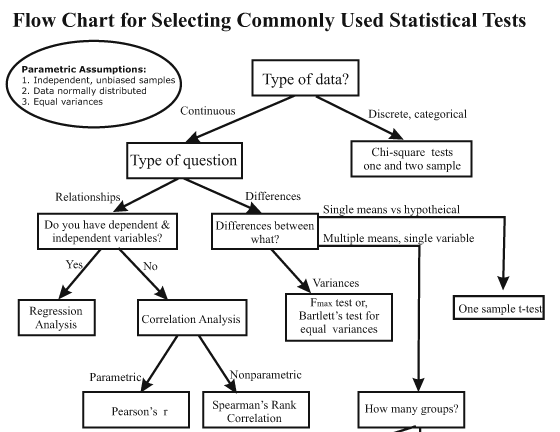
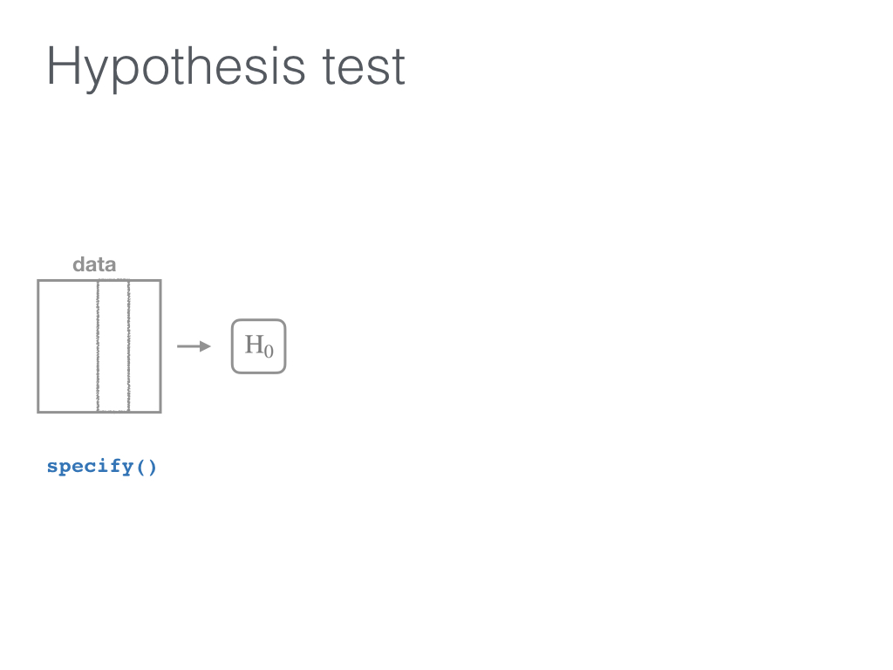

layout: true

.footer[Slides available at <http://bit.ly/infer-austin> <br> Package webpage at <https://infer.netlify.com>]

---

```{r include=FALSE}
library(ggplot2)
filter <- dplyr::filter
knitr::opts_chunk$set(warning=FALSE, message=FALSE, fig.width=10.5, fig.height=4, 
  comment=NA, rows.print=16)
theme_set(theme_gray(base_size = 24))
```

## Understanding who you are

- Who uses hypothesis testing/confidence intervals at least once a week?
--

- Who uses the `tidyverse` at least once a week?
--

- Who has heard of permutation testing? Randomization-based methods? Resampling methods? Bootstrap methods?

---

## Pre-requisites for this talk

- Some experience with statistical inference (hypothesis testing / confidence intervals)
--

- A ~~admiration~~, ~~abundance of love~~, ~~won't do anything without it~~ respect for the `tidyverse` and its power to get more users into doing data analysis/visualization quickly (The pit of success)
--

- ~~Ability~~ Desire to think differently about statistical inference using computational methods as the driver

---

class: center

### Is this statistical inference to you?


[](https://i.pinimg.com/originals/e5/ea/32/e5ea322d61bd36a5062080b1b5fe6daa.gif)

---

class: middle

Students at Virginia Tech studied which vehicles come to a complete stop at an intersection with four-way stop signs, selecting at random the cars to observe. <!--They looked at several factors to see which (if any) were associated with coming to a complete stop. (They defined a complete stop as “the speed of the vehicle will become zero at least for an [instant]”). Some of these variables included the age of the driver, how many passengers were in the vehicle, and type of vehicle.--> The explanatory variable used here is the arrival position of vehicles approaching an intersection all traveling in the same direction. They classified this arrival pattern into three groups: whether the vehicle arrives alone, is the lead in a group of vehicles, or is a follower in a group of vehicles. Is there an association between arrival pattern and whether or not a complete stop was made? <!--The students studied one specific intersection in Northern Virginia at a variety of different times. Because random assignment was not used, this is an observational study. Also note that no vehicle from one group is paired with a vehicle from another group.-->

---

class: middle

Which type of hypothesis test should we conduct here?

- A. Independent means t-test
- B. One proportion test
- C. Chi-Square Test of Independence
- D. ANOVA

---

## The data

```{r echo=FALSE}
library(tidyverse)
stop_type <- c(rep("complete", 265), rep("not_complete", 52))
vehicle_type <- c(rep("single", 151), rep("lead", 38), rep("follow", 76),
  rep("single", 25), rep("lead", 5), rep("follow", 22))
car_stop <- data_frame(stop_type, vehicle_type)
write_rds(car_stop, "car_stop.rds")
```

```{r}
library(tidyverse)
set.seed(2)
#car_stop <- read_rds("https://ismayc.github.io/talks/data-day-texas-infer/car_stop.rds")
car_stop %>% sample_n(12)
```

---

class: middle

Which type of hypothesis test should we conduct here?

- A. Independent means t-test
- B. One proportion test
- C. Chi-Square Test of Independence
- D. ANOVA

--

<br>

**C. Chi-Square Test of Independence**

---

class: middle

- Using a `data` argument

```{r error=TRUE}
chisq.test(data = car_stop, x = stop_type, y = vehicle_type)
```

--

- Using a formula

```{r error=TRUE}
chisq.test(data = car_stop, formula = vehicle_type ~ stop_type)
```


---


## Finally

```{r}
chisq.test(car_stop$stop_type, car_stop$vehicle_type)
```

---

## 

```{r eval=FALSE}
?chisq.test()
```

[](https://www.rdocumentation.org/packages/stats/versions/3.4.3/topics/chisq.test)

---

```{r echo=FALSE, fig.height=7.5}
deg_freedom <- 2
chisq_dist <- ggplot(data.frame(x = c(qchisq(0.001, deg_freedom), qchisq(0.999, deg_freedom))), aes(x)) + 
    stat_function(fun = dchisq, args = list(df = deg_freedom), color = "black") +
    xlab("") +
    ylab("") +
    geom_vline(xintercept = chisq.test(car_stop$stop_type, car_stop$vehicle_type)$statistic, color = "red")
chisq_dist + 
  ggtitle("Chi-square distribution with 2 degrees of freedom")   
```


---

Is there an association between arrival pattern and whether or not a complete stop was made?

## The null hypothesis
--

> No association exists between the arrival vehicle's position and whether
or not it makes a complete stop.

## The alternative hypothesis
--

> An association exists between the arrival vehicle's position and
whether or not it makes a complete stop.


---

## How can computation help us to understand what is going on here?

--

[](http://allendowney.blogspot.com/2016/06/there-is-still-only-one-test.html)


---

## The tricky step

--

- Modeling the null hypothesis
  - How do we simulate data assuming the null hypothesis is true in our problem (there is no association between the variables)?
--

  - What might the sample data look like if the null was true?


---

## Properties of the original sample collected

```{r}
car_stop %>% count(stop_type, vehicle_type)
```

--

```{r}
( orig_table <- table(car_stop$stop_type, car_stop$vehicle_type) )
```


---

### Permute the sample data

```{r echo=FALSE}
library(infer)
set.seed(3)
(perm1 <- car_stop %>% 
  specify(stop_type ~ vehicle_type) %>% 
  hypothesize(null = "independence") %>% 
  generate(reps = 1, type = "permute") %>% 
  ungroup() %>% 
  dplyr::select(-replicate) %>% 
  sample_n(size = nrow(car_stop)))
```
--

```{r echo=FALSE}
( new_table <- table(perm1$stop_type, perm1$vehicle_type) )
```


---

## Comparing the original and permuted sample

```{r}
addmargins(orig_table)
addmargins(new_table)
```

---

## Where are we?

[](http://allendowney.blogspot.com/2016/06/there-is-still-only-one-test.html)

---

## Test statistic

[Chi-square test statistic](https://en.wikipedia.org/wiki/Pearson%27s_chi-squared_test)
  - A measure of how far what we observed in our sample is from what we would expect if the null hypothesis was true

--

```{r}
chisq.test(car_stop$stop_type, car_stop$vehicle_type)
```

```{r}
chisq.test(car_stop$stop_type, car_stop$vehicle_type)$statistic
```

---

## For the permuted data

```{r}
chisq.test(perm1$stop_type, perm1$vehicle_type)$statistic
```

--

- Another permutation

```{r include=FALSE}
(perm2 <- car_stop %>% 
  specify(stop_type ~ vehicle_type) %>% 
  hypothesize(null = "independence") %>% 
  generate(reps = 1, type = "permute") %>% 
  ungroup() %>% 
  dplyr::select(-replicate) %>% 
  sample_n(size = nrow(car_stop)))
```

```{r}
chisq.test(perm2$stop_type, perm2$vehicle_type)$statistic
```

---

## What does the distribution of multiple repetitions of the permuted data look like?

```{r echo=FALSE}
( car_chisq <- car_stop %>% 
  specify(stop_type ~ vehicle_type) %>% 
  hypothesize(null = "independence") %>% 
  generate(reps = 1000, type = "permute") %>% 
  calculate(stat = "Chisq") )
```

---

<small>The distribution of multiple repetitions of the permuted data</small>
--

```{r echo=FALSE, fig.height=3.5}
ggplot(data = car_chisq, mapping = aes(x = stat)) +
  geom_density() +
  geom_vline(xintercept = chisq.test(car_stop$stop_type, car_stop$vehicle_type)$statistic, 
             color = "red") +
  xlab("") +
  ylab("") +
  xlim(c(0, 14))
```

--

<small>Recall the traditional method using the Chi-square distribution </small>

```{r echo=FALSE, fig.height=3.5}
chisq_dist
```


---

<!-- So how did I generate this code to permute? -->

## Objectives of `infer`

- Implement common classical inferential techniques in a `tidyverse`-friendly framework that is expressive of the underlying procedure. 
--

  - Dataframe in, dataframe out
  - Compose tests and intervals with pipes
  - Unite computational and approximation methods
  - Reading a chain of `infer` code should describe the inferential procedure

---

class: inverse, center, middle

# The `infer` verbs


---


---


---




---


---


---


---


---


---


---


---


---

## Back to the example

```{r}
car_stop %>% 
  specify(stop_type ~ vehicle_type) %>% 
  hypothesize(null = "independence") %>% 
  generate(reps = 1000, type = "permute") %>% 
  calculate(stat = "Chisq")
```


---

## Back to the example

```{r}
car_stop %>% 
  specify(stop_type ~ vehicle_type) %>% 
  hypothesize(null = "independence") %>% 
  generate(reps = 1000, type = "permute") %>% 
  calculate(stat = "Chisq") %>% 
  visualize()
```

---

## What's to come


- Wrapper functions: `t_test`, `chisq_test`, etc.
- Generalized input to `calculate()`
  - For example, `calculate(trimmed_mean)`
  - Support for more advanced regression models
- Adding features to `visualize()`
  - Show both traditional and computation methods
- Implement list-columns in the `generate()` step

---

## Tips and tricks for package development

- Use [GitHub](https://github.com/andrewpbray/infer/) and pull requests to the `master` branch
- [Create useful vignettes](https://cran.r-project.org/web/packages/infer/vignettes/flights_examples.html) so others know how your pkg works
- Write tests and assertions for your code
  - [Buy Richie's *Testing R Code* book](https://www.crcpress.com/Testing-R-Code/Cotton/p/book/9781498763653)
- Let [travis-ci](https://travis-ci.org/andrewpbray/infer) do [the work](https://github.com/andrewpbray/infer/blob/master/.travis.yml) for you
- Use Hadley's [`pkgdown` package](https://github.com/r-lib/pkgdown) to build a pkg website
  - Host it on Netlify.com to be super cool


---

## More info

- https://infer.netlify.com
  - Many examples under Articles there with more to come
  - Plans to be implemented in <http://www.ModernDive.com> by this summer
      - [Sign up](http://eepurl.com/cBkItf) for the ModernDive mailing list for details
- Two DataCamp courses currently launched that use `infer`
  - [Inference for Numerical Data](https://www.datacamp.com/courses/inference-for-numerical-data) by Mine Cetinkaya-Rundel
  - [Inference for Regression](https://www.datacamp.com/courses/inference-for-linear-regression) by Jo Hardin
- Two more DataCamp courses to be launched
---

layout: false
class: middle


- Special thanks to [Andrew Bray](https://andrewpbray.github.io) and the other pkg contributors
- Slides created via the R package [xaringan](https://github.com/yihui/xaringan) by Yihui Xie
- Slides available at <http://bit.ly/infer-austin>
- Source code for these slides at <https://github.com/ismayc/talks/data-day-texas-infer>

<br>

<center>
<a href="https://giphy.com/gifs/wMY3LjQQMqo5W?utm_source=media-link&utm_medium=landing&utm_campaign=Media%20Links&utm_term="> 

</a>
</center>


