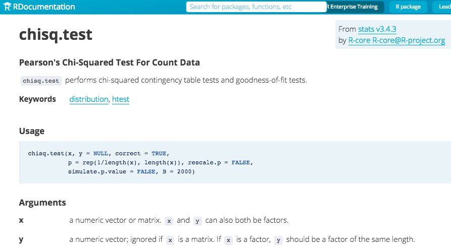
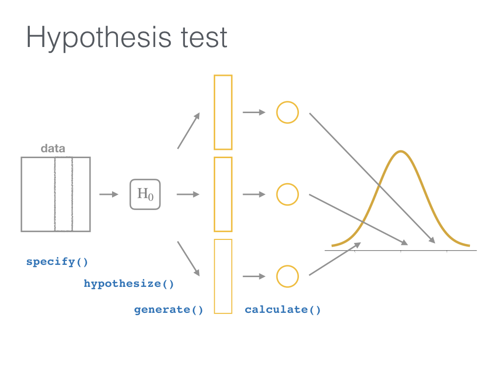

class: inverse
layout: true

.footer[Slides available at <http://bit.ly/infer-useR> <br> Package webpage at <https://infer.netlify.com>]

---

```{r include=FALSE}
library(ggplot2)
filter <- dplyr::filter
knitr::opts_chunk$set(warning=FALSE, message=FALSE, fig.width=10.5, fig.height=4, 
  comment=NA, rows.print=16)
theme_set(theme_gray(base_size = 24))
```

## Understanding who you are

- Who uses hypothesis testing/confidence intervals at least once a week?
--

- Who uses the `tidyverse` at least once a week?
--

- Who has heard of simulation-based inference methods? 
  - Permutation testing? 
  - Resampling methods? 
  - Bootstrap methods?

---

class: middle

<small>Students at Virginia Tech studied which vehicles come to a <font color="mediumpurple">complete stop</font> at an intersection with four-way stop signs, selecting at random the cars to observe. <!--They looked at several factors to see which (if any) were associated with coming to a complete stop. (They defined a complete stop as “the speed of the vehicle will become zero at least for an [instant]”). Some of these variables included the age of the driver, how many passengers were in the vehicle, and type of vehicle.--> The <font color="lightgreen">explanatory</font> variable used here is the arrival position of vehicles approaching an intersection all traveling in the same direction. They classified this arrival pattern into three groups: whether the vehicle arrives alone (<code><small>single</small></code>), is the <code><small>lead</small></code> in a group of vehicles, or is a <code><small>follow</small></code>er in a group of vehicles. Is there an association between <font color="lightgreen">arrival pattern</font> and whether a <code><font color="purple"><small>complete</small></font></code> stop or <code><font color="purple"><small>not_complete</small></font></code> was made?</small> <!--The students studied one specific intersection in Northern Virginia at a variety of different times. Because random assignment was not used, this is an observational study. Also note that no vehicle from one group is paired with a vehicle from another group.-->

<br>

<tiny>- From <a href="http://math.hope.edu/isi/"> 
"Introduction to Statistical Investigations"
</a> by Tintle et al.</tiny>

---

class: middle

Which type of hypothesis test should we conduct here?

- A. Independent samples t-test
- B. One proportion test
- C. Chi-Square test of independence
- D. ANOVA

---

```{r echo=FALSE}
library(tidyverse)
stop_type <- c(rep("complete", 265), rep("not_complete", 52))
vehicle_type <- c(rep("single", 151), rep("lead", 38), rep("follow", 76),
  rep("single", 25), rep("lead", 5), rep("follow", 22))
car_stop <- data_frame(stop_type, vehicle_type)
write_rds(car_stop, "car_stop.rds")
set.seed(2)
```

```{r eval=FALSE}
library(tidyverse)
# https://ismayc.github.io/talks/infer-useR/car_stop.rds
download.file("http://bit.ly/car_stop_rds", 
              destfile = "car_stop.rds")
car_stop <- read_rds("car_stop.rds")
car_stop %>% sample_n(10)
```

```{r echo=FALSE}
library(tidyverse)
set.seed(2)
# https://ismayc.github.io/talks/infer-useR/car_stop.rds
# download.file("http://bit.ly/car_stop_rds", destfile = "car_stop.rds")
car_stop <- read_rds("car_stop.rds")
car_stop %>% sample_n(10)
```


---

class: middle

Which type of hypothesis test should we conduct here?

- A. Independent samples t-test
- B. One proportion test
- C. Chi-Square Test of Independence
- D. ANOVA

--

<br>

***

## Answer:

 - **C. Chi-Square Test of Independence**

---

class: middle

## Let's do this in R

- Using a `data` argument

```{r eval=FALSE}
chisq.test(data = car_stop, x = stop_type, y = vehicle_type)
```

--

```
Error in chisq.test(data = car_stop, x = stop_type, 
  y = vehicle_type)
```  

--

- Using a formula

```{r eval=FALSE}
chisq.test(data = car_stop, 
           formula = vehicle_type ~ stop_type)
```
--

```
Error in chisq.test(data = car_stop, 
  formula = vehicle_type ~ stop_type)
```

<br>
---

## Finally

```{r}
chisq.test(car_stop$stop_type, car_stop$vehicle_type)
```

---

layout: false

## 

```{r eval=FALSE}
?chisq.test()
```

[](https://www.rdocumentation.org/packages/stats/versions/3.4.3/topics/chisq.test)

---

class: inverse
layout: true

.footer[Slides available at <http://bit.ly/infer-useR> <br> Package webpage at <https://infer.netlify.com>]

---

```{r echo=FALSE, fig.height=7}
deg_freedom <- 2
chisq_dist <- ggplot(data.frame(x = c(qchisq(0.001, deg_freedom), qchisq(0.999, deg_freedom))), aes(x)) + 
    stat_function(fun = dchisq, args = list(df = deg_freedom), color = "black") +
    xlab("") +
    ylab("") +
    geom_vline(xintercept = chisq.test(car_stop$stop_type, car_stop$vehicle_type)$statistic, color = "red")
chisq_dist + 
  ggtitle("Chi-square distribution with 2 degrees of freedom")   
```

P-value is `r round(chisq.test(car_stop$stop_type, car_stop$vehicle_type)$p.value, 4)`.
---

## `infer` Teaser - Maybe a different approach?

```{r}
library(infer)
car_stop %>% chisq_test(vehicle_type ~ stop_type)
```

```{r echo=FALSE}
knitr::include_graphics("figure/v0.3.0.png")
```


---

Is there an association between arrival pattern and whether or not a complete stop was made?

## The null hypothesis

> No association exists between the arrival vehicle's position and whether
or not it makes a complete stop.

## The alternative hypothesis

> An association exists between the arrival vehicle's position and
whether or not it makes a complete stop.

---

layout: false

## How can computation help us to understand what is going on here?

--

[](http://allendowney.blogspot.com/2016/06/there-is-still-only-one-test.html)

---

class: inverse
layout: true

.footer[Slides available at <http://bit.ly/infer-useR> <br> Package webpage at <https://infer.netlify.com>]

---


## The tricky step

--

Modeling the null hypothesis
  - How do we simulate data assuming the null hypothesis is true in our problem (there is no association between the variables)?
--

  - What might the sample data look like if the null was true?


---

### Properties of the original sample collected

```{r}
car_stop %>% dplyr::count(stop_type, vehicle_type)
```

--

```{r}
( orig_table <- car_stop %>% 
    janitor::tabyl(stop_type, vehicle_type) )
```


---

### Permute the sample data <br> - Shuffle `stop_type` across `vehicle_type`

```{r echo=FALSE}
library(infer)
set.seed(3)
(perm1 <- car_stop %>% 
  specify(stop_type ~ vehicle_type) %>% 
  hypothesize(null = "independence") %>% 
  generate(reps = 1, type = "permute") %>% 
  ungroup() %>% 
  dplyr::select(-replicate) %>% 
  sample_n(size = nrow(car_stop)))
```
--

```{r echo=FALSE}
#( new_table <- table(perm1$stop_type, perm1$vehicle_type) )
( new_table <- perm1 %>% janitor::tabyl(stop_type, vehicle_type) )
```


---

## Comparing the original and permuted sample

```{r}
orig_table %>% janitor::adorn_totals(where = c("row", "col"))
new_table %>% janitor::adorn_totals(where = c("row", "col"))
```

---

layout: false

## Where are we?

[](http://allendowney.blogspot.com/2016/06/there-is-still-only-one-test.html)

---

class: inverse
layout: true

.footer[Slides available at <http://bit.ly/infer-useR> <br> Package webpage at <https://infer.netlify.com>]

---


## Chi-square test statistic

- Measure of how far what we observed in our sample is from what we would expect if the null hypothesis was true ([Wikipedia](https://en.wikipedia.org/wiki/Pearson%27s_chi-squared_test))

--

```{r}
car_stop %>% infer::chisq_stat(vehicle_type ~ stop_type)
```

```{r}
chisq.test(car_stop$stop_type, car_stop$vehicle_type)$statistic
```


---

## For the permuted data

```{r}
perm1 %>% infer::chisq_stat(vehicle_type ~ stop_type)
```

--

## Another permutation

```{r include=FALSE}
(perm2 <- car_stop %>% 
  specify(stop_type ~ vehicle_type) %>% 
  hypothesize(null = "independence") %>% 
  generate(reps = 1, type = "permute") %>% 
  ungroup() %>% 
  dplyr::select(-replicate) %>% 
  sample_n(size = nrow(car_stop)))
```

```{r}
perm2 %>% infer::chisq_stat(vehicle_type ~ stop_type)
```

---

## What does the distribution of multiple repetitions of the permuted data look like?

```{r echo=FALSE}
( car_chisq <- car_stop %>% 
  specify(stop_type ~ vehicle_type) %>% 
  hypothesize(null = "independence") %>% 
  generate(reps = 1000, type = "permute") %>% 
  calculate(stat = "Chisq") )
```

---

layout: false

<small>The distribution of multiple repetitions of the permuted data</small>

```{r echo=FALSE, fig.height=3.7}
ggplot(data = car_chisq, mapping = aes(x = stat)) +
  geom_density() +
  geom_vline(xintercept = chisq.test(car_stop$stop_type, car_stop$vehicle_type)$statistic, 
             color = "red") +
  xlab("") +
  ylab("") +
  xlim(c(0, 14))
```

--

<small>Recall the traditional method using the Chi-square distribution </small>

```{r echo=FALSE, fig.height=3.7}
chisq_dist
```

---

class: inverse
layout: true

.footer[Slides available at <http://bit.ly/infer-useR> <br> Package webpage at <https://infer.netlify.com>]

---

<!-- So how did I generate this code to permute? -->

## Objectives of the `infer` package

- Implement common classical inferential techniques in a `tidyverse`-friendly framework that is expressive of the underlying procedure. 
--

  - Dataframe in, dataframe out
  - Compose tests and intervals with pipes
  - Unite computational and approximation methods
  - Reading a chain of `infer` code should describe the inferential procedure

---

layout: false
class: inverse, center, middle

# The `infer` verbs


---


---


---


---


---


---


---


---


---




---


---


---

class: inverse
layout: true

.footer[Slides available at <http://bit.ly/infer-useR> <br> Package webpage at <https://infer.netlify.com>]

---

```{r}
library(infer)
car_stop %>% 
  specify(stop_type ~ vehicle_type) %>% 
  hypothesize(null = "independence") %>% 
  generate(reps = 1000, type = "permute") %>% 
  calculate(stat = "Chisq")
```


---

## Back to the example

```{r fig.height=3.5}
null_distn <- car_stop %>% 
  specify(stop_type ~ vehicle_type) %>% 
  hypothesize(null = "independence") %>% 
  generate(reps = 1000, type = "permute") %>% 
  calculate(stat = "Chisq") 
null_distn %>% visualize()
```

---

## Get the simulation-based p-value

```{r fig.height=3.5}
Chisq_obs <- car_stop %>% 
  specify(stop_type ~ vehicle_type) %>% 
  calculate(stat = "Chisq") 
null_distn %>% 
  get_pvalue(obs_stat = Chisq_obs, direction = "greater")
```

---

## Visualize it

```{r fig.height=3.5}
null_distn %>% 
  visualize(obs_stat = Chisq_obs, direction = "greater")
```

---

## Compare to theoretical

```{r include=FALSE}
theme_set(theme_gray(base_size = 18))
```

```{r fig.height=3.5, warning=TRUE}
null_distn %>% 
  visualize(method = "both", obs_stat = Chisq_obs, 
            direction = "greater")
```

---

## What's to come with `infer`

- Generalized input to `calculate()`
  - For example, `calculate(trimmed_mean)`
- [More to-dos](https://infer-dev.netlify.com/to-do)
- Feature requests and bug reports at https://github.com/andrewpbray/infer/issues

---

class: inverse
layout: false

## More info and practice

- [infer.netlify.com](https://infer.netlify.com) (or [infer-dev.netlify.com](https://infer-dev.netlify.com))
  - Many examples under Articles with more to come
- To be fully implemented in [ModernDive.com](www.ModernDive.com)
      - [Sign up](http://eepurl.com/cBkItf) for the ModernDive mailing list
- DataCamp courses with `infer` + one more coming
  - [Inference for Numerical Data](https://www.datacamp.com/courses/inference-for-numerical-data)
  - [Inference for Categorical Data](https://www.datacamp.com/courses/inference-for-categorical-data)
  - [Inference for Regression](https://www.datacamp.com/courses/inference-for-linear-regression)
- Keep an eye on the [`tidymodels` meta-package](https://github.com/tidymodels/tidymodels)
---

layout: false
class: inverse, middle

<center>
<a href="https://www.tidyverse.org/learn">

</a>&emsp;&emsp;<a href="https://moderndive.netlify.com"> 
</a>&emsp;&emsp;<a href="https://infer.netlify.com"> 
</a></center>

## Thanks for attending! Contact me: [Email](mailto:chester@datacamp.com) or [Twitter](https://twitter.com/old_man_chester)
- Thanks to [Albert Y. Kim](https://twitter.com/rudeboybert), [Andrew Bray](https://andrewpbray.github.io), and [Alison Hill](https://twitter.com/apreshill)
- Slides created via the R package [xaringan](https://github.com/yihui/xaringan) by Yihui Xie
- Slides' source code at <https://github.com/ismayc/talks/>

