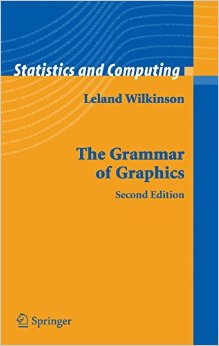
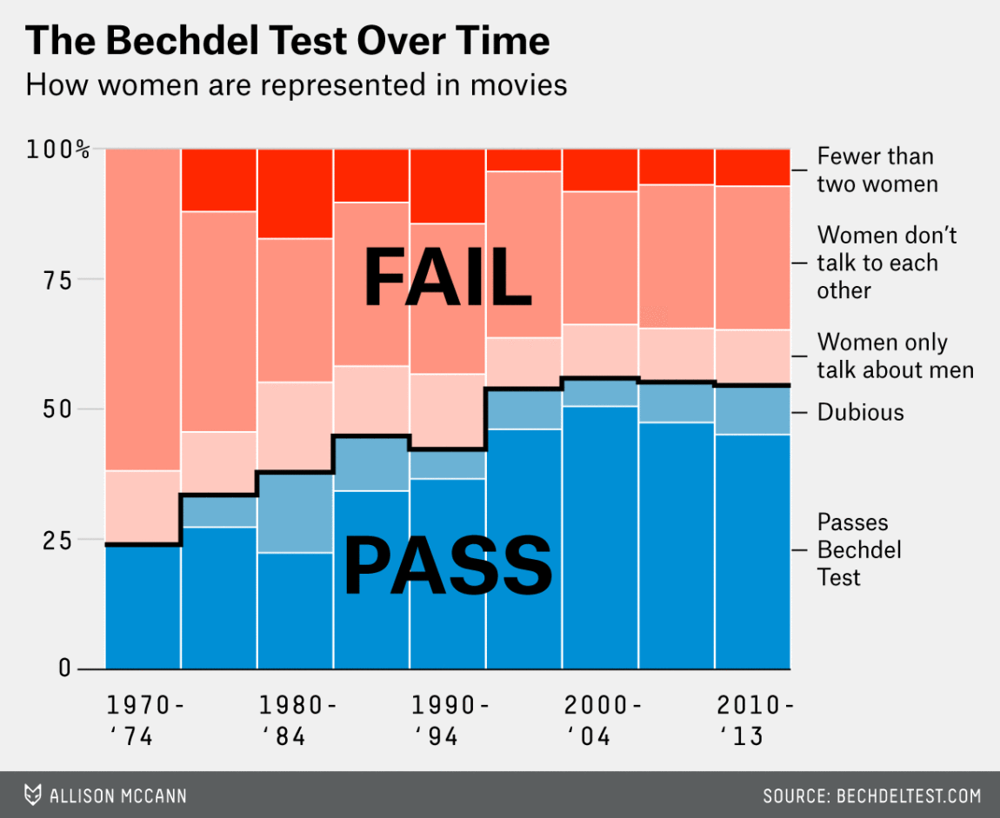
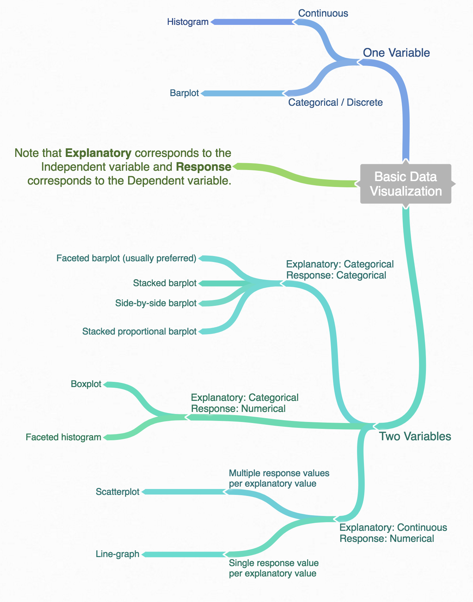
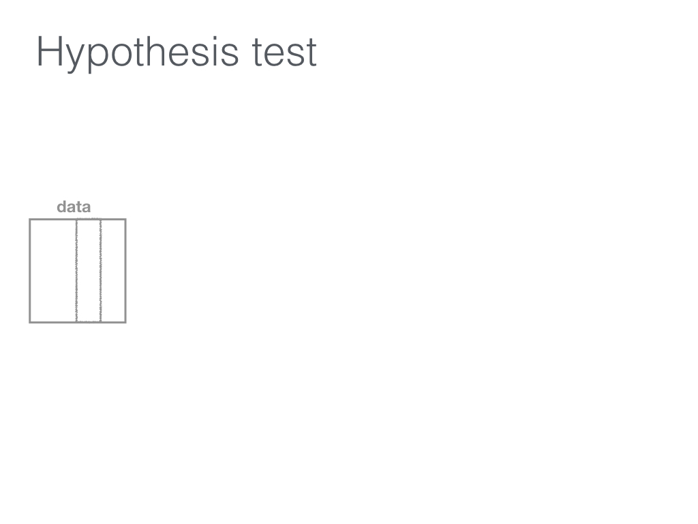
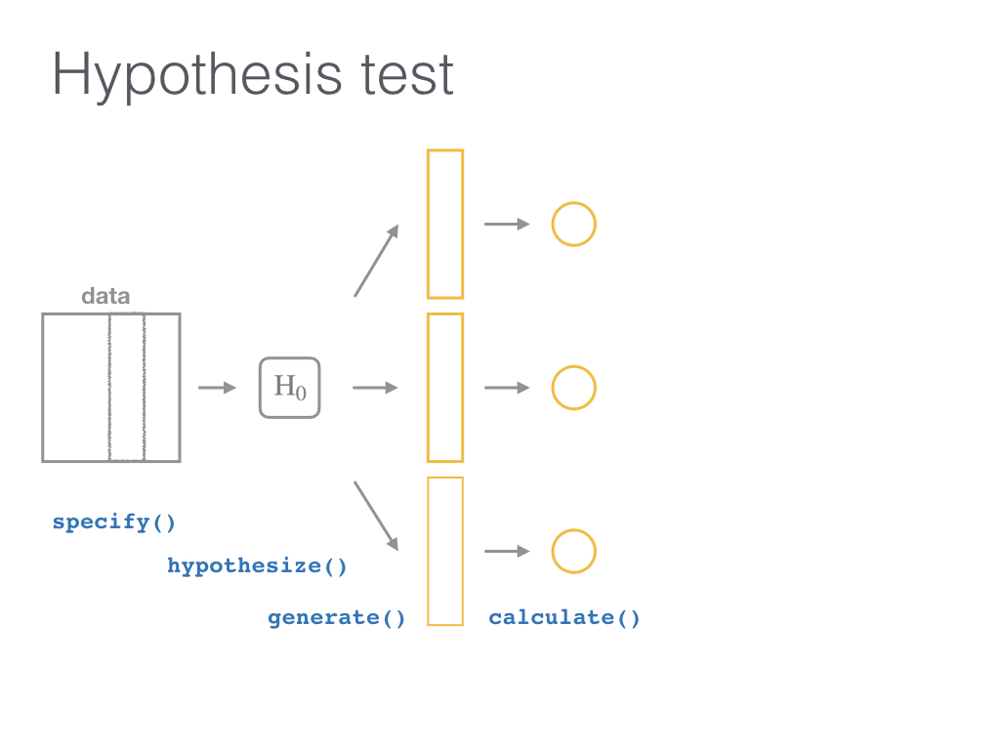

class: inverse
name: toc

```{r include=FALSE, purl=TRUE}
#specify the packages of interest
pkgs <- c("tidyverse", "moderndive", "gapminder",
          "nycflights13", "fivethirtyeight", "janitor",
          "ggplot2movies", "remotes")

# use this function to check if each package is on the local machine
# if a package is installed, it will be loaded
# if any are not, the missing package(s) will be installed and loaded
pkg.check <- function(x) {
    if (!require(x, character.only = TRUE)) {
        install.packages(x, dependencies = TRUE, repos = "https://cran.rstudio.com")
        library(x, character.only = TRUE)
    }
}
lapply(pkgs, pkg.check)

if(!require("infer"))
  remotes::install_github("andrewpbray/infer")
```

```{r echo=FALSE, purl=FALSE}
library(ggplot2)
filter <- dplyr::filter
knitr::opts_chunk$set(warning=FALSE, message=FALSE, fig.width=10.5, fig.height=4, comment=NA, rows.print=16)
theme_set(theme_gray(base_size = 24))
options(digits = 5, width = 70)

gif_link <- function(link, file, size){
    knitr::asis_output(
      paste0('<center>\n<a href="',
             link,
             '">\n\n</a>\n</center>'
      ))
}

```

# Table of Contents

Part 1
- [Data Wrangling](#wrangling)
- [Data Viz](#viz)
- [Data Tidying](#tidying)

Part 2
- [Resampling](#resampling)
- [Inference](#inference)

.footer[R code from throughout the slides is saved as an R script [here](https://raw.githubusercontent.com/ismayc/talks/master/ness-infer/slide_code.R)]
---

layout: true
class: inverse

.footer[Slides available at http://bit.ly/ness-infer &emsp; &emsp; &emsp; [Return to Table of Contents](#toc)]

---

## More freely available information

`r gif_link("http://moderndive.com", "img/wide_format.png", 650)`

<center><h2>A Modern Dive into Data with R</h2></center>

* Webpage: <http://moderndive.com>
* Developmental version at <https://moderndive.netlify.com>
* [GitHub Repo](https://github.com/moderndive/moderndiver-book)
* Please [signup](http://eepurl.com/cBkItf) for our mailing list!

---

layout: false
class: center, middle


---

layout: true
class: inverse

.footer[Slides available at http://bit.ly/ness-infer &emsp; &emsp; &emsp; [Return to Table of Contents](#toc)]

---

## Designed for the novice / Nice for the practioner

`r gif_link("http://moderndive.netlify.com/2-getting-started.html", "img/engine.png", 600)`

---

## Designed for the novice / Nice for the practioner

`r gif_link("http://moderndive.netlify.com/2-getting-started.html", "img/appstore.png", 600)`

---

class: normal, center, middle

# R Data Types

---

## The bare minimum needed for understanding today

Vector/variable
  - Type of vector (`int`, `num`, `chr`, `lgl`, `date`)

--

Data frame
  - Vectors of (potentially) different types
  - Each vector has the same number of rows

---

## The bare minimum needed for understanding today

```{r eval=FALSE, purl=FALSE}
library(tibble)
library(lubridate)
ex1 <- data_frame(
    vec1 = c(1980, 1990, 2000, 2010),
    vec2 = c(1L, 2L, 3L, 4L),
    vec3 = c("low", "low", "high", "high"),
    vec4 = c(TRUE, FALSE, FALSE, FALSE),
    vec5 = ymd(c("2017-05-23", "1776/07/04", 
                 "1983-05/31", "1908/04-01"))
  )
ex1
```

--

```{r echo=FALSE, purl=TRUE}
library(tibble)
library(lubridate)
ex1 <- data_frame(
    vec1 = c(1980, 1990, 2000, 2010),
    vec2 = c(1L, 2L, 3L, 4L),
    vec3 = c("low", "low", "high", "high"),
    vec4 = c(TRUE, FALSE, FALSE, FALSE),
    vec5 = ymd(c("2017-05-23", "1776/7/04", "1983-5/31", "1908/04-1"))
  )
ex1
```
  
---

class: center, middle  
  
# Welcome to the [tidyverse](https://blog.rstudio.org/2016/09/15/tidyverse-1-0-0/)!
  
The `tidyverse` is a collection of R packages that share common philosophies and are designed to work together. <br><br> 
  
<a href="http://tidyverse.tidyverse.org/logo.png"></a>

---

# First motivating example for today

<a href="http://gitsense.github.io/images/wealth.gif"></a>

- Inspired by the late, great [Hans Rosling](https://www.youtube.com/watch?v=jbkSRLYSojo)


---

layout: false
class: center, middle
name: wrangling

# Data Wrangling

`r gif_link("https://dplyr.tidyverse.org", "img/dplyr_hex.png", 400)`

---

layout: true
class: inverse

.footer[Slides available at http://bit.ly/ness-infer &emsp; &emsp; &emsp; [Return to Table of Contents](#toc)]

---

## The [`gapminder` package](https://github.com/jennybc/gapminder)

```{r, purl=TRUE}
library(gapminder)
gapminder
```


---

## Base R versus the `tidyverse`

- The mean life expectancy across all years for Asia
--

```{r, purl=TRUE}
# Base R
asia <- gapminder[gapminder$continent == "Asia", ]
mean(asia$lifeExp)
```
--
 
```{r eval=FALSE, purl=FALSE}
library(dplyr)
gapminder %>% filter(continent == "Asia") %>%
  summarize(mean_exp = mean(lifeExp))
```

```{r echo=FALSE, purl=TRUE}
library(dplyr)
gapminder %>% filter(continent == "Asia") %>%
  summarize(mean_exp = as.numeric(format(mean(lifeExp), digits = 5))) %>% 
  pull()
```


---

## The pipe `%>%`

 &emsp; &emsp; &emsp; 
--

- A way to chain together commands
- Can be read as "and then" when reading over code
--

```{r eval=FALSE, purl=FALSE}
library(dplyr)
gapminder %>% filter(continent == "Asia") %>%
  summarize(mean_exp = mean(lifeExp))
```

---

name: fivemv

# [The Five Main Verbs (5MV)](http://moderndive.com/5-wrangling.html) of data wrangling

- [`filter()`](#filter) 
- [`summarize()`](#summarize)
- [`group_by()`](#groupby)
- [`mutate()`](#mutate) 
- [`arrange()`](#arrange)

---

name: filter

## `filter()`

- Select a subset of the rows of a data frame. 

- Arguments are "filters" that you'd like to apply.
--

```{r, purl=TRUE}
library(gapminder); library(dplyr)
gap_2007 <- gapminder %>% filter(year == 2007)
head(gap_2007, 4)
```

- Use `==` to compare a variable to a value

---

## Logical operators

- Use `|` to check for any in multiple filters being true:
--

```{r eval=FALSE, purl=FALSE}
gapminder %>% 
  filter(year == 2002 | continent == "Asia") %>% 
  sample_n(8)
```
--

```{r echo=FALSE, purl=TRUE}
set.seed(2018)
gapminder %>% 
  filter(year == 2002 | continent == "Asia") %>% 
  sample_n(8)
```

---

## Logical operators

- Use `,` to check for all of multiple filters being true:
--

```{r eval=FALSE, purl=FALSE}
gapminder %>% 
  filter(year == 2002, continent == "Asia")
```

```{r echo=FALSE, purl=TRUE}
gapminder %>% 
  filter(year == 2002, continent == "Asia") %>% 
  head(8)
```

---

## Logical operators

- Use `%in%` to check for any being true <br> (shortcut to using `|` repeatedly with `==`)
--

```{r eval=FALSE, purl=FALSE}
gapminder %>% 
  filter(country %in% c("Argentina", "Belgium", "Mexico"),
         year %in% c(1987, 1992))
```
--

```{r echo=FALSE, purl=TRUE}
gapminder %>% 
  filter(country %in% c("Argentina", "Belgium", "Mexico"),
         year %in% c(1987, 1992))
```


---

name: summarize

## `summarize()`

- Any numerical summary that you want to apply to a column of a data frame is specified within `summarize()`.

```{r eval=FALSE, purl=FALSE}
stats_1997 <- gapminder %>% 
  filter(year == 1997) %>% 
  summarize(max_exp = max(lifeExp),
            sd_exp = sd(lifeExp))
stats_1997
```
--

```{r echo=FALSE, purl=TRUE}
stats_1997 <- gapminder %>% 
  filter(year == 1997) %>% 
  summarize(max_exp = max(lifeExp),
            sd_exp = sd(lifeExp))
stats_1997
```

---

name: groupby

### Combining `summarize()` with `group_by()`

When you'd like to determine a numerical summary for all
levels of a different categorical variable

```{r eval=FALSE, purl=FALSE}
max_exp_1997_by_cont <- gapminder %>% 
  filter(year == 1997) %>% 
  group_by(continent) %>%
  summarize(max_exp = max(lifeExp),
            sd_exp = sd(lifeExp))
max_exp_1997_by_cont
```

--
```{r echo=FALSE, purl=TRUE}
max_exp_1997_by_cont <- gapminder %>% 
  filter(year == 1997) %>% 
  group_by(continent) %>%
  summarize(max_exp = max(lifeExp),
            sd_exp = sd(lifeExp))
max_exp_1997_by_cont
```

---

name: mutate

## `mutate()`

- Allows you to 
    1. <font color="yellow">create a new variable with a specific value</font> OR
    2. create a new variable based on other variables OR
    3. change the contents of an existing variable

--

```{r, purl=TRUE}
gap_plus <- gapminder %>% mutate(just_one = 1)
head(gap_plus, 4)
```

---

## `mutate()`

- Allows you to 
    1. create a new variable with a specific value OR
    2. <font color="yellow">create a new variable based on other variables</font> OR
    3. change the contents of an existing variable

--

```{r echo=FALSE, purl=TRUE}
set.seed(2)
```


```{r, purl=TRUE}
gap_w_gdp <- gapminder %>% mutate(gdp = pop * gdpPercap)
sample_n(gap_w_gdp, 4)
```

---

## `mutate()`

- Allows you to 
    1. create a new variable with a specific value OR
    2. create a new variable based on other variables OR
    3. <font color="yellow">change the contents of an existing variable</font>

--

```{r, purl=TRUE}
gap_weird <- gapminder %>% mutate(pop = pop + 1000)
head(gap_weird, 4)
```

---

name: arrange

## `arrange()`

- Reorders the rows in a data frame based on the values of one or more variables
--

```{r, purl=TRUE}
gapminder %>% arrange(year, country) %>% head(10)
```

---

## `arrange()`

- Can also put into descending order
--

```{r desc, purl=TRUE}
gapminder %>%
  filter(year > 2000) %>%
  arrange(desc(lifeExp)) %>%
  head(10)
```

---

## Don't mix up `arrange` and `group_by`

- `group_by` is used (mostly) with `summarize` to calculate summaries over groups

- `arrange` is used for sorting

---

## Don't mix up `arrange` and `group_by`

This doesn't really do anything useful

```{r purl=TRUE}
gapminder %>% group_by(year)
```

---

## Don't mix up `arrange` and `group_by`

But this does

```{r purl=TRUE}
gapminder %>% arrange(year)
```

---

## Practice

Use the [5MV](#fivemv) to answer problems from R data packages, e.g., [`nycflights13::weather`] 

<!--
Lay out what the resulting table should look like on paper first.
-->

1. What is the maximum arrival delay for each carrier departing JFK? [`nycflights13::flights`]

2. Calculate for each movie the domestic return on investment for 2013 scaled data descending by ROI <br> [`fivethirtyeight::bechdel`]

---

layout: false
class: center, middle
name: viz

# Data Visualization

`r gif_link("https://ggplot2.tidyverse.org", "img/ggplot2_hex.png", 400)`
---

layout: true
class: inverse

.footer[Slides available at http://bit.ly/ness-infer &emsp; &emsp; &emsp; [Return to Table of Contents](#toc)]

---
```{r echo=FALSE,fig.height=6, fig.width=10, fig.align='center', purl=FALSE}
library(gapminder)
options(scipen = 99)

gapminder %>% filter(year == 1992) %>%
  ggplot(aes(x = log(gdpPercap, base = 10), y = lifeExp, color = continent,
             size = pop)) +
  geom_point() + xlab('Gross Domestic Product (log scale)') + ylab('Life Expectancy at birth (years)') + ggtitle("Gapminder for 1992")
```


- What are the variables here?
- What is the observational unit?
- How are the variables mapped to aesthetics?

---

class: center, middle

## Grammar of Graphics

Wilkinson (2005) laid out the proposed <br> "Grammar of Graphics"

<br>

<a href="http://www.powells.com/book/the-grammar-of-graphics-9780387245447"></a>

---

class: center, middle

## Grammar of Graphics in R

Wickham implemented the grammar in R <br> in the `ggplot2` package

<br>

<a href="http://www.powells.com/book/ggplot2-elegant-graphics-for-data-analysis-9783319242750/68-428"></a>

---

class: center, middle

## What is a statistical graphic?

--

## A `mapping` of <br> `data` variables

--

## to <br> `aes()`thetic attributes

--

## of <br> `geom_`etric objects.

---

class: inverse, center, middle

# Back to Basics

---

## Old school

- Sketch the graphics below on paper, where the `x`-axis is variable `A` and the `y`-axis is variable `B`

```{r echo=FALSE, purl=TRUE}
simple_ex <-
  data_frame(
    A = c(1980, 1990, 2000, 2010),
    B = c(1, 2, 3, 4),
    C = c(3, 2, 1, 2),
    D = c("cold", "cold", "hot", "hot")
  )
simple_ex
```

<!-- Copy to chalkboard/whiteboard -->

1. <small>A scatter plot</small>
1. <small>A scatter plot where the `color` of the points corresponds to `D`</small>
1. <small>A scatter plot where the `size` of the points corresponds to `C`</small>

---

layout: true
class: inverse

.footer[Slides available at http://bit.ly/ness-infer &emsp; &emsp; &emsp; [Return to Table of Contents](#toc)]

---

## Reproducing the plots in `ggplot2`

### 1. A scatterplot

```{r, eval=FALSE, purl=FALSE}
library(ggplot2)
ggplot(data = simple_ex, mapping = aes(x = A, y = B)) + 
  geom_point()
```
--

```{r, echo=FALSE, fig.height=4.4, purl=TRUE}
ggplot(data = simple_ex, aes(x = A, y = B)) + 
  geom_point()
```


---


## Reproducing the plots in `ggplot2`

### 2. A scatter plot where the `color` of the points corresponds to `D`

```{r, eval=FALSE, purl=FALSE}
library(ggplot2)
ggplot(data = simple_ex, mapping = aes(x = A, y = B)) + 
  geom_point(mapping = aes(color = D))
```
--

```{r, echo=FALSE, fig.height=4.4, purl=TRUE}
ggplot(data = simple_ex, mapping = aes(x = A, y = B)) + 
  geom_point(mapping = aes(color = D))
```


---

## Reproducing the plots in `ggplot2`

### 3. A scatter plot where the `size` of the points corresponds to `C`

```{r, eval=FALSE, purl=FALSE}
library(ggplot2)
ggplot(data = simple_ex, mapping = aes(x = A, y = B, size = C)) + 
  geom_point()
```
--

```{r, echo=FALSE, fig.height=4.4, purl=TRUE}
ggplot(data = simple_ex, mapping = aes(x = A, y = B, size = C)) + 
  geom_point()
```

---

# [The Five-Named Graphs](http://moderndive.com/3-viz.html#FiveNG)

## The 5NG of data viz

- Scatterplot: `geom_point()`
- Line graph: `geom_line()`
- Histogram: `geom_histogram()`
- Boxplot: `geom_boxplot()`
- Bar graph: `geom_bar()`


---

class: center, middle

## More examples

---

## Histogram

```{r fig.height=5.5, purl=TRUE}
library(nycflights13)
ggplot(data = weather, mapping = aes(x = humid)) +
  geom_histogram(bins = 20, color = "black", fill = "darkorange")
```

---

## Boxplot (broken)

```{r fig.height=5.5, purl=TRUE}
library(nycflights13)
ggplot(data = weather, mapping = aes(x = month, y = humid)) +
  geom_boxplot()
```

---


## Boxplot (fixed)

```{r fig.height=5.5, purl=TRUE}
library(nycflights13)
ggplot(data = weather, mapping = aes(x = factor(month), y = humid)) +
  geom_boxplot()
```

---

## Bar graph

```{r fig.height=5.5, purl=TRUE}
library(fivethirtyeight)
ggplot(data = bechdel, mapping = aes(x = clean_test)) +
  geom_bar()
```

---

## How about over time?

- One more variable to create with `dplyr`

```{r, purl=TRUE}
library(dplyr)
year_bins <- c("'70-'74", "'75-'79", "'80-'84", "'85-'89",
               "'90-'94", "'95-'99", "'00-'04", "'05-'09",
               "'10-'13")
bechdel <- bechdel %>%
  mutate(five_year = cut(year, 
                         breaks = seq(1969, 2014, 5), 
                         labels = year_bins))
```

---

## How about over time? (Stacked)

```{r fig.width=11, fig.height=5, purl=TRUE}
library(fivethirtyeight)
library(ggplot2)
ggplot(data = bechdel,
       mapping = aes(x = five_year, fill = clean_test)) +
  geom_bar()
```

---

## How about over time? (Side-by-side)

```{r fig.width=11, fig.height=5, purl=TRUE}
library(fivethirtyeight)
library(ggplot2)
ggplot(data = bechdel,
       mapping = aes(x = five_year, fill = clean_test)) +
  geom_bar(position = "dodge")
```

---

## How about over time? (Stacked proportional)

```{r fig.width=11, fig.height=5, purl=TRUE}
library(fivethirtyeight)
library(ggplot2)
ggplot(data = bechdel,
       mapping = aes(x = five_year, fill = clean_test)) +
  geom_bar(position = "fill", color = "black")
```

---


class: center, middle

## `ggplot2` is for beginners and for data science professionals!

<a href="https://fivethirtyeight.com/features/the-dollar-and-cents-case-against-hollywoods-exclusion-of-women/"></a>

---

## Practice

Produce appropriate 5NG with R package & data set in [ ], e.g., [`nycflights13::weather`] 

<!--
Try to look through the help documentation/Google to improve your plots
-->

1. How does `age` predict `recline_rude`? <br> [`fivethirtyeight::flying`]

2. Distribution of log base 10 scale of `budget_2013` <br> [`fivethirtyeight::bechdel`]

3. How does `budget` predict `rating`? <br> [`ggplot2movies::movies`]

---

### HINTS

```{r echo=FALSE, fig.height=7, fig.width=10.5, purl=FALSE}
library(gridExtra)
library(fivethirtyeight)
library(ggplot2movies)
#library(okcupiddata)

p1 <- ggplot(data = na.omit(flying), mapping = aes(fill = recline_rude, x = age)) + geom_bar(position = "fill") + ggtitle("Problem 1") + theme_gray(base_size = 20)

#p2 <- ggplot(data = profiles, mapping = aes(x = sex, y = age)) +
#  geom_boxplot() + ggtitle("Problem 2") + theme_gray(base_size = 20)

p3 <- ggplot(data = movies, mapping = aes(x = budget, y = rating)) +
  geom_point() + ggtitle("Problem 3") + theme_gray(base_size = 20)

p2 <- ggplot(data = bechdel, mapping = aes(x = log(budget_2013, 10))) +
  geom_histogram(color = "white", bins = 10) + ggtitle("Problem 2") +
  theme_gray(base_size = 20)

grid.arrange(p1, #p2, 
             p2, p3, ncol = 2, padding = unit(0.5, "line"),
             widths = c(2.6, 1.8))

```


---

class: inverse, center, middle

# DEMO in RStudio

---

class: center, middle

### Determining the appropriate plot

<a href="https://coggle.it/diagram/V_G2gzukTDoQ-aZt"></a>

---

layout: false
class: center, middle
name: tidying

# Data Tidying

`r gif_link("https://tidyr.tidyverse.org", "img/tidyr_hex.png", 380)`

---

layout: true
class: inverse

.footer[Slides available at http://bit.ly/ness-infer &emsp; &emsp; &emsp; [Return to Table of Contents](#toc)]

---

# Tidy Data?


1. Each variable forms a column.
2. Each observation forms a row.
3. Each type of observational unit forms a table.

The third point means we don't mix apples and oranges.

---

## What is Tidy Data?

1. Each observation forms a row. In other words, each row corresponds to a single instance of an <u>observational unit</u>
1. Each variable forms a column:
    + Some variables may be used to identify the <u>observational units</u>. 
    + For organizational purposes, it's generally better to put these in the left-hand columns
1. Each type of observational unit forms a table.

---

## Differentiating between <u>neat</u> data and <u>tidy</u> data

- Colloquially, they mean the same thing
- But in our context, one is a subset of the other. 

<br>

<u>Neat</u> data is 
  - easy to look at, 
  - organized nicely, and 
  - in table form.

--

<u>Tidy</u> data is neat but also abides by a set of three rules.

---

class: center, middle

<a href="figure/lebowski-abides-o.gif"></a>


---

## Is this tidy?

```{r echo=FALSE, message=FALSE, warning=FALSE, purl=TRUE}
library(fivethirtyeight)
set.seed(2)
bechdel %>% sample_n(12) %>%
  select(year, title, clean_test, budget_2013) %>%
  arrange(title)
```


---

name: demscore

## How about this? Is this tidy?

```{r echo=FALSE, message=FALSE, warning=FALSE, purl=TRUE}
dem_score <- read_csv("https://raw.githubusercontent.com/ismayc/talks/master/ness-infer/data/dem_score.csv")
dem_score %>% slice(1:12)
```

---

name: whytidy

## Why is tidy data important?

- Think about trying to plot democracy score across years in the simplest way possible with the data on the [Is this tidy? slide](#demscore).
--

- It would be much easier if the data looked like what follows instead so we could put 
    - `year` on the `x`-axis and 
    - `dem_score` on the `y`-axis.

---

## Tidy is good

```{r eval=FALSE, purl=FALSE}
library(tidyr)
dem_score_tidy <- dem_score %>% 
  gather(-country, key = "year", value = "dem_score") %>% 
  mutate(year = as.integer(year)) 
dem_score_tidy %>% sample_n(10) %>% arrange(country)
```
--

```{r echo=FALSE, purl=TRUE}
library(tidyr)
dem_score_tidy <- dem_score %>% 
  gather(-country, key = "year", value = "dem_score") %>% 
  mutate(year = as.integer(year)) 
dem_score_tidy %>% sample_n(10) %>% arrange(country)
```

---

## Let's plot it

- Plot the line graph for 4 countries using `ggplot`

```{r purl=TRUE}
dem_score4 <- dem_score_tidy %>%
  filter(country %in% c("Australia", "Pakistan", "Portugal", "Uruguay"))
ggplot(data = dem_score4, mapping = aes(x = year, y = dem_score)) +
  geom_line(mapping = aes(color = country), size = 2)
```

---

## Beginning steps

Frequently the first thing to do when given a dataset is to

- check that the data is <u>tidy</u> (if not, convert it!)
- identify the observational unit,
- specify the variables, and
- give the types of variables you are presented with.

This will help with 

- choosing the appropriate plot, 
- summarizing the data, and 
- understanding which inferences can be applied.

---

layout: false
class: center, middle
name: sampling

# Sampling Distributions

`r gif_link("https://moderndive.github.io/moderndive", "https://raw.githubusercontent.com/moderndive/moderndive/master/images/hex_blue_text.png", 380)`

---

layout: true
class: inverse

.footer[Slides available at http://bit.ly/ness-infer &emsp; &emsp; &emsp; [Return to Table of Contents](#toc)]

---

# Use what you know to connect with new

```{r eval=FALSE, purl=FALSE}
library(gapminder)
library(tidyverse)
gapminder_2007 <- gapminder %>% filter(year == 2007)
ggplot(data = gapminder_2007, 
       mapping = aes(x = gdpPercap, y = lifeExp, 
                     size = pop, color = continent)) +
  geom_point()
```

---

```{r echo=FALSE, fig.height=7.5, fig.width=10, purl=TRUE}
library(gapminder)
library(tidyverse)
gapminder_2007 <- gapminder %>% filter(year == 2007)
ggplot(data = gapminder_2007, 
       mapping = aes(x = gdpPercap, y = lifeExp, 
                     size = pop, color = continent)) +
  geom_point()
```

---

## Extending this knowledge to something new

- How can we now learn about <u>sampling distributions</u>?

--

`r gif_link("http://moderndive.com/images/sampling_bowl.jpeg", "img/sampling_bowl.jpeg", 380)`

---

```{r purl=TRUE}
library(moderndive)
bowl
```

---

## One virtual scoop of 50 balls

```{r purl=TRUE}
set.seed(1977)
( bowl_sample <- bowl %>% sample_n(size = 50) )
```

---

# Proportion that are red

```{r purl=TRUE}
bowl_sample %>% 
  summarize(prop_red = mean(color == "red")) %>% 
  pull()
```

--

## Is this how many are in the full bowl?

---

## Sampling variability

### What does `rep_bowl_samples` look like?

```{r purl=TRUE}
library(moderndive)
rep_bowl_samples <- bowl %>% 
  rep_sample_n(size = 50, reps = 10000)
```

--

### How about `bowl_props`?

```{r purl=TRUE}
bowl_props <- rep_bowl_samples %>% 
  group_by(replicate) %>% 
  summarize(prop_red = mean(color == "red"))
```


---

## The sampling distribution

```{r fig.height=4.7, purl=TRUE}
ggplot(data = bowl_props, mapping = aes(x = prop_red)) +
  geom_histogram(binwidth = 0.02, color = "white")
```

---

# Practice

- Let's estimate the mean age of pennies
- Create a sampling distribution of 10,000 samples each of size 50 from `moderndive::pennies`

---

## Shifting focus

### What about if all we had was the one sample of balls?

```{r purl=TRUE}
bowl_sample %>% count(color)
```

--

### How could we use this sample to make a guess about the sampling variability from other samples?

---

layout: true
class: inverse

---

# Building up to statistical inference!

```{r purl=TRUE}
library(infer)
bowl_sample %>% 
  specify(formula = color ~ NULL, success = "red")
```

---

# Bootstrapping?

```{r purl=TRUE}
library(infer)
( bootstrap_samples <- bowl_sample %>% 
  specify(formula = color ~ NULL, success = "red") %>% 
  generate(reps = 48, type = "bootstrap") )
```

---

# What does `bootstrap_samples` represent?

## Remember we assumed that all we had was the original sample of 32 red and 18 white to start.
--

## Hope `bootstrap_samples` is close to this:

`r gif_link("http://moderndive.netlify.com/images/sampling_bowl.jpeg", "img/big_sampling_bowl.jpeg", 500)`

---

## Bootstrap statistics

```{r purl=TRUE}
bowl_sample %>% 
  specify(formula = color ~ NULL, success = "red") %>% 
  generate(reps = 48, type = "bootstrap") %>% 
  calculate(stat = "prop")
```

---

## Do 10,000 reps to get a better sense for variability

### Just as we did with the sampling distribution

```{r purl=TRUE}
bootstrap_stats <- bowl_sample %>% 
  specify(formula = color ~ NULL, success = "red") %>% 
  generate(reps = 10000, type = "bootstrap") %>% 
  calculate(stat = "prop")
```

---

### The bootstrap distribution

```{r fig.height=2.7, echo=FALSE, purl=TRUE}
ggplot(data = bootstrap_stats, mapping = aes(x = stat)) +
  geom_histogram(binwidth = 0.02, color = "white") +
  geom_vline(xintercept = mean(bootstrap_stats$stat), color = "red",
             size = 2) +
  xlim(0.15, 0.55) +
  geom_vline(xintercept = c(mean(bootstrap_stats$stat) - sd(bootstrap_stats$stat), mean(bootstrap_stats$stat) + sd(bootstrap_stats$stat)), color = "red", size = 1.5)
```

### The sampling distribution

```{r fig.height=2.7, echo=FALSE, purl=TRUE}
ggplot(data = bowl_props, mapping = aes(x = prop_red)) +
  geom_histogram(binwidth = 0.02, color = "white") +
  geom_vline(xintercept = mean(bowl_props$prop_red), color = "red",
             size = 2) +
  xlim(0.15, 0.55) +
  geom_vline(xintercept = c(mean(bowl_props$prop_red) - sd(bowl_props$prop_red), mean(bowl_props$prop_red) + sd(bowl_props$prop_red)), color = "red", size = 1.5)
```

---

layout: false

## `infer` verbs

`r gif_link("https://infer.netlify.com", "img/infer_ci.jpg", 750)`

---

## `infer` verbs

`r gif_link("https://infer.netlify.com", "img/infer_ht.jpg", 750)`


---

layout: true
class: inverse

.footer[Slides available at http://bit.ly/ness-infer &emsp; &emsp; &emsp; [Return to Table of Contents](#toc)]

---

layout: false
class: middle, center

# Statistical Inference

`r gif_link("https://infer-dev.netlify.com", "img/infer_gnome.png", 400)`

---

layout: true
class: inverse

.footer[Slides available at http://bit.ly/ness-infer &emsp; &emsp; &emsp; [Return to Table of Contents](#toc)]

---


# Research Question

If you see someone else yawn, are you more likely to yawn?

In an episode of the show *Mythbusters*, they tested the myth that yawning is contagious. 

- Analysis done with [Alison Hill](https://alison.rbind.io)

---

## Participants and Procedure

--

- 50 adults who thought they were being considered for an appearance on the show. 

--

- Each participant was interviewed individually by a show recruiter ("confederate") who either yawned or not

--

- Participants then sat by themselves in a large van and were asked to wait. 

--

- While in the van, the Mythbusters watched to see if the unaware participants yawned.


---

## Data

- 34 saw the confederate yawn ( *seed* )
- 16 did not see the confederate yawn ( *control* )

--

```{r purl=TRUE}
group <- c(rep("control", 12), rep("seed", 24), 
            rep("control", 4), rep("seed", 10))
yawn <- c(rep(0, 36), rep(1, 14))
yawn_myth <- data_frame(subj = seq(1, 50), group, yawn) %>% 
  mutate(yawn = factor(yawn))
slice(yawn_myth, c(5, 17, 37, 49))
```

---

# Results

```{r purl=TRUE}
library(janitor)
yawn_myth %>% 
  tabyl(group, yawn) %>% 
  adorn_percentages() %>% 
  adorn_pct_formatting() %>% 
  adorn_ns()
```

---
class: inverse, middle, center

## Conclusion

--

## *Finding: CONFIRMED* <sup>1</sup>

.footnote[
[1] http://www.discovery.com/tv-shows/mythbusters/mythbusters-database/yawning-contagious/]

---

# Really?

> "Though that's not an enormous increase, since they tested 50 people in the field, the gap was still wide enough for the MythBusters to confirm that yawning is indeed contagious." <sup>1</sup>

.footnote[
[1] http://www.discovery.com/tv-shows/mythbusters/mythbusters-database/yawning-contagious/]


---

# State the hypotheses

--

Null hypothesis:  

> There is no difference between the seed and control groups in the proportion of people who yawned.

--

Alternative hypothesis (directional): 

> More people (relatively) yawned in the seed group than in the control group.

---

# Test the hypothesis

Which type of hypothesis test would you conduct here?

- Independent samples t-test
- Two proportion test
- Chi-square Goodness of Fit
- Analysis of Variance

---

# Test the hypothesis

Which type of hypothesis test would you conduct here?

- Independent samples t-test
- Two proportion test
- Chi-square Goodness of Fit
- Analysis of Variance

--

<br>

***

Answer: 
- Two proportion test


---
class: center, middle

# Two proportion test

--

$H_0: p_{seed} - p_{control} = 0$

--

$H_A: p_{seed} - p_{control} > 0$

---

# The observed difference

```{r purl=TRUE}
yawn_myth %>%
  group_by(group) %>%
  summarize(prop = mean(yawn == 1))
```

--

```{r purl=TRUE}
(obs_diff <- yawn_myth %>%
  group_by(group) %>%
  summarize(prop = mean(yawn == 1)) %>%
  summarize(diff(prop)) %>%
  pull())
```


---
class: inverse, middle, center

## Is this difference *meaningful*?

--

## Different question: 

--

## Is this difference *significant*?

---

# Modeling the null hypothesis

If... 

<br>

&emsp;&emsp; $H_0: p_{seed} = p_{control}$ &emsp;&emsp;

<br>

is true, then whether or not the participant saw someone else yawn does not matter.

--

<br>

In other words, there is no association between exposure and yawning.


---
class: inverse, center, middle


---


.pull-left[
### Original universe

```{r echo=FALSE, purl=TRUE}
yawn_myth %>% 
  slice(c(1:6, 15:20))
yawn_myth %>% 
  tabyl(group, yawn) %>% 
  adorn_totals(where = c("row", "col"))
```
]

--

.pull-right[
### Parallel universe
```{r echo=FALSE, purl=TRUE}
set.seed(2018)
perm1 <- yawn_myth %>% 
  specify(formula = yawn ~ group,
           success = "1") %>% 
  hypothesize(null = "independence") %>% 
  generate(reps = 1, type = "permute") %>% 
  ungroup() %>% 
  mutate(subj = seq(1,50)) %>% 
  select(subj, group, alt_yawn = yawn) 
perm1 %>% 
  slice(c(1:6, 15:20))
perm1 %>% 
  tabyl(group, alt_yawn) %>% 
  adorn_totals(where = c("row", "col"))
```
]

---

# 1000 parallel universes

.pull-left[
```{r echo=FALSE, purl=TRUE}
yawn_universes <- yawn_myth %>% 
  specify(yawn ~ group,
          success = "1") %>% 
  hypothesize(null = "independence") %>% 
  generate(reps = 1000, type = "permute") %>% 
  calculate(stat = "diff in props", 
            order = c("seed", "control"))
yawn_universes
```
]

--

.pull-right[
```{r echo=FALSE, purl=TRUE}
yawn_universes %>% 
  slice(991:1000)
```
]

---
## The parallel universe distribution

```{r echo=FALSE, purl=TRUE}
set.seed(2)
null_distn <- yawn_myth %>% 
  specify(formula = yawn ~ group,
          success = "1") %>% 
  hypothesize(null = "independence") %>% 
  generate(reps = 1000, type = "permute") %>% 
  calculate(stat = "diff in props", 
            order = c("seed", "control"))
null_plot <- null_distn %>% 
  visualize(obs_stat = obs_diff, direction = "right") +
  labs(x = "Difference in proportions")
null_plot
```


The distribution of 1000 differences in proportions, if the null hypothesis were *true* and yawning was not contagious. 


---
## Calculating the p-value

In how many of our "parallel universes" is the difference as big or bigger than the one we observed (`r obs_diff`)?

--

<br>

The shaded proportion is the p-value!

```{r echo=FALSE, purl=TRUE}
null_distn %>% 
  summarize(n_as_big = sum(stat >= obs_diff),
            n_total = n(),
            p_value = mean(stat >= obs_diff))
```

---
class: middle, center
layout: false

# There is Only One Test!

[](http://allendowney.blogspot.com/2016/06/there-is-still-only-one-test.html)

---

layout: true
class: inverse

.footer[Slides available at http://bit.ly/ness-infer &emsp; &emsp; &emsp; [Return to Table of Contents](#toc)]

---

layout: false



---


---


---


---


---


---


---



---


---


---


---

layout: true
class: inverse

.footer[Slides available at http://bit.ly/ness-infer &emsp; &emsp; &emsp; [Return to Table of Contents](#toc)]

---

# `infer`

Five functions:

- `specify()`
- `hypothesize()`
- `generate()`
- `calculate()`
- `visualize()`

---

# `infer`
<small>
- `specify` the response and explanatory variables (`y ~ x`)
- `hypothesize` what the null hypothesis is (here, `independence` of `y` and `x`)
- `generate` new samples from parallel universes:
    - <small>Resample from our original data <u>without replacement</u>, each time shuffling the `group` (`type = "permute"`)</small>
    - <small>Do this <u>a ton of times</u> (`reps = 1000`)</small>
- `calculate` the *new* statistic (`stat = "diff in props"`) for each `rep`
</small>

---

# `infer` example

```{r eval=FALSE, purl=FALSE}
set.seed(8)
null_distn <- yawn_myth %>% 
  specify(formula = yawn ~ group, success = "1") %>% 
  hypothesize(null = "independence") %>% 
  generate(reps = 1000, type = "permute") %>% 
  calculate(stat = "diff in props", order = c("seed", "control"))
```

---

# Visualize the null distribution

- `visualize` the distribution of the `stat` <br> (here, `diff in props`)

```{r include=FALSE, purl=TRUE}
set.seed(8)
null_distn <- yawn_myth %>% 
  specify(formula = yawn ~ group, success = "1") %>% 
  hypothesize(null = "independence") %>% 
  generate(reps = 1000, type = "permute") %>% 
  calculate(stat = "diff in props", order = c("seed", "control"))
```


```{r purl=TRUE}
null_distn %>% 
  visualize(obs_stat = obs_diff, direction = "right")
```

---

# Classical inference

Rely on theory to tell us what the null distribution looks like.

```{r include=FALSE, purl=TRUE}
theme_set(theme_gray(base_size = 22))
yawn_table <- table(group, yawn)
yz <- prop.test(x = yawn_table, n = nrow(yawn_myth),
          alternative = "greater", correct = FALSE) 
obs_z <- yz %>% 
  broom::tidy(yz) %>% 
  pull(statistic)
```

```{r eval=FALSE, purl=FALSE}
yawn_myth %>%
  specify(yawn ~ group, success = "1") %>%
  hypothesize(null = "independence") %>% 
  # generate() is not needed since we are not doing simulation
  calculate(stat = "z", order = c("seed", "control")) %>%
  visualize(method = "theoretical", obs_stat = obs_z,
            direction = "right")
```

```{r include=FALSE, purl=TRUE}
yawn_myth %>%
  specify(yawn ~ group, success = "1") %>%
  hypothesize(null = "independence") %>% 
  # generate() is not needed since we are not doing simulation
  calculate(stat = "z", order = c("seed", "control")) %>%
  visualize(method = "theoretical", obs_stat = obs_z,
            direction = "right")
```

---

# Classical inference

Rely on theory to tell us what the null distribution looks like.

```{r echo=FALSE, fig.height=4.5, warning=TRUE, purl=TRUE}
yawn_myth %>%
  specify(yawn ~ group, success = "1") %>%
  hypothesize(null = "independence") %>% 
  # generate() is not needed since we are not doing simulation
  calculate(stat = "z", order = c("seed", "control")) %>%
  visualize(method = "theoretical", obs_stat = obs_z,
            direction = "right")
```

---

# Resampling vs Classical (`stat = "z"`) 

```{r fig.height=2.8, warning=TRUE, purl=TRUE}
yawn_myth %>%
  specify(yawn ~ group, success = "1") %>%
  hypothesize(null = "independence") %>% 
  generate(reps = 1000, type = "permute") %>% 
  calculate(stat = "z", order = c("seed", "control")) %>% 
  visualize(method = "both", bins = 10, obs_stat = obs_z, 
            direction = "right")
```

---

# Practice

- Read in/prep the [`mazes` data](http://bit.ly/mazes-gist)

```{r, purl=TRUE}
library(readr)
mazes <- read_csv("http://bit.ly/mazes-gist") %>% 
  clean_names() %>%  #janitor package
  filter(dx %in% c("ASD", "TD"))
```

- Use `infer` to compare a numerical variable between the two groups using:
    - A permutation test and
    - A classical theoretical test.
    
About the data: <small>[Quantitative analysis of disfluency in children with autism spectrum disorder or language impairment](http://journals.plos.org/plosone/article?id=10.1371/journal.pone.0173936)</small>

---

# More practice (time permitting)

- Find a data set / use your own and perform statistical inference on one or two of the variables there using the `infer` package

---

## More info and resources

- https://infer-dev.netlify.com
  - Many examples under Articles with more to come
  - To be discussed in [www.ModernDive.com](www.ModernDive.com)
      - [Sign up](http://eepurl.com/cBkItf) to the mailing list for updates
- DataCamp courses launched that use `infer`
  - [Inference for Numerical Data](https://www.datacamp.com/courses/inference-for-numerical-data) by Mine Cetinkaya-Rundel
  - [Inference for Regression](https://www.datacamp.com/courses/inference-for-linear-regression) by Jo Hardin
- Two more DataCamp courses to launch soon
- [Learn the Tidyverse](https://www.tidyverse.org/learn/)

---

## Future plans

- Generalize `calculate()`'s `stat` argument
- Improve speed and memory used by shifting to list-columns
- Rewrite the inference part of the [ModernDive](http://moderndive.netlify.com/9-ci.html) book
- Lead more workshops on using the `infer` package to extend knowledge of the `tidyverse`, R, and statistics

---

layout: false
class: inverse, middle

<center>
<a href="https://www.datacamp.com">

</a>&emsp;&emsp;<a href="https://moderndive.netlify.com"> 
</a>&emsp;&emsp;<a href="https://infer.netlify.com"> 
</a></center>

## Thanks for attending! Contact me: [Email](mailto:chester@datacamp.com) or [Twitter](https://twitter.com/old_man_chester)
- Special thanks to [Albert Y. Kim](https://twitter.com/rudeboybert), 
    - [Andrew Bray](https://andrewpbray.github.io), and 
    - [Alison Hill](https://twitter.com/apreshill)
- Slides created via the R package [xaringan](https://github.com/yihui/xaringan) by Yihui Xie
- Slides available at <http://bit.ly/ness-infer>
- Slides source code at <https://github.com/ismayc/talks/>
