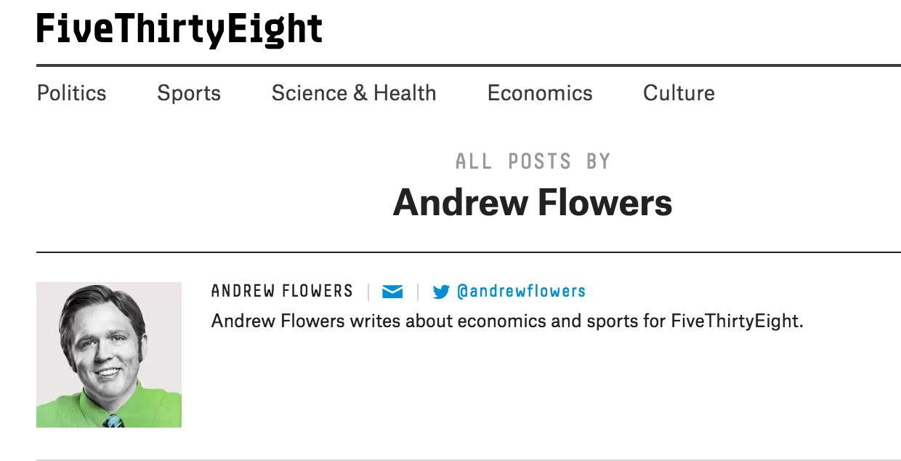

layout: true

.footer[Slides available at http://bit.ly/pdx538]

---

```{r include=FALSE}
library(ggplot2)
filter <- dplyr::filter
knitr::opts_chunk$set(warning=FALSE, message=FALSE, fig.width=10.5, fig.height=4, 
  comment=NA, rows.print=16)
theme_set(theme_gray(base_size = 24))
```

# Packages to install to follow along today

- `devtools`
- `fivethirtyeight`
- `tidyverse`
- `rmarkdown`
- Sorry, I forgot to add `roxygen2`
- Also, download the CSV file at <http://ismayc.github.io/periodic-table-data.csv>

---


# Motivating the idea

You can only look at this so many times:

--

```{r}
library(tidyverse)
ggplot(data = iris, 
       mapping = aes(x = Sepal.Width, y = Sepal.Length, color = Species)) + 
  geom_point()
```


---

## Motivating the idea

And this too...  I mean this is data on 1974 cars...

```{r}
ggplot(data = mtcars, 
       mapping = aes(x = factor(am), y = mpg)) + 
  geom_boxplot() +
  geom_point(alpha = 0.5, color = "blue") +
  coord_flip()
```

---

## Motivating the idea

<center>
<a href="http://gph.is/1VD6OCF"> 

</a>
</center>

<!-- I will discuss the motivation behind creating a data package using the data from the stories produced by FiveThirtyEight.  I’ll also walk through the process of creating a data package in R and some of the vignettes for the package that have been created by my students and others from throughout the world.  Lastly, I’ll discuss some ideas (that I’d love to work with others on) for other data packages in R that can better serve the R community by helping novice and intermediate R users work with and tidy 'messy' data. -->

---

## Finding great, interesting, accessible data sets is hard

<center>
<a href="http://giphy.com/gifs/justin-g-angry-better-call-saul-exasperation-26tnnpcYVRNJGlHy0"> 

</a>
</center>

---

## Ah ha!

<center>
<a href="https://github.com/fivethirtyeight"> 

</a>
</center>

---

## Ah ha!

<center>
<a href="https://github.com/fivethirtyeight/data/blob/master/police-locals/police-locals.csv"> 

</a>
</center>

---

## Hmmmf...

```{r}
police_locals <- read_csv("https://raw.githubusercontent.com/fivethirtyeight/data/master/police-locals/police-locals.csv")
police_locals
```

---

## We want to be able to do this!

```{r eval=FALSE}
library(fivethirtyeight)
police_locals
```

```{r echo=FALSE}
library(fivethirtyeight)
data("police_locals")
police_locals
```

---

class: center, middle

<a href="http://gph.is/1FFoxxM"> 

</a>

---

## Email to FiveThirtyEight

<a href="https://fivethirtyeight.com/contributors/andrew-flowers/"> 

</a>

---

## Permission granted!

<a href="https://www.rstudio.com/resources/videos/finding-and-telling-stories-with-r/"> 

</a>

---

class: inverse, middle

# But how did we do it!?

- [`data` repo on `fivethirtyeight` GitHub](https://github.com/fivethirtyeight/data)

- [`data-raw` folder in `fivethirtyeight` package](https://github.com/rudeboybert/fivethirtyeight/tree/master/data-raw)

---

## But how did we do it!?


- R script files for cleaning and importing into package
    - [Albert's](https://github.com/rudeboybert/fivethirtyeight/blob/master/data-raw/process_data_sets_albert.R)
    - [Jennifer's](https://github.com/rudeboybert/fivethirtyeight/blob/master/data-raw/process_data_sets_jen.R)
    - [Chester's](https://github.com/rudeboybert/fivethirtyeight/blob/master/data-raw/process_data_sets_chester.R)

- Standardized documentation for each data set
    - [Albert's](https://github.com/rudeboybert/fivethirtyeight/blob/master/R/data_albert.R)
    - [Jennifer's](https://github.com/rudeboybert/fivethirtyeight/blob/master/R/data_jen.R)
    - [Chester's](https://github.com/rudeboybert/fivethirtyeight/blob/master/R/data_chester.R)

---

## Built vignettes

- `fivethirtyeight` package vignette
  - [R Markdown file](https://github.com/rudeboybert/fivethirtyeight/edit/master/vignettes/fivethirtyeight.Rmd)
  - [HTML vignette via `pkgdown`](https://rudeboybert.github.io/fivethirtyeight/articles/fivethirtyeight.html)
  - [HTML vignette on CRAN](https://cran.r-project.org/web/packages/fivethirtyeight/vignettes/fivethirtyeight.html)
- `bechdel` `tidyverse` analysis vignette
  - [R Markdown file](https://raw.githubusercontent.com/rudeboybert/fivethirtyeight/master/vignettes/bechdel.Rmd)
  - [HTML vignette on CRAN](https://cran.r-project.org/web/packages/fivethirtyeight/vignettes/bechdel.html)

---

## Requested crowd-sourced vignettes

- [NBA player predictions](https://cran.r-project.org/web/packages/fivethirtyeight/vignettes/NBA.html) from [G. Elliott Morris](http://www.thecrosstab.com/)

- [Trump Twitter analysis](https://cran.r-project.org/web/packages/fivethirtyeight/vignettes/trump_twitter.html) from [Adam Spannbauer](https://adamspannbauer.github.io/post/2017-03-25-about/)

- [Other vignettes on CRAN](https://CRAN.R-project.org/package=fivethirtyeight)

--

### Assigned my Pacific University Social Statistics students for their group projects to create `fivethirtyeight` package vignettes 
  - [R Markdown Source code](https://github.com/ismayc/soc301_s2017/tree/master/docs/group_projects)
  - [All Knitted HTML documents](https://ismayc.github.io/soc301_s2017/group-projects/index.html)

---

class: inverse, center, middle

# Call to Action

---

> New (and relatively new) R users deserve interesting, relevant, current, easy-to-manage data sets in a package crowdsource developed by R users who remember what it was like to have to endure example after example of `mtcars`, `iris`, and `diamonds`.

--

- Basic principles put forth in [`rawdata` package](https://github.com/ismayc/rawdata)

- Hoping to explore [`awesome-public-datasets`](https://github.com/caesar0301/awesome-public-datasets) and documenting license type

--

<br>

- Will you join me in improving the experience for new useRs?


---

class: center, middle, inverse

# Building an R data package

---

## Let's build an R data package from close to scratch

- [RStudio Package Development Cheat Sheet](https://www.rstudio.com/wp-content/uploads/2015/06/devtools-cheatsheet.pdf)

--

- As an example, we can use data on the periodic table of elements as a CSV file from [here](http://ismayc.github.io/periodic-table-data.csv).

---

### Building an R data package in RStudio (Part 1)

1. Open RStudio
2. Navigate to the directory when you'd like to store your package and `setwd()`
3. Run `devtools::create("peRiodic")` to create a new project for the `peRiodic` package
4. Open the `peRiodic.Rproj` file to open the project
4. Run `devtools::use_data_raw()` in the R Console
5. Move the `periodic-table-data.csv` you downloaded into the `data-raw` folder

---

### Building an R data package in RStudio (Part 2)

6. Create an R script file in the `data-raw` folder called, say, `process_data.R`
    - Write (and run) the code to read in this file as a data frame with name `periodic_table`
    - Also, convert the `block` variable to a factor with appropriate levels
7.   Enter (and run) as the last line of `process_data.R`:
    ```
    devtools::use_data(periodic_table, 
            overwrite = TRUE)
    ```

---

### Building an R data package in RStudio (Part 3)

- Documentation

1. Check out the formatting of the [`data.R`](https://raw.githubusercontent.com/ismayc/chemistr/master/R/data.R) file
  - Copy-and-paste this into a `data.R` file in the `R` folder of `peRiodic`
2. Press `Ctrl/Cmd + Shift + D` to document `periodic_table`
3. Press **Build & Reload** in the **Build** tab in RStudio near **History**
4. Run `?periodic_table` in your R Console to check the package is done.

---

layout: false
class: middle

# Thanks for attending!

- Special thanks to 
    - [Andrew Flowers](https://www.linkedin.com/in/andrew-flowers-1319934)
    - [Albert Y. Kim](https://twitter.com/rudeboybert)
    - [Jennifer Chunn](https://twitter.com/jchunn206)
- Slides created via the R package [xaringan](https://github.com/yihui/xaringan) by Yihui Xie
- Running HTML document created via the R package [rmarkdown](http://rmarkdown.rstudio.com/) by RStudio
- Slides available at <http://bit.ly/pdx538>
- Source code for these slides at <https://github.com/ismayc/talks/pdx538>
