name: toc

# Overview

- <small>Rasmus Bååth - [The current state of naming conventions in R](#rasmus)</small>
- <small>Henning Bumann - [An Introduction to the r2anki-package](#henning)</small>
- <small>Mark Padgham - [Maps are data, so why plot data on a map](#map)</small>
- <small>Lucy D'Agostino McGowan - [papr: Tinder for pre-prints, a Shiny Application for collecting gut-reactions to pre-prints from the scientific community](#tidy)</small>


---

class: center, middle
name: rasmus

# [Rasmus Bååth](https://user2017.sched.com/event/AxrG/the-current-state-of-naming-conventions-in-r?iframe=no)

[](https://twitter.com/rabaath)

[Video - Starting at 10:40](https://channel9.msdn.com/Events/useR-international-R-User-conferences/useR-International-R-User-2017-Conference/Room-302-Lightning-Talks)


---

class: center, middle

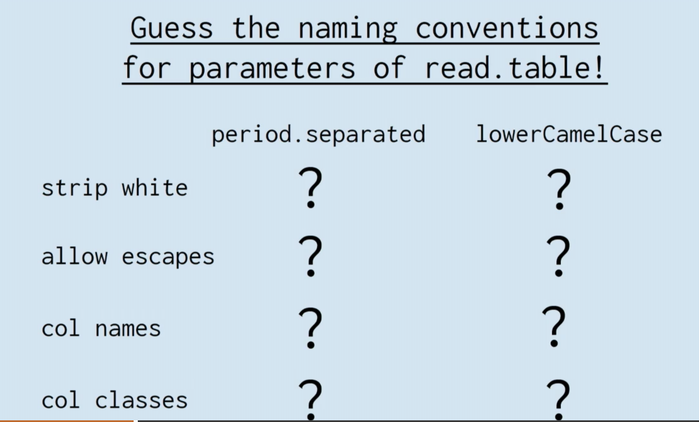


---

class: center, middle

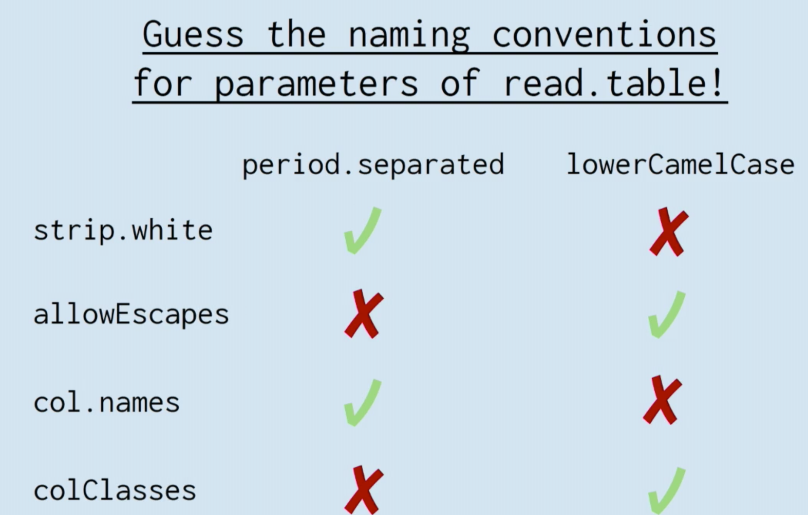

---

class: center, middle

## Function name trends

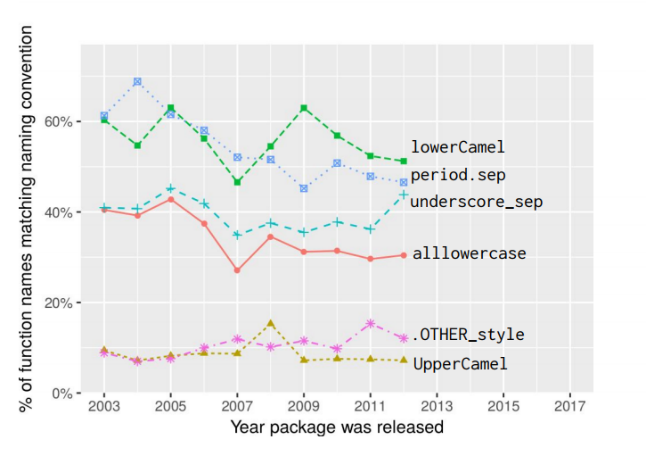

---

class: center, middle

## Trends have changed...

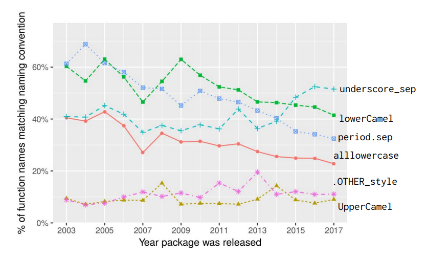

---

class: center, middle
name: henning

# [Henning Bumann](https://user2017.sched.com/event/AxrM/an-introduction-to-the-r2anki-package?iframe=no)

[](https://twitter.com/henningsway)

[Video - Starting at 16:00](https://channel9.msdn.com/Events/useR-international-R-User-conferences/useR-International-R-User-2017-Conference/Room-302-Lightning-Talks)

---

class: center, middle

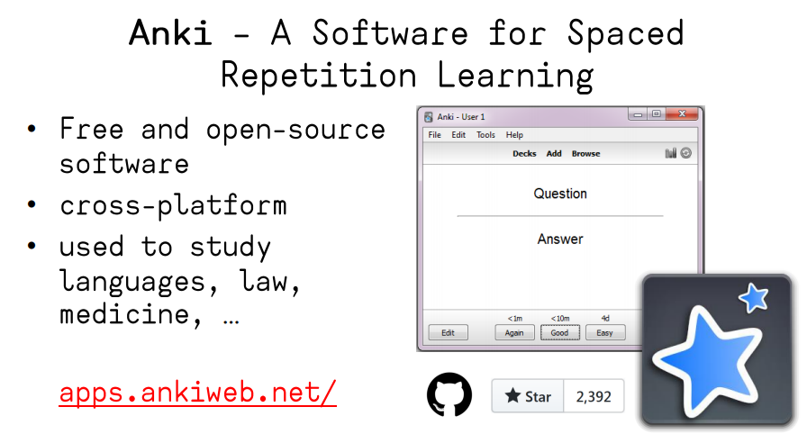


---

class: center, middle

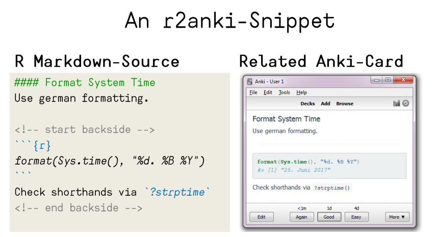


---

class: center, middle

## [Sidebar:  Plug for DataCamp practice mode](https://www.datacamp.com/community/blog/introducing-daily-practice-mode#gs.3dTwcqE)

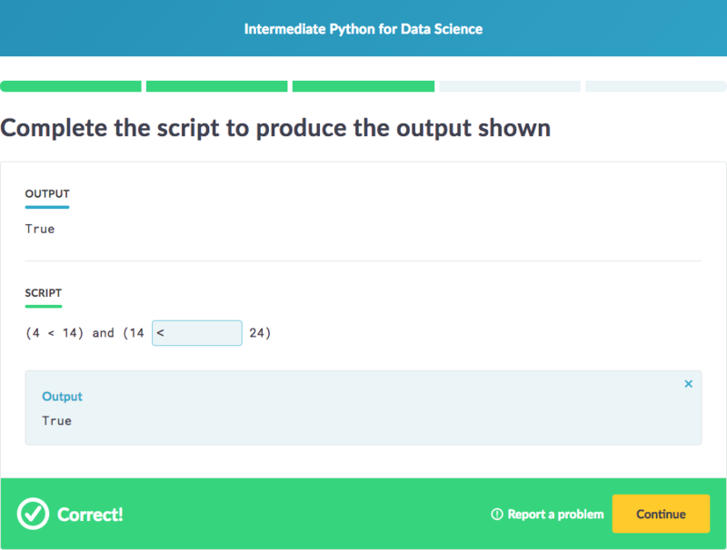

---

class: center, middle
name: mark

# [Mark Padgham](https://user2017.sched.com/event/AxpD/maps-are-data-so-why-plot-data-on-a-map)

[ 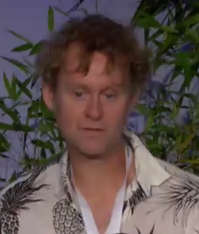](https://twitter.com/bikesRdata)


[Video](https://channel9.msdn.com/events/useR-international-R-User-conferences/useR-International-R-User-2017-Conference/Maps-are-data-so-why-plot-data-on-a-map?term=padgham)
---

class: center, middle

# Why should you use OpenStreetMap?
--

## What's the least mapped country on the planet?

---

## Google Maps (Anju, North Korea)

[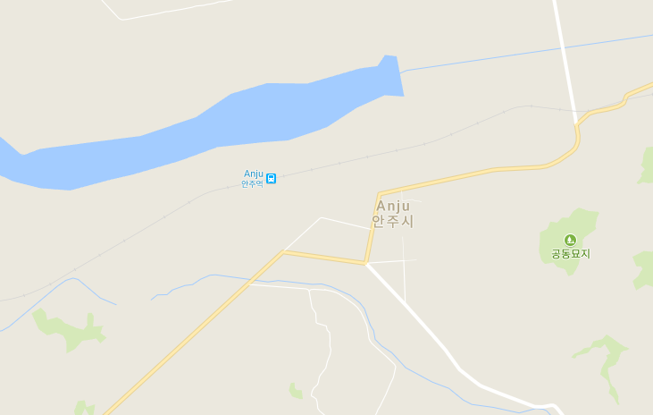](https://www.google.com/maps/@39.6193725,125.6450556,14z)


---

## OpenStreetMap (Anju, North Korea)

[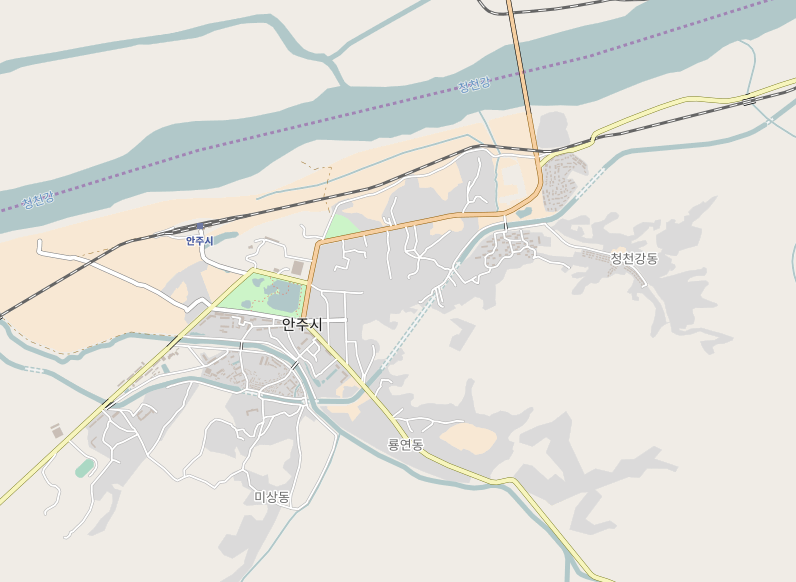](http://www.openstreetmap.org/#map=14/39.6205/125.6565)

---

```{r warning=FALSE, message=FALSE}
library(osmdata)
library(tidyverse)
# Get list of spatial data (opq - overpass query)
anju_bldgs <- opq("anju north korea") %>% 
  add_osm_feature(key = "building") %>% 
  osmdata_sf()
```
--

```{r}
names(anju_bldgs)
```
--

```{r}
# Base R bananas
table(anju_bldgs$osm_polygons$tourism)
```


---

# Mapping Forest Grove, Oregon

```{r, warning=FALSE, message=FALSE, cache=TRUE}
bb <- osmdata::getbb("forest grove oregon")
highways <- bb %>% osmplotr::extract_osm_objects(key = "highway")
map <- osmplotr::osm_basemap(bbox = bb, bg = "gray20") %>%
  osmplotr::add_osm_objects(highways, col = "yellow")
osmplotr::print_osm_map(map)
```

---

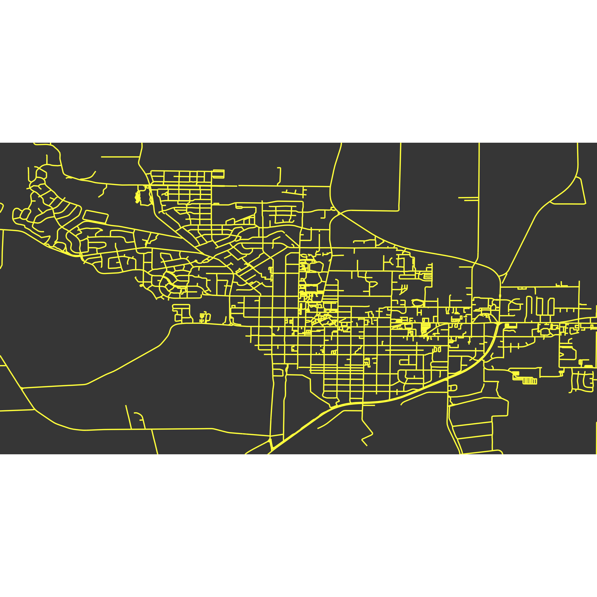

---

class: center, middle
name: lucy

# [Lucy D'Agostino McGowan](https://user2017.sched.com/event/AxsQ/papr-tinder-for-pre-prints-a-shiny-application-for-collecting-gut-reactions-to-pre-prints-from-the-scientific-community)

[](https://twitter.com/LucyStats)


[Video](https://channel9.msdn.com/events/useR-international-R-User-conferences/useR-International-R-User-2017-Conference/papr-Tinder-for-pre-prints-a-Shiny-Application-for-collecting-gut-reactions-to-pre-prints-from-the-s?term=lucy)

---

class: center, middle

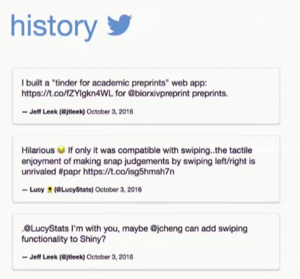

<!--
Links with social media to see which articles people you follow have liked
-->


---

class: center, middle

[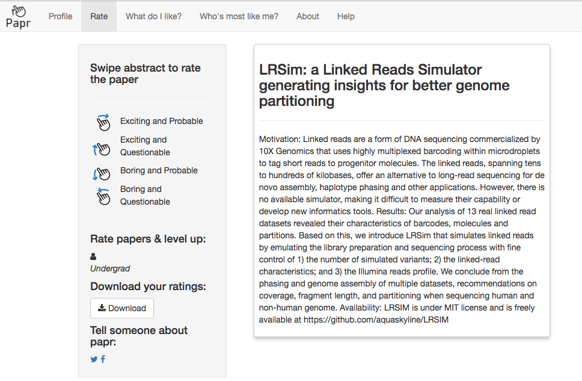](https://jhubiostatistics.shinyapps.io/papr/)

---

class: middle

# Thanks for attending!

- Slides created via the R package [xaringan](https://github.com/yihui/xaringan) by Yihui Xie
- Source code for these slides (useR_recap17) at <https://github.com/ismayc/talks>